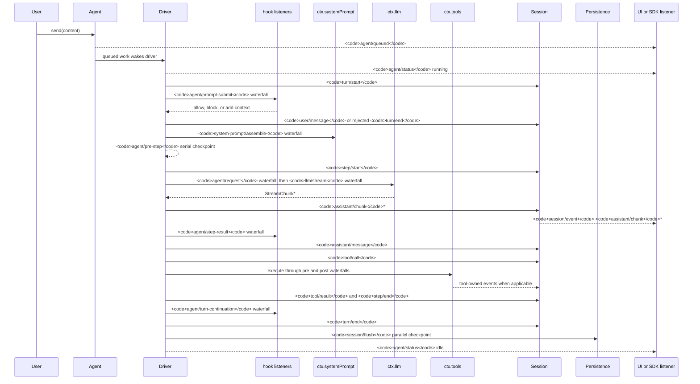

<!-- Generated by scripts/gen-doc-graphs.ts - do not edit by hand.
     Run `pnpm run gen-doc-graphs` to regenerate. -->

# Agent Turn And Step Lifecycle

This sequence is the visual companion to [architecture.md](architecture.md#loop-lifecycle-session--turn--step). It keeps durable replay facts on `session/event` and live control/status on `agent/*`.

SDK users that need replayable transcript data should consume `session/event`; `agent/*` is the live coordination surface for queue/status, prompt interception, request shaping, steering, continuation, and errors.

Maintenance mode: curated Mermaid sequence; exact event signatures live in the generated Cordis catalog.
