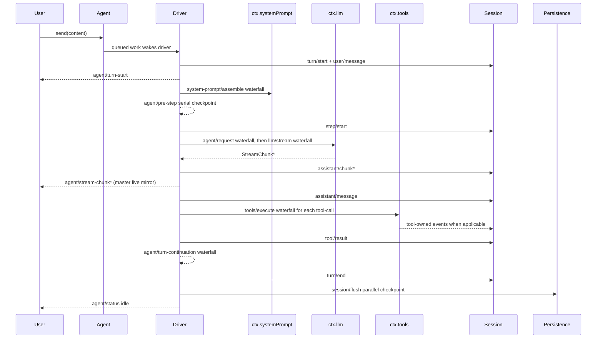

<!-- Generated by scripts/gen-doc-graphs.ts - do not edit by hand.
     Run `pnpm run gen-doc-graphs` to regenerate. -->

# Agent Turn And Step Lifecycle

Maintenance mode: curated Mermaid sequence; exact event signatures live in the generated Cordis catalog.

This sequence is the visual companion to [architecture.md](../architecture.md#loop-lifecycle-session--turn--step). It shows the durable session event path separately from live `agent/*` notifications.

Future pressure from the hooks stack: PR #129 removes the live `agent/stream-chunk` mirror and leaves durable `assistant/chunk` on `session/event` as the authoritative token stream. Consumers that need replayable transcript data should already treat `session/event` as the load-bearing path.
