<!-- Generated by scripts/gen-doc-graphs.ts - do not edit by hand.
     Run `pnpm run gen-doc-graphs` to regenerate. -->

# App Composition

Maintenance mode: hybrid: leaf plugin lists are parsed from `examples/*/cordis.yml`; bundle expansions are curated from app package source.

This graph is for SDK users asking which pieces a runnable agent loads. Leaf configs choose adapters and optional product tools; app packages provide the front door; `dsh-agent-core` bundles the providerless spine.

```mermaid
flowchart LR
  subgraph example_echo["examples/echo-agent"]
    cfg_echo["cordis.yml"]
    plugin_echo_hmr["hmr<br/>@cordisjs/plugin-hmr"]
    cfg_echo --> plugin_echo_hmr
    plugin_echo_mock_llm["mock-llm<br/>./src/mock-llm.ts"]
    cfg_echo --> plugin_echo_mock_llm
    plugin_echo_echo_tool["echo-tool<br/>./src/echo-tool.ts"]
    cfg_echo --> plugin_echo_echo_tool
    plugin_echo_bash["bash<br/>@deepseek-ai/dsh-bash-local"]
    cfg_echo --> plugin_echo_bash
    plugin_echo_stdio_agent["stdio-agent<br/>@deepseek-ai/dsh-stdio-agent"]
    cfg_echo --> plugin_echo_stdio_agent
    plugin_echo_stdio_agent --> bundle_stdio
  end
  subgraph example_coding["examples/coding-agent"]
    cfg_coding["cordis.yml"]
    plugin_coding_hmr["hmr<br/>@cordisjs/plugin-hmr"]
    cfg_coding --> plugin_coding_hmr
    plugin_coding_llm_deepseek["llm-deepseek<br/>@deepseek-ai/dsh-llm-deepseek"]
    cfg_coding --> plugin_coding_llm_deepseek
    plugin_coding_bash["bash<br/>@deepseek-ai/dsh-bash-local"]
    cfg_coding --> plugin_coding_bash
    plugin_coding_stdio_agent["stdio-agent<br/>@deepseek-ai/dsh-stdio-agent"]
    cfg_coding --> plugin_coding_stdio_agent
    plugin_coding_stdio_agent --> bundle_stdio
    plugin_coding_compact_basic["compact-basic<br/>@deepseek-ai/dsh-compact-basic"]
    cfg_coding --> plugin_coding_compact_basic
    plugin_coding_subagent["subagent<br/>@deepseek-ai/dsh-subagent"]
    cfg_coding --> plugin_coding_subagent
    plugin_coding_subagent_spawn["subagent-spawn<br/>@deepseek-ai/dsh-subagent-spawn"]
    cfg_coding --> plugin_coding_subagent_spawn
    plugin_coding_subagent_fork["subagent-fork<br/>@deepseek-ai/dsh-subagent-fork"]
    cfg_coding --> plugin_coding_subagent_fork
    plugin_coding_tool_subagent["tool-subagent<br/>@deepseek-ai/dsh-tool-subagent"]
    cfg_coding --> plugin_coding_tool_subagent
    plugin_coding_tool_subagent_fork["tool-subagent-fork<br/>@deepseek-ai/dsh-tool-subagent"]
    cfg_coding --> plugin_coding_tool_subagent_fork
    plugin_coding_tool_todo["tool-todo<br/>@deepseek-ai/dsh-tool-todo"]
    cfg_coding --> plugin_coding_tool_todo
  end
  subgraph example_acp["examples/acp-agent"]
    cfg_acp["cordis.yml"]
    plugin_acp_llm_deepseek["llm-deepseek<br/>@deepseek-ai/dsh-llm-deepseek"]
    cfg_acp --> plugin_acp_llm_deepseek
    plugin_acp_bash["bash<br/>@deepseek-ai/dsh-bash-local"]
    cfg_acp --> plugin_acp_bash
    plugin_acp_acp_agent["acp-agent<br/>@deepseek-ai/dsh-acp-agent"]
    cfg_acp --> plugin_acp_acp_agent
    plugin_acp_acp_agent --> bundle_acp_agent
    plugin_acp_subagent["subagent<br/>@deepseek-ai/dsh-subagent"]
    cfg_acp --> plugin_acp_subagent
    plugin_acp_subagent_spawn["subagent-spawn<br/>@deepseek-ai/dsh-subagent-spawn"]
    cfg_acp --> plugin_acp_subagent_spawn
    plugin_acp_subagent_fork["subagent-fork<br/>@deepseek-ai/dsh-subagent-fork"]
    cfg_acp --> plugin_acp_subagent_fork
    plugin_acp_tool_subagent["tool-subagent<br/>@deepseek-ai/dsh-tool-subagent"]
    cfg_acp --> plugin_acp_tool_subagent
    plugin_acp_tool_subagent_fork["tool-subagent-fork<br/>@deepseek-ai/dsh-tool-subagent"]
    cfg_acp --> plugin_acp_tool_subagent_fork
    plugin_acp_tool_todo["tool-todo<br/>@deepseek-ai/dsh-tool-todo"]
    cfg_acp --> plugin_acp_tool_todo
  end
  bundle_stdio["@deepseek-ai/dsh-stdio-agent"] --> bundle_agent_core["@deepseek-ai/dsh-agent-core"]
  bundle_stdio --> bundle_jsonl["@deepseek-ai/dsh-session-persistence-jsonl"]
  bundle_stdio --> bundle_ui_stdio["@deepseek-ai/dsh-ui-stdio"]
  bundle_acp_agent["@deepseek-ai/dsh-acp-agent"] --> bundle_agent_core
  bundle_acp_agent --> bundle_jsonl
  bundle_acp_agent --> bundle_acp["@deepseek-ai/dsh-acp"]
  bundle_agent_core --> spine_llm["ctx.llm"]
  bundle_agent_core --> spine_sessions["ctx.sessions"]
  bundle_agent_core --> spine_tools["ctx.tools + tool-bash"]
  bundle_agent_core --> spine_loop["ctx.agents + ctx.agentLoop"]
```

| Example | Parsed plugin ids | Config |
| --- | --- | --- |
| `examples/echo-agent` | `hmr`, `mock-llm`, `echo-tool`, `bash`, `stdio-agent` | [`examples/echo-agent/cordis.yml`](../../examples/echo-agent/cordis.yml) |
| `examples/coding-agent` | `hmr`, `llm-deepseek`, `bash`, `stdio-agent`, `compact-basic`, `subagent`, `subagent-spawn`, `subagent-fork`, `tool-subagent`, `tool-subagent-fork`, `tool-todo` | [`examples/coding-agent/cordis.yml`](../../examples/coding-agent/cordis.yml) |
| `examples/acp-agent` | `llm-deepseek`, `bash`, `acp-agent`, `subagent`, `subagent-spawn`, `subagent-fork`, `tool-subagent`, `tool-subagent-fork`, `tool-todo` | [`examples/acp-agent/cordis.yml`](../../examples/acp-agent/cordis.yml) |
