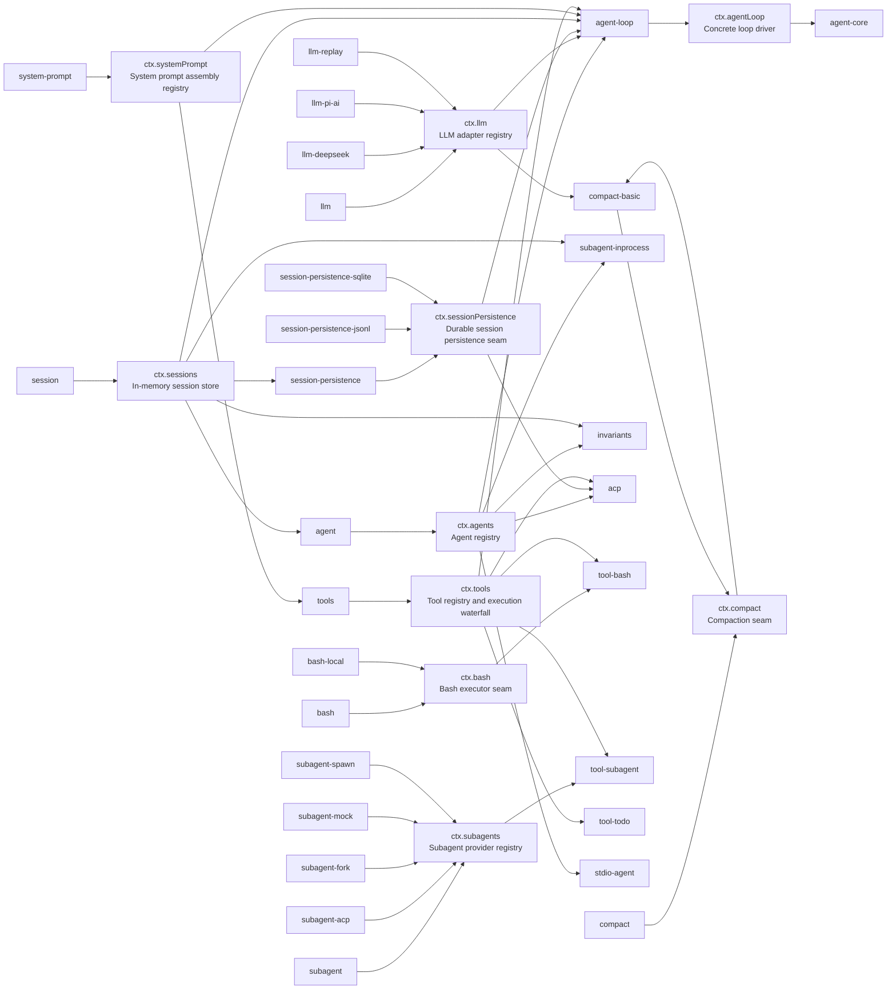

<!-- Generated by scripts/gen-doc-graphs.ts - do not edit by hand.
     Run `pnpm run gen-doc-graphs` to regenerate. -->

# Capability Seams And Core Services

Maintenance mode: hybrid: services are discovered from Cordis declarations; interface/implementation/consumer roles are classified in `scripts/gen-doc-graphs.ts` with a completeness guard.

A service can be a core spine service, a swappable capability seam, or a bundle/composition point. The graph shows the package that owns the service declaration, known implementation packages, and packages that consume the service directly.

| ctx key | Role | Owner | Implementations | Direct consumers | Note |
| --- | --- | --- | --- | --- | --- |
| `ctx.llm` | `seam` | [`llm`](../../packages/llm/llm) | [`llm-deepseek`](../../packages/llm/llm-deepseek), [`llm-pi-ai`](../../packages/llm/llm-pi-ai), [`llm-replay`](../../packages/support/llm-replay) | [`agent-loop`](../../packages/core/agent-loop), [`compact-basic`](../../packages/compact/compact-basic) | Adapters register provider implementations; the loop and compaction call the provider-neutral stream service. |
| `ctx.sessions` | `core` | [`session`](../../packages/core/session) | - | [`agent-loop`](../../packages/core/agent-loop), [`agent`](../../packages/core/agent), [`session-persistence`](../../packages/session-persistence/session-persistence), [`subagent-inprocess`](../../packages/subagent/subagent-inprocess), [`invariants`](../../packages/support/invariants) | Owns append-only Session instances and emits the durable session event feed. |
| `ctx.sessionPersistence` | `seam` | [`session-persistence`](../../packages/session-persistence/session-persistence) | [`session-persistence-jsonl`](../../packages/session-persistence/session-persistence-jsonl), [`session-persistence-sqlite`](../../packages/session-persistence/session-persistence-sqlite) | [`agent-loop`](../../packages/core/agent-loop), [`acp`](../../packages/ui/acp) | Backends persist the same SessionEvent vocabulary; apps choose a backend at composition time. |
| `ctx.systemPrompt` | `core` | [`system-prompt`](../../packages/core/system-prompt) | - | [`agent-loop`](../../packages/core/agent-loop), [`tools`](../../packages/core/tools) | Collects prompt sections and model-facing tool schemas for each step. |
| `ctx.tools` | `core` | [`tools`](../../packages/core/tools) | - | [`agent-loop`](../../packages/core/agent-loop), [`tool-bash`](../../packages/bash/tool-bash), [`tool-subagent`](../../packages/subagent/tool-subagent), [`tool-todo`](../../packages/todo/tool-todo), [`acp`](../../packages/ui/acp) | Registers tool definitions, exposes schemas to the prompt, and routes calls through tools/execute. |
| `ctx.agents` | `core` | [`agent`](../../packages/core/agent) | - | [`agent-loop`](../../packages/core/agent-loop), [`acp`](../../packages/ui/acp), [`subagent-inprocess`](../../packages/subagent/subagent-inprocess), [`stdio-agent`](../../packages/ui/stdio-agent), [`invariants`](../../packages/support/invariants) | Owns live Agent handles and the create/resume factory seam. |
| `ctx.agentLoop` | `bundle` | [`agent-loop`](../../packages/core/agent-loop) | - | [`agent-core`](../../packages/core/agent-core) | The one concrete loop plugin; extension packages depend on dsh-agent events and services, not on this package. |
| `ctx.bash` | `seam` | [`bash`](../../packages/bash/bash) | [`bash-local`](../../packages/bash/bash-local) | [`tool-bash`](../../packages/bash/tool-bash) | The model-facing bash tools consume this seam; sandboxed or remote executors can replace bash-local. |
| `ctx.compact` | `seam` | [`compact`](../../packages/compact/compact) | [`compact-basic`](../../packages/compact/compact-basic) | [`compact-basic`](../../packages/compact/compact-basic) | The basic backend currently consumes the pre-step event directly; a model-facing compact tool remains deferred. |
| `ctx.subagents` | `seam` | [`subagent`](../../packages/subagent/subagent) | [`subagent-spawn`](../../packages/subagent/subagent-spawn), [`subagent-fork`](../../packages/subagent/subagent-fork), [`subagent-acp`](../../packages/subagent/subagent-acp), [`subagent-mock`](../../packages/support/subagent-mock) | [`tool-subagent`](../../packages/subagent/tool-subagent) | Providers implement transports; tool-subagent exposes one configured provider as a model-facing tool name. |
