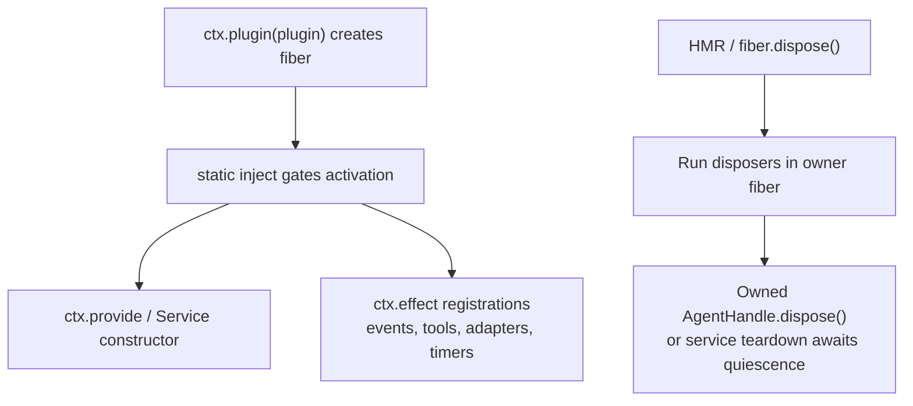

<!-- Generated by scripts/gen-doc-graphs.ts - do not edit by hand.
     Run `pnpm run gen-doc-graphs` to regenerate. -->

# Plugin Disposal And Hot Reload Ownership

Maintenance mode: curated Mermaid flow based on Cordis fiber/effect conventions.

This graph is a maintainer checklist for plugin authors: registrations are effects, service injection gates activation, and owned handles must be disposed by their owner.

Hook bridges and SDK plugins increase the number of long-lived listeners, so this ownership graph should stay small and visible.
