<!-- Generated by scripts/gen-doc-graphs.ts - do not edit by hand.
     Run `pnpm run gen-doc-graphs` to regenerate. -->

# Package Topology By Group

Maintenance mode: generated from `packages/*/*/package.json` peer dependencies plus package group paths.

```mermaid
flowchart TD
  subgraph group_util["packages/util"]
    pkg_brand["brand"]
  end
  subgraph group_llm["packages/llm"]
    pkg_llm["llm"]
    pkg_llm_deepseek["llm-deepseek"]
    pkg_llm_pi_ai["llm-pi-ai"]
  end
  subgraph group_core["packages/core"]
    pkg_agent["agent"]
    pkg_agent_core["agent-core"]
    pkg_agent_loop["agent-loop"]
    pkg_session["session"]
    pkg_system_prompt["system-prompt"]
    pkg_tools["tools"]
  end
  subgraph group_bash["packages/bash"]
    pkg_bash["bash"]
    pkg_bash_local["bash-local"]
    pkg_tool_bash["tool-bash"]
  end
  subgraph group_compact["packages/compact"]
    pkg_compact["compact"]
    pkg_compact_basic["compact-basic"]
  end
  subgraph group_subagent["packages/subagent"]
    pkg_subagent["subagent"]
    pkg_subagent_acp["subagent-acp"]
    pkg_subagent_fork["subagent-fork"]
    pkg_subagent_inprocess["subagent-inprocess"]
    pkg_subagent_spawn["subagent-spawn"]
    pkg_tool_subagent["tool-subagent"]
  end
  subgraph group_session_persistence["packages/session-persistence"]
    pkg_session_persistence["session-persistence"]
    pkg_session_persistence_jsonl["session-persistence-jsonl"]
    pkg_session_persistence_sqlite["session-persistence-sqlite"]
  end
  subgraph group_todo["packages/todo"]
    pkg_tool_todo["tool-todo"]
  end
  subgraph group_support["packages/support"]
    pkg_invariants["invariants"]
    pkg_llm_replay["llm-replay"]
    pkg_subagent_mock["subagent-mock"]
    pkg_ui_stdio["ui-stdio"]
  end
  subgraph group_ui["packages/ui"]
    pkg_acp["acp"]
    pkg_acp_agent["acp-agent"]
    pkg_stdio_agent["stdio-agent"]
  end
  pkg_llm --> pkg_brand
  pkg_bash --> pkg_brand
  pkg_llm_deepseek --> pkg_llm
  pkg_llm_pi_ai --> pkg_llm
  pkg_session --> pkg_brand
  pkg_session --> pkg_llm
  pkg_system_prompt --> pkg_llm
  pkg_bash_local --> pkg_bash
  pkg_agent --> pkg_brand
  pkg_agent --> pkg_llm
  pkg_agent --> pkg_session
  pkg_compact --> pkg_llm
  pkg_compact --> pkg_session
  pkg_session_persistence --> pkg_session
  pkg_llm_replay --> pkg_llm
  pkg_llm_replay --> pkg_session
  pkg_tools --> pkg_agent
  pkg_tools --> pkg_llm
  pkg_tools --> pkg_system_prompt
  pkg_compact_basic --> pkg_agent
  pkg_compact_basic --> pkg_compact
  pkg_compact_basic --> pkg_llm
  pkg_compact_basic --> pkg_session
  pkg_session_persistence_jsonl --> pkg_session
  pkg_session_persistence_jsonl --> pkg_session_persistence
  pkg_session_persistence_sqlite --> pkg_session
  pkg_session_persistence_sqlite --> pkg_session_persistence
  pkg_invariants --> pkg_agent
  pkg_invariants --> pkg_llm
  pkg_invariants --> pkg_session
  pkg_ui_stdio --> pkg_agent
  pkg_ui_stdio --> pkg_llm
  pkg_ui_stdio --> pkg_session
  pkg_agent_loop --> pkg_agent
  pkg_agent_loop --> pkg_llm
  pkg_agent_loop --> pkg_session
  pkg_agent_loop --> pkg_session_persistence
  pkg_agent_loop --> pkg_system_prompt
  pkg_agent_loop --> pkg_tools
  pkg_tool_bash --> pkg_agent
  pkg_tool_bash --> pkg_bash
  pkg_tool_bash --> pkg_llm
  pkg_tool_bash --> pkg_tools
  pkg_subagent --> pkg_agent
  pkg_subagent --> pkg_llm
  pkg_subagent --> pkg_tools
  pkg_tool_todo --> pkg_agent
  pkg_tool_todo --> pkg_session
  pkg_tool_todo --> pkg_tools
  pkg_acp --> pkg_agent
  pkg_acp --> pkg_llm
  pkg_acp --> pkg_session
  pkg_acp --> pkg_session_persistence
  pkg_acp --> pkg_tools
  pkg_agent_core --> pkg_agent
  pkg_agent_core --> pkg_agent_loop
  pkg_agent_core --> pkg_invariants
  pkg_agent_core --> pkg_llm
  pkg_agent_core --> pkg_session
  pkg_agent_core --> pkg_system_prompt
  pkg_agent_core --> pkg_tool_bash
  pkg_agent_core --> pkg_tools
  pkg_subagent_acp --> pkg_agent
  pkg_subagent_acp --> pkg_llm
  pkg_subagent_acp --> pkg_subagent
  pkg_subagent_inprocess --> pkg_agent
  pkg_subagent_inprocess --> pkg_llm
  pkg_subagent_inprocess --> pkg_session
  pkg_subagent_inprocess --> pkg_subagent
  pkg_tool_subagent --> pkg_agent
  pkg_tool_subagent --> pkg_llm
  pkg_tool_subagent --> pkg_subagent
  pkg_tool_subagent --> pkg_tools
  pkg_subagent_mock --> pkg_agent
  pkg_subagent_mock --> pkg_llm
  pkg_subagent_mock --> pkg_subagent
  pkg_subagent_fork --> pkg_agent
  pkg_subagent_fork --> pkg_session
  pkg_subagent_fork --> pkg_subagent
  pkg_subagent_fork --> pkg_subagent_inprocess
  pkg_subagent_spawn --> pkg_subagent
  pkg_subagent_spawn --> pkg_subagent_inprocess
  pkg_acp_agent --> pkg_acp
  pkg_acp_agent --> pkg_agent_core
  pkg_acp_agent --> pkg_session_persistence_jsonl
  pkg_stdio_agent --> pkg_agent
  pkg_stdio_agent --> pkg_agent_core
  pkg_stdio_agent --> pkg_session
  pkg_stdio_agent --> pkg_session_persistence_jsonl
  pkg_stdio_agent --> pkg_ui_stdio
```

This graph complements [module-graph.md](../module-graph.md): it keeps the same canonical peer-dependency edge source, but clusters packages by the `packages/<group>/<pkg>` hierarchy so layering and capability families are easier to scan.

| Package | Group | Depends on |
| --- | --- | --- |
| [`brand`](../../packages/util/brand) | `util` | - |
| [`llm`](../../packages/llm/llm) | `llm` | [`brand`](../../packages/util/brand) |
| [`bash`](../../packages/bash/bash) | `bash` | [`brand`](../../packages/util/brand) |
| [`llm-deepseek`](../../packages/llm/llm-deepseek) | `llm` | [`llm`](../../packages/llm/llm) |
| [`llm-pi-ai`](../../packages/llm/llm-pi-ai) | `llm` | [`llm`](../../packages/llm/llm) |
| [`session`](../../packages/core/session) | `core` | [`brand`](../../packages/util/brand), [`llm`](../../packages/llm/llm) |
| [`system-prompt`](../../packages/core/system-prompt) | `core` | [`llm`](../../packages/llm/llm) |
| [`bash-local`](../../packages/bash/bash-local) | `bash` | [`bash`](../../packages/bash/bash) |
| [`agent`](../../packages/core/agent) | `core` | [`brand`](../../packages/util/brand), [`llm`](../../packages/llm/llm), [`session`](../../packages/core/session) |
| [`compact`](../../packages/compact/compact) | `compact` | [`llm`](../../packages/llm/llm), [`session`](../../packages/core/session) |
| [`session-persistence`](../../packages/session-persistence/session-persistence) | `session-persistence` | [`session`](../../packages/core/session) |
| [`llm-replay`](../../packages/support/llm-replay) | `support` | [`llm`](../../packages/llm/llm), [`session`](../../packages/core/session) |
| [`tools`](../../packages/core/tools) | `core` | [`agent`](../../packages/core/agent), [`llm`](../../packages/llm/llm), [`system-prompt`](../../packages/core/system-prompt) |
| [`compact-basic`](../../packages/compact/compact-basic) | `compact` | [`agent`](../../packages/core/agent), [`compact`](../../packages/compact/compact), [`llm`](../../packages/llm/llm), [`session`](../../packages/core/session) |
| [`session-persistence-jsonl`](../../packages/session-persistence/session-persistence-jsonl) | `session-persistence` | [`session`](../../packages/core/session), [`session-persistence`](../../packages/session-persistence/session-persistence) |
| [`session-persistence-sqlite`](../../packages/session-persistence/session-persistence-sqlite) | `session-persistence` | [`session`](../../packages/core/session), [`session-persistence`](../../packages/session-persistence/session-persistence) |
| [`invariants`](../../packages/support/invariants) | `support` | [`agent`](../../packages/core/agent), [`llm`](../../packages/llm/llm), [`session`](../../packages/core/session) |
| [`ui-stdio`](../../packages/support/ui-stdio) | `support` | [`agent`](../../packages/core/agent), [`llm`](../../packages/llm/llm), [`session`](../../packages/core/session) |
| [`agent-loop`](../../packages/core/agent-loop) | `core` | [`agent`](../../packages/core/agent), [`llm`](../../packages/llm/llm), [`session`](../../packages/core/session), [`session-persistence`](../../packages/session-persistence/session-persistence), [`system-prompt`](../../packages/core/system-prompt), [`tools`](../../packages/core/tools) |
| [`tool-bash`](../../packages/bash/tool-bash) | `bash` | [`agent`](../../packages/core/agent), [`bash`](../../packages/bash/bash), [`llm`](../../packages/llm/llm), [`tools`](../../packages/core/tools) |
| [`subagent`](../../packages/subagent/subagent) | `subagent` | [`agent`](../../packages/core/agent), [`llm`](../../packages/llm/llm), [`tools`](../../packages/core/tools) |
| [`tool-todo`](../../packages/todo/tool-todo) | `todo` | [`agent`](../../packages/core/agent), [`session`](../../packages/core/session), [`tools`](../../packages/core/tools) |
| [`acp`](../../packages/ui/acp) | `ui` | [`agent`](../../packages/core/agent), [`llm`](../../packages/llm/llm), [`session`](../../packages/core/session), [`session-persistence`](../../packages/session-persistence/session-persistence), [`tools`](../../packages/core/tools) |
| [`agent-core`](../../packages/core/agent-core) | `core` | [`agent`](../../packages/core/agent), [`agent-loop`](../../packages/core/agent-loop), [`invariants`](../../packages/support/invariants), [`llm`](../../packages/llm/llm), [`session`](../../packages/core/session), [`system-prompt`](../../packages/core/system-prompt), [`tool-bash`](../../packages/bash/tool-bash), [`tools`](../../packages/core/tools) |
| [`subagent-acp`](../../packages/subagent/subagent-acp) | `subagent` | [`agent`](../../packages/core/agent), [`llm`](../../packages/llm/llm), [`subagent`](../../packages/subagent/subagent) |
| [`subagent-inprocess`](../../packages/subagent/subagent-inprocess) | `subagent` | [`agent`](../../packages/core/agent), [`llm`](../../packages/llm/llm), [`session`](../../packages/core/session), [`subagent`](../../packages/subagent/subagent) |
| [`tool-subagent`](../../packages/subagent/tool-subagent) | `subagent` | [`agent`](../../packages/core/agent), [`llm`](../../packages/llm/llm), [`subagent`](../../packages/subagent/subagent), [`tools`](../../packages/core/tools) |
| [`subagent-mock`](../../packages/support/subagent-mock) | `support` | [`agent`](../../packages/core/agent), [`llm`](../../packages/llm/llm), [`subagent`](../../packages/subagent/subagent) |
| [`subagent-fork`](../../packages/subagent/subagent-fork) | `subagent` | [`agent`](../../packages/core/agent), [`session`](../../packages/core/session), [`subagent`](../../packages/subagent/subagent), [`subagent-inprocess`](../../packages/subagent/subagent-inprocess) |
| [`subagent-spawn`](../../packages/subagent/subagent-spawn) | `subagent` | [`subagent`](../../packages/subagent/subagent), [`subagent-inprocess`](../../packages/subagent/subagent-inprocess) |
| [`acp-agent`](../../packages/ui/acp-agent) | `ui` | [`acp`](../../packages/ui/acp), [`agent-core`](../../packages/core/agent-core), [`session-persistence-jsonl`](../../packages/session-persistence/session-persistence-jsonl) |
| [`stdio-agent`](../../packages/ui/stdio-agent) | `ui` | [`agent`](../../packages/core/agent), [`agent-core`](../../packages/core/agent-core), [`session`](../../packages/core/session), [`session-persistence-jsonl`](../../packages/session-persistence/session-persistence-jsonl), [`ui-stdio`](../../packages/support/ui-stdio) |
