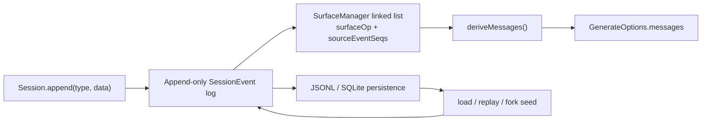

<!-- Generated by scripts/gen-doc-graphs.ts - do not edit by hand.
     Run `pnpm run gen-doc-graphs` to regenerate. -->

# Session Surface And Message Projection

Maintenance mode: curated Mermaid dataflow; exact event/type shapes live in core-data-structures.

This graph separates the append-only log from the derived message surface the next model request sees.

See [core-data-structures/session.md](../core-data-structures/session.md) for the full `SessionEventMap`, surface operations, and turn-enclosure invariant.
