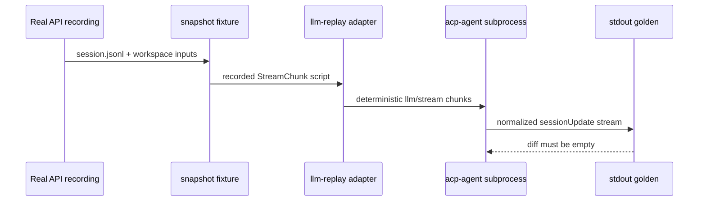

<!-- Generated by scripts/gen-doc-graphs.ts - do not edit by hand.
     Run `pnpm run gen-doc-graphs` to regenerate. -->

# ACP Snapshot Replay

Maintenance mode: curated Mermaid sequence based on the snapshot test harness.

This graph explains what a snapshot scenario proves: recorded real-model session logs are replayed keylessly, then ACP stdout is normalized and diffed.

Future pressure from the fs stack: policy rejection scenarios are valuable because they prove both world state and failed tool-card rendering, not just that replay returns text.
