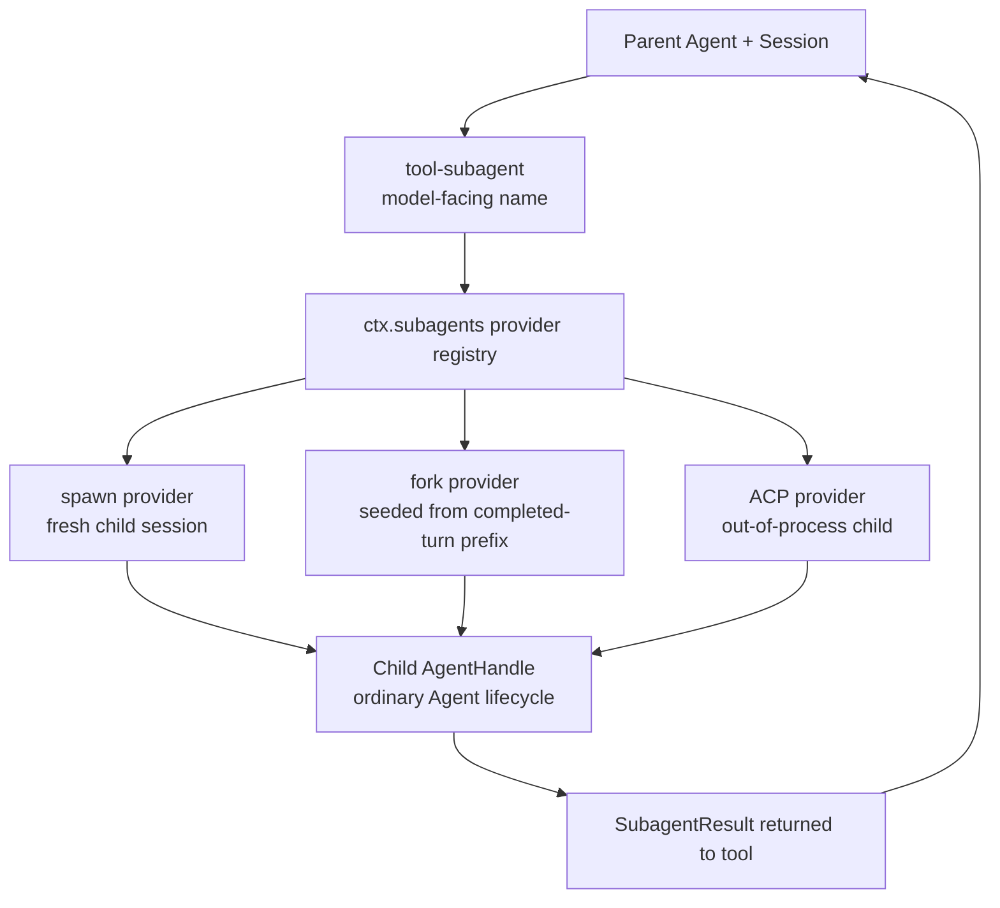

<!-- Generated by scripts/gen-doc-graphs.ts - do not edit by hand.
     Run `pnpm run gen-doc-graphs` to regenerate. -->

# Subagent And Session Lineage

Maintenance mode: curated Mermaid flow; provider inventory is visible in the generated capability seam graph.

This graph keeps delegation semantics separate from hook observation. A subagent backend creates an ordinary child agent/session through the shared provider registry.

The hooks stack adds richer lifecycle observation around child runs; the core ownership rule stays the same: the provider owns the child handle and must dispose it.
