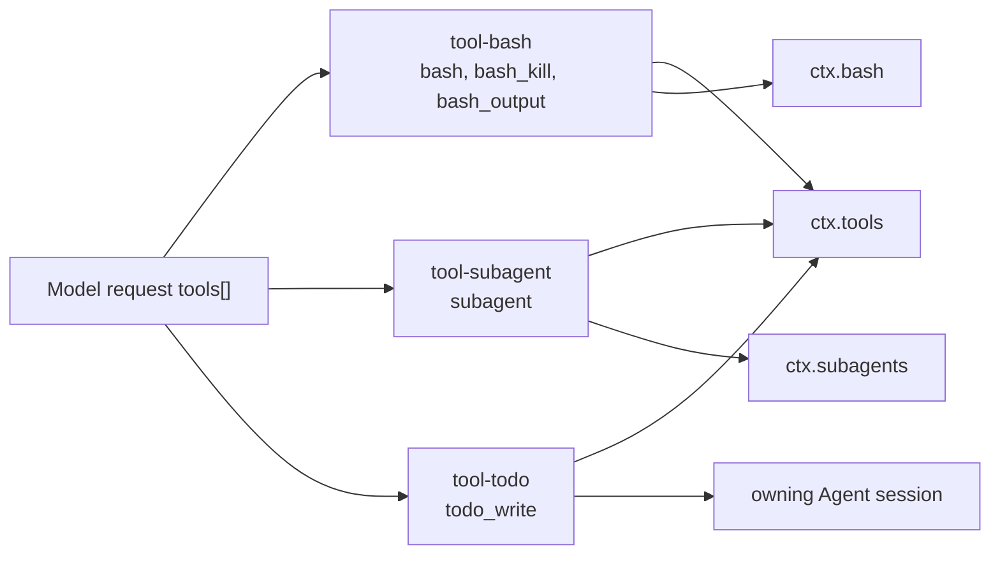

<!-- Generated by scripts/gen-doc-graphs.ts - do not edit by hand.
     Run `pnpm run gen-doc-graphs` to regenerate. -->

# Tool Affordance Map

Maintenance mode: hybrid: tool names/schemas are boot-harvested from shipped tool plugins; required services and shipped aliases are classified in `scripts/gen-doc-graphs.ts` with a completeness guard.

This page connects the model-visible tools to the plugin packages and service seams behind them. For exact JSON Schemas, see [tool-catalog/tools.md](../tool-catalog/tools.md).

| Tool package | Model-visible names | Requires | Writes / affects | Shipped aliases | Note |
| --- | --- | --- | --- | --- | --- |
| `@deepseek-ai/dsh-tool-bash` | `bash`, `bash_kill`, `bash_output` | `ctx.tools`, `ctx.bash` | `tool/call`, `tool/result`, `context/message via agent.inject() for background completion notices` | - | The bash/bash_output/bash_kill tools are model-facing consumers of the bash executor seam. |
| `@deepseek-ai/dsh-tool-subagent` | `subagent` | `ctx.tools`, `ctx.subagents` | `tool/call`, `tool/result`, `child session events through the chosen provider` | `subagent`, `subagent_fork` | The default package schema registers subagent; shipped coding/acp configs load it twice to expose spawn and fork backends. |
| `@deepseek-ai/dsh-tool-todo` | `todo_write` | `ctx.tools`, `owning Agent session` | `tool/call`, `todo/write`, `tool/result` | - | todo_write is session-owned state; UIs render the latest todo/write event as a checklist or ACP plan. |
