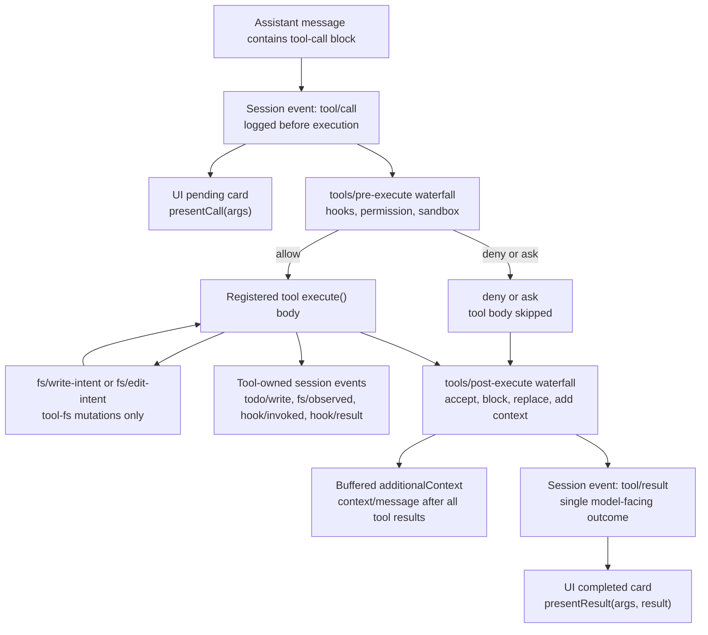

<!-- Generated by scripts/gen-doc-graphs.ts - do not edit by hand.
     Run `pnpm run gen-doc-graphs` to regenerate. -->

# Tool Execution Pipeline

Maintenance mode: curated Mermaid flow; exact tool schemas and event signatures live in generated catalogs.

This graph shows where policy, hooks, sandboxing, filesystem guards, result rewriting, and UI rendering fit without changing the loop. The key extension points are the `tools/pre-execute` and `tools/post-execute` waterfalls.

Filesystem read-before-edit checks live below `tool-fs` on the `fs/*` event gate, while hook bridges and future permission prompts live on the generic tool waterfalls. That split lets the same hooks observe bash, fs, web, todo, and subagent calls without coupling those tools to one policy service.
