<!-- Generated by scripts/gen-module-graph.ts — do not edit by hand.
     Run `pnpm run gen-module-graph` to regenerate. -->

# Module dependency graph

Inter-package dependencies among the `@deepseek-ai/dsh-*` harness packages, derived from each package's `peerDependencies` (the canonical runtime-dependency signal). An edge `a --> b` means package `a` depends on package `b`. Names have the `@deepseek-ai/dsh-` prefix stripped.

```mermaid
graph TD
  bash --> brand
  llm --> brand
  bash-local --> bash
  llm-deepseek --> llm
  llm-pi-ai --> llm
  session --> brand
  session --> llm
  system-prompt --> llm
  agent --> brand
  agent --> llm
  agent --> session
  compact --> llm
  compact --> session
  llm-replay --> llm
  llm-replay --> session
  session-persistence --> session
  compact-basic --> agent
  compact-basic --> compact
  compact-basic --> llm
  compact-basic --> session
  invariants --> agent
  invariants --> llm
  invariants --> session
  session-persistence-jsonl --> session
  session-persistence-jsonl --> session-persistence
  session-persistence-sqlite --> session
  session-persistence-sqlite --> session-persistence
  tools --> agent
  tools --> llm
  tools --> system-prompt
  ui-stdio --> agent
  ui-stdio --> llm
  ui-stdio --> session
  acp --> agent
  acp --> llm
  acp --> session
  acp --> session-persistence
  acp --> tools
  agent-loop --> agent
  agent-loop --> llm
  agent-loop --> session
  agent-loop --> session-persistence
  agent-loop --> system-prompt
  agent-loop --> tools
  subagent --> agent
  subagent --> llm
  subagent --> tools
  tool-bash --> agent
  tool-bash --> bash
  tool-bash --> llm
  tool-bash --> tools
  tool-todo --> agent
  tool-todo --> session
  tool-todo --> tools
  agent-core --> agent
  agent-core --> agent-loop
  agent-core --> invariants
  agent-core --> llm
  agent-core --> session
  agent-core --> system-prompt
  agent-core --> tool-bash
  agent-core --> tools
  subagent-acp --> agent
  subagent-acp --> llm
  subagent-acp --> subagent
  subagent-inprocess --> agent
  subagent-inprocess --> llm
  subagent-inprocess --> session
  subagent-inprocess --> subagent
  subagent-mock --> agent
  subagent-mock --> llm
  subagent-mock --> subagent
  tool-subagent --> agent
  tool-subagent --> llm
  tool-subagent --> subagent
  tool-subagent --> tools
  acp-agent --> acp
  acp-agent --> agent-core
  acp-agent --> session-persistence-jsonl
  stdio-agent --> agent
  stdio-agent --> agent-core
  stdio-agent --> session
  stdio-agent --> session-persistence-jsonl
  stdio-agent --> ui-stdio
  subagent-fork --> agent
  subagent-fork --> session
  subagent-fork --> subagent
  subagent-fork --> subagent-inprocess
  subagent-spawn --> subagent
  subagent-spawn --> subagent-inprocess
```

| Package | Depends on |
| --- | --- |
| `brand` | — |
| `bash` | `brand` |
| `llm` | `brand` |
| `bash-local` | `bash` |
| `llm-deepseek` | `llm` |
| `llm-pi-ai` | `llm` |
| `session` | `brand`, `llm` |
| `system-prompt` | `llm` |
| `agent` | `brand`, `llm`, `session` |
| `compact` | `llm`, `session` |
| `llm-replay` | `llm`, `session` |
| `session-persistence` | `session` |
| `compact-basic` | `agent`, `compact`, `llm`, `session` |
| `invariants` | `agent`, `llm`, `session` |
| `session-persistence-jsonl` | `session`, `session-persistence` |
| `session-persistence-sqlite` | `session`, `session-persistence` |
| `tools` | `agent`, `llm`, `system-prompt` |
| `ui-stdio` | `agent`, `llm`, `session` |
| `acp` | `agent`, `llm`, `session`, `session-persistence`, `tools` |
| `agent-loop` | `agent`, `llm`, `session`, `session-persistence`, `system-prompt`, `tools` |
| `subagent` | `agent`, `llm`, `tools` |
| `tool-bash` | `agent`, `bash`, `llm`, `tools` |
| `tool-todo` | `agent`, `session`, `tools` |
| `agent-core` | `agent`, `agent-loop`, `invariants`, `llm`, `session`, `system-prompt`, `tool-bash`, `tools` |
| `subagent-acp` | `agent`, `llm`, `subagent` |
| `subagent-inprocess` | `agent`, `llm`, `session`, `subagent` |
| `subagent-mock` | `agent`, `llm`, `subagent` |
| `tool-subagent` | `agent`, `llm`, `subagent`, `tools` |
| `acp-agent` | `acp`, `agent-core`, `session-persistence-jsonl` |
| `stdio-agent` | `agent`, `agent-core`, `session`, `session-persistence-jsonl`, `ui-stdio` |
| `subagent-fork` | `agent`, `session`, `subagent`, `subagent-inprocess` |
| `subagent-spawn` | `subagent`, `subagent-inprocess` |
