<!-- Generated by scripts/gen-module-graph.ts — do not edit by hand.
     Run `pnpm run gen-module-graph` to regenerate. -->

# Module dependency graph

```mermaid
flowchart TD
  subgraph group_util["packages/util"]
    pkg_brand["brand"]
  end
  subgraph group_llm["packages/llm"]
    pkg_llm["llm"]
    pkg_llm_deepseek["llm-deepseek"]
    pkg_llm_pi_ai["llm-pi-ai"]
  end
  subgraph group_core["packages/core"]
    pkg_agent["agent"]
    pkg_agent_core["agent-core"]
    pkg_agent_loop["agent-loop"]
    pkg_session["session"]
    pkg_system_prompt["system-prompt"]
    pkg_tools["tools"]
  end
  subgraph group_bash["packages/bash"]
    pkg_bash["bash"]
    pkg_bash_local["bash-local"]
    pkg_tool_bash["tool-bash"]
  end
  subgraph group_fs["packages/fs"]
    pkg_fs["fs"]
    pkg_fs_local["fs-local"]
    pkg_fs_policy["fs-policy"]
    pkg_tool_fs["tool-fs"]
  end
  subgraph group_compact["packages/compact"]
    pkg_compact["compact"]
    pkg_compact_basic["compact-basic"]
  end
  subgraph group_subagent["packages/subagent"]
    pkg_subagent["subagent"]
    pkg_subagent_acp["subagent-acp"]
    pkg_subagent_fork["subagent-fork"]
    pkg_subagent_inprocess["subagent-inprocess"]
    pkg_subagent_spawn["subagent-spawn"]
    pkg_tool_subagent["tool-subagent"]
  end
  subgraph group_web["packages/web"]
    pkg_tool_web["tool-web"]
    pkg_web["web"]
    pkg_web_fetch_local["web-fetch-local"]
    pkg_web_search_deepseek["web-search-deepseek"]
    pkg_web_search_exa["web-search-exa"]
    pkg_web_search_perplexity["web-search-perplexity"]
  end
  subgraph group_todo["packages/todo"]
    pkg_tool_todo["tool-todo"]
  end
  subgraph group_hooks["packages/hooks"]
    pkg_hook_protocol["hook-protocol"]
    pkg_hooks_claude["hooks-claude"]
    pkg_hooks_codex["hooks-codex"]
  end
  subgraph group_session_persistence["packages/session-persistence"]
    pkg_session_persistence["session-persistence"]
    pkg_session_persistence_jsonl["session-persistence-jsonl"]
    pkg_session_persistence_sqlite["session-persistence-sqlite"]
  end
  subgraph group_support["packages/support"]
    pkg_acp_snapshot["acp-snapshot"]
    pkg_invariants["invariants"]
    pkg_llm_replay["llm-replay"]
    pkg_subagent_mock["subagent-mock"]
  end
  subgraph group_ui["packages/ui"]
    pkg_acp["acp"]
    pkg_acp_agent["acp-agent"]
    pkg_app_boot["app-boot"]
    pkg_stdio_agent["stdio-agent"]
  end
  subgraph group_code_runtime["packages/code-runtime"]
    pkg_code_runtime["code-runtime"]
  end
  pkg_llm --> pkg_brand
  pkg_bash --> pkg_brand
  pkg_llm_deepseek --> pkg_llm
  pkg_llm_pi_ai --> pkg_llm
  pkg_session --> pkg_brand
  pkg_session --> pkg_llm
  pkg_system_prompt --> pkg_llm
  pkg_bash_local --> pkg_bash
  pkg_fs --> pkg_brand
  pkg_fs --> pkg_llm
  pkg_web --> pkg_llm
  pkg_agent --> pkg_brand
  pkg_agent --> pkg_llm
  pkg_agent --> pkg_session
  pkg_agent --> pkg_system_prompt
  pkg_fs_local --> pkg_fs
  pkg_fs_policy --> pkg_fs
  pkg_compact --> pkg_llm
  pkg_compact --> pkg_session
  pkg_web_fetch_local --> pkg_web
  pkg_web_search_deepseek --> pkg_web
  pkg_web_search_exa --> pkg_web
  pkg_web_search_perplexity --> pkg_web
  pkg_hook_protocol --> pkg_bash
  pkg_hook_protocol --> pkg_session
  pkg_session_persistence --> pkg_session
  pkg_llm_replay --> pkg_llm
  pkg_llm_replay --> pkg_session
  pkg_tools --> pkg_agent
  pkg_tools --> pkg_llm
  pkg_tools --> pkg_system_prompt
  pkg_compact_basic --> pkg_agent
  pkg_compact_basic --> pkg_compact
  pkg_compact_basic --> pkg_llm
  pkg_compact_basic --> pkg_session
  pkg_session_persistence_jsonl --> pkg_session
  pkg_session_persistence_jsonl --> pkg_session_persistence
  pkg_session_persistence_sqlite --> pkg_session
  pkg_session_persistence_sqlite --> pkg_session_persistence
  pkg_invariants --> pkg_agent
  pkg_invariants --> pkg_llm
  pkg_invariants --> pkg_session
  pkg_agent_loop --> pkg_agent
  pkg_agent_loop --> pkg_llm
  pkg_agent_loop --> pkg_session
  pkg_agent_loop --> pkg_session_persistence
  pkg_agent_loop --> pkg_system_prompt
  pkg_agent_loop --> pkg_tools
  pkg_tool_bash --> pkg_agent
  pkg_tool_bash --> pkg_bash
  pkg_tool_bash --> pkg_llm
  pkg_tool_bash --> pkg_system_prompt
  pkg_tool_bash --> pkg_tools
  pkg_tool_fs --> pkg_fs
  pkg_tool_fs --> pkg_llm
  pkg_tool_fs --> pkg_session
  pkg_tool_fs --> pkg_system_prompt
  pkg_tool_fs --> pkg_tools
  pkg_subagent --> pkg_agent
  pkg_subagent --> pkg_llm
  pkg_subagent --> pkg_tools
  pkg_tool_web --> pkg_llm
  pkg_tool_web --> pkg_system_prompt
  pkg_tool_web --> pkg_tools
  pkg_tool_web --> pkg_web
  pkg_tool_todo --> pkg_agent
  pkg_tool_todo --> pkg_session
  pkg_tool_todo --> pkg_tools
  pkg_hooks_codex --> pkg_agent
  pkg_hooks_codex --> pkg_hook_protocol
  pkg_hooks_codex --> pkg_llm
  pkg_hooks_codex --> pkg_session
  pkg_hooks_codex --> pkg_tools
  pkg_acp --> pkg_agent
  pkg_acp --> pkg_llm
  pkg_acp --> pkg_session
  pkg_acp --> pkg_session_persistence
  pkg_acp --> pkg_tools
  pkg_agent_core --> pkg_agent
  pkg_agent_core --> pkg_agent_loop
  pkg_agent_core --> pkg_invariants
  pkg_agent_core --> pkg_llm
  pkg_agent_core --> pkg_session
  pkg_agent_core --> pkg_system_prompt
  pkg_agent_core --> pkg_tool_bash
  pkg_agent_core --> pkg_tools
  pkg_subagent_acp --> pkg_agent
  pkg_subagent_acp --> pkg_llm
  pkg_subagent_acp --> pkg_subagent
  pkg_subagent_inprocess --> pkg_agent
  pkg_subagent_inprocess --> pkg_llm
  pkg_subagent_inprocess --> pkg_session
  pkg_subagent_inprocess --> pkg_subagent
  pkg_subagent_inprocess --> pkg_system_prompt
  pkg_subagent_inprocess --> pkg_tools
  pkg_tool_subagent --> pkg_agent
  pkg_tool_subagent --> pkg_llm
  pkg_tool_subagent --> pkg_subagent
  pkg_tool_subagent --> pkg_tools
  pkg_hooks_claude --> pkg_agent
  pkg_hooks_claude --> pkg_hook_protocol
  pkg_hooks_claude --> pkg_llm
  pkg_hooks_claude --> pkg_session
  pkg_hooks_claude --> pkg_subagent
  pkg_hooks_claude --> pkg_tools
  pkg_subagent_mock --> pkg_agent
  pkg_subagent_mock --> pkg_llm
  pkg_subagent_mock --> pkg_subagent
  pkg_subagent_fork --> pkg_agent
  pkg_subagent_fork --> pkg_session
  pkg_subagent_fork --> pkg_subagent
  pkg_subagent_fork --> pkg_subagent_inprocess
  pkg_subagent_spawn --> pkg_subagent
  pkg_subagent_spawn --> pkg_subagent_inprocess
  pkg_acp_agent --> pkg_acp
  pkg_acp_agent --> pkg_agent_core
  pkg_acp_agent --> pkg_app_boot
  pkg_acp_agent --> pkg_session_persistence_jsonl
  pkg_stdio_agent --> pkg_agent
  pkg_stdio_agent --> pkg_agent_core
  pkg_stdio_agent --> pkg_app_boot
  pkg_stdio_agent --> pkg_llm
  pkg_stdio_agent --> pkg_session
  pkg_stdio_agent --> pkg_session_persistence_jsonl
```

Inter-package dependencies among the `@deepseek-ai/dsh-*` harness packages, derived from each package's `peerDependencies` (the canonical runtime-dependency signal) and grouped by the `packages/<group>/<pkg>` hierarchy. An edge `a --> b` means package `a` depends on package `b`. Names have the `@deepseek-ai/dsh-` prefix stripped.

| Package | Group | Depends on |
| --- | --- | --- |
| [`brand`](../packages/util/brand) | `util` | — |
| [`acp-snapshot`](../packages/support/acp-snapshot) | `support` | — |
| [`app-boot`](../packages/ui/app-boot) | `ui` | — |
| [`code-runtime`](../packages/code-runtime/code-runtime) | `code-runtime` | — |
| [`llm`](../packages/llm/llm) | `llm` | [`brand`](../packages/util/brand) |
| [`bash`](../packages/bash/bash) | `bash` | [`brand`](../packages/util/brand) |
| [`llm-deepseek`](../packages/llm/llm-deepseek) | `llm` | [`llm`](../packages/llm/llm) |
| [`llm-pi-ai`](../packages/llm/llm-pi-ai) | `llm` | [`llm`](../packages/llm/llm) |
| [`session`](../packages/core/session) | `core` | [`brand`](../packages/util/brand), [`llm`](../packages/llm/llm) |
| [`system-prompt`](../packages/core/system-prompt) | `core` | [`llm`](../packages/llm/llm) |
| [`bash-local`](../packages/bash/bash-local) | `bash` | [`bash`](../packages/bash/bash) |
| [`fs`](../packages/fs/fs) | `fs` | [`brand`](../packages/util/brand), [`llm`](../packages/llm/llm) |
| [`web`](../packages/web/web) | `web` | [`llm`](../packages/llm/llm) |
| [`agent`](../packages/core/agent) | `core` | [`brand`](../packages/util/brand), [`llm`](../packages/llm/llm), [`session`](../packages/core/session), [`system-prompt`](../packages/core/system-prompt) |
| [`fs-local`](../packages/fs/fs-local) | `fs` | [`fs`](../packages/fs/fs) |
| [`fs-policy`](../packages/fs/fs-policy) | `fs` | [`fs`](../packages/fs/fs) |
| [`compact`](../packages/compact/compact) | `compact` | [`llm`](../packages/llm/llm), [`session`](../packages/core/session) |
| [`web-fetch-local`](../packages/web/web-fetch-local) | `web` | [`web`](../packages/web/web) |
| [`web-search-deepseek`](../packages/web/web-search-deepseek) | `web` | [`web`](../packages/web/web) |
| [`web-search-exa`](../packages/web/web-search-exa) | `web` | [`web`](../packages/web/web) |
| [`web-search-perplexity`](../packages/web/web-search-perplexity) | `web` | [`web`](../packages/web/web) |
| [`hook-protocol`](../packages/hooks/hook-protocol) | `hooks` | [`bash`](../packages/bash/bash), [`session`](../packages/core/session) |
| [`session-persistence`](../packages/session-persistence/session-persistence) | `session-persistence` | [`session`](../packages/core/session) |
| [`llm-replay`](../packages/support/llm-replay) | `support` | [`llm`](../packages/llm/llm), [`session`](../packages/core/session) |
| [`tools`](../packages/core/tools) | `core` | [`agent`](../packages/core/agent), [`llm`](../packages/llm/llm), [`system-prompt`](../packages/core/system-prompt) |
| [`compact-basic`](../packages/compact/compact-basic) | `compact` | [`agent`](../packages/core/agent), [`compact`](../packages/compact/compact), [`llm`](../packages/llm/llm), [`session`](../packages/core/session) |
| [`session-persistence-jsonl`](../packages/session-persistence/session-persistence-jsonl) | `session-persistence` | [`session`](../packages/core/session), [`session-persistence`](../packages/session-persistence/session-persistence) |
| [`session-persistence-sqlite`](../packages/session-persistence/session-persistence-sqlite) | `session-persistence` | [`session`](../packages/core/session), [`session-persistence`](../packages/session-persistence/session-persistence) |
| [`invariants`](../packages/support/invariants) | `support` | [`agent`](../packages/core/agent), [`llm`](../packages/llm/llm), [`session`](../packages/core/session) |
| [`agent-loop`](../packages/core/agent-loop) | `core` | [`agent`](../packages/core/agent), [`llm`](../packages/llm/llm), [`session`](../packages/core/session), [`session-persistence`](../packages/session-persistence/session-persistence), [`system-prompt`](../packages/core/system-prompt), [`tools`](../packages/core/tools) |
| [`tool-bash`](../packages/bash/tool-bash) | `bash` | [`agent`](../packages/core/agent), [`bash`](../packages/bash/bash), [`llm`](../packages/llm/llm), [`system-prompt`](../packages/core/system-prompt), [`tools`](../packages/core/tools) |
| [`tool-fs`](../packages/fs/tool-fs) | `fs` | [`fs`](../packages/fs/fs), [`llm`](../packages/llm/llm), [`session`](../packages/core/session), [`system-prompt`](../packages/core/system-prompt), [`tools`](../packages/core/tools) |
| [`subagent`](../packages/subagent/subagent) | `subagent` | [`agent`](../packages/core/agent), [`llm`](../packages/llm/llm), [`tools`](../packages/core/tools) |
| [`tool-web`](../packages/web/tool-web) | `web` | [`llm`](../packages/llm/llm), [`system-prompt`](../packages/core/system-prompt), [`tools`](../packages/core/tools), [`web`](../packages/web/web) |
| [`tool-todo`](../packages/todo/tool-todo) | `todo` | [`agent`](../packages/core/agent), [`session`](../packages/core/session), [`tools`](../packages/core/tools) |
| [`hooks-codex`](../packages/hooks/hooks-codex) | `hooks` | [`agent`](../packages/core/agent), [`hook-protocol`](../packages/hooks/hook-protocol), [`llm`](../packages/llm/llm), [`session`](../packages/core/session), [`tools`](../packages/core/tools) |
| [`acp`](../packages/ui/acp) | `ui` | [`agent`](../packages/core/agent), [`llm`](../packages/llm/llm), [`session`](../packages/core/session), [`session-persistence`](../packages/session-persistence/session-persistence), [`tools`](../packages/core/tools) |
| [`agent-core`](../packages/core/agent-core) | `core` | [`agent`](../packages/core/agent), [`agent-loop`](../packages/core/agent-loop), [`invariants`](../packages/support/invariants), [`llm`](../packages/llm/llm), [`session`](../packages/core/session), [`system-prompt`](../packages/core/system-prompt), [`tool-bash`](../packages/bash/tool-bash), [`tools`](../packages/core/tools) |
| [`subagent-acp`](../packages/subagent/subagent-acp) | `subagent` | [`agent`](../packages/core/agent), [`llm`](../packages/llm/llm), [`subagent`](../packages/subagent/subagent) |
| [`subagent-inprocess`](../packages/subagent/subagent-inprocess) | `subagent` | [`agent`](../packages/core/agent), [`llm`](../packages/llm/llm), [`session`](../packages/core/session), [`subagent`](../packages/subagent/subagent), [`system-prompt`](../packages/core/system-prompt), [`tools`](../packages/core/tools) |
| [`tool-subagent`](../packages/subagent/tool-subagent) | `subagent` | [`agent`](../packages/core/agent), [`llm`](../packages/llm/llm), [`subagent`](../packages/subagent/subagent), [`tools`](../packages/core/tools) |
| [`hooks-claude`](../packages/hooks/hooks-claude) | `hooks` | [`agent`](../packages/core/agent), [`hook-protocol`](../packages/hooks/hook-protocol), [`llm`](../packages/llm/llm), [`session`](../packages/core/session), [`subagent`](../packages/subagent/subagent), [`tools`](../packages/core/tools) |
| [`subagent-mock`](../packages/support/subagent-mock) | `support` | [`agent`](../packages/core/agent), [`llm`](../packages/llm/llm), [`subagent`](../packages/subagent/subagent) |
| [`subagent-fork`](../packages/subagent/subagent-fork) | `subagent` | [`agent`](../packages/core/agent), [`session`](../packages/core/session), [`subagent`](../packages/subagent/subagent), [`subagent-inprocess`](../packages/subagent/subagent-inprocess) |
| [`subagent-spawn`](../packages/subagent/subagent-spawn) | `subagent` | [`subagent`](../packages/subagent/subagent), [`subagent-inprocess`](../packages/subagent/subagent-inprocess) |
| [`acp-agent`](../packages/ui/acp-agent) | `ui` | [`acp`](../packages/ui/acp), [`agent-core`](../packages/core/agent-core), [`app-boot`](../packages/ui/app-boot), [`session-persistence-jsonl`](../packages/session-persistence/session-persistence-jsonl) |
| [`stdio-agent`](../packages/ui/stdio-agent) | `ui` | [`agent`](../packages/core/agent), [`agent-core`](../packages/core/agent-core), [`app-boot`](../packages/ui/app-boot), [`llm`](../packages/llm/llm), [`session`](../packages/core/session), [`session-persistence-jsonl`](../packages/session-persistence/session-persistence-jsonl) |
