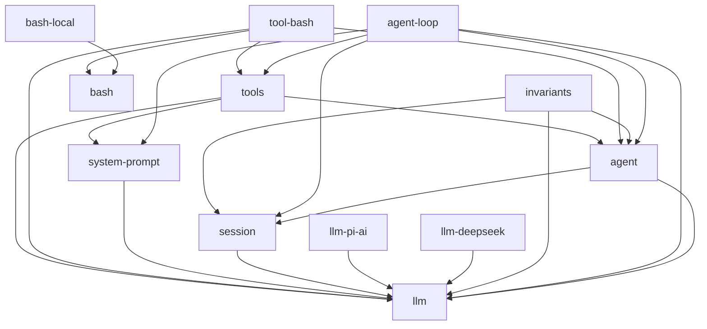

<!-- Generated by scripts/gen-module-graph.ts — do not edit by hand.
     Run `pnpm run gen-module-graph` to regenerate. -->

# Module dependency graph

Inter-package dependencies among the `@deepseek-ai/dsh-*` harness packages, derived from each
package's `peerDependencies` (the canonical runtime-dependency signal). An edge `a --> b` means
package `a` depends on package `b`. Names have the `@deepseek-ai/dsh-` prefix stripped.

| Package | Depends on |
| --- | --- |
| `agent` | `llm`, `session` |
| `agent-loop` | `agent`, `llm`, `session`, `system-prompt`, `tools` |
| `bash` | — |
| `bash-local` | `bash` |
| `invariants` | `agent`, `llm`, `session` |
| `llm` | — |
| `llm-deepseek` | `llm` |
| `llm-pi-ai` | `llm` |
| `session` | `llm` |
| `system-prompt` | `llm` |
| `tool-bash` | `agent`, `bash`, `llm`, `tools` |
| `tools` | `agent`, `llm`, `system-prompt` |
