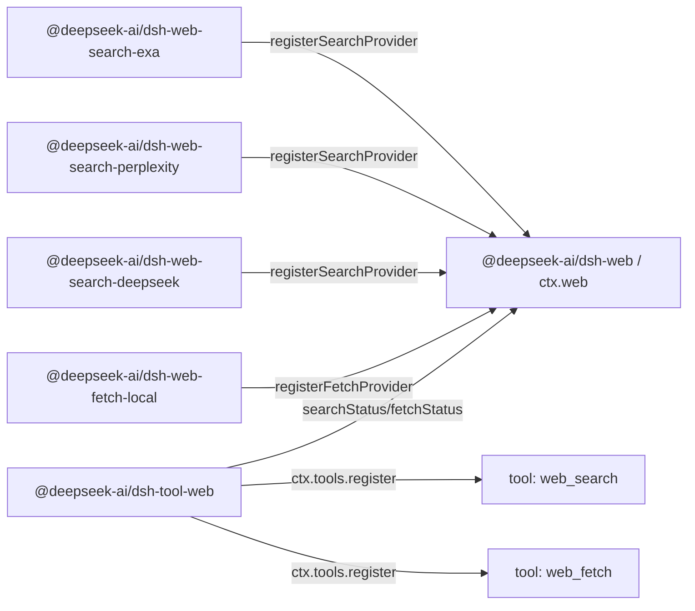

# RFC: Web capability seam - stable tools over multiple providers

Status: implemented

## Problem

The harness needs model-facing web tools without binding the model contract to one vendor's API shape. Search is the immediate pressure point: the first version should support at least Exa search and Perplexity search — two deliberately different provider shapes (Exa returns a flat `results[]` of `{title, url, highlights, publishedDate}`; Perplexity returns a generated answer plus citations), which is what proves the normalized seam does not just mirror one vendor. Fetch is a separate capability: an anonymous public HTTP(S) fetch backend has transport, security, redirect, decoding, and size-limit concerns that are not the same as provider-backed search.

The model-facing surface should stay stable while backends change. A search provider swap should not change how the model asks for a query, and a fetch implementation swap should not change how the model asks for a URL. Conversely, a provider package should not expose its own model-facing tool schema just because it has extra provider-specific knobs.

Putting search and fetch directly in `dsh-tool-web` would make the model-facing tool own provider selection, backend request mapping, transport policy, result normalization, prompt guidance, presentation, and schema registration at once. Letting each provider register its own tool has the opposite problem: tool availability, names, descriptions, and parameters would depend on whichever provider packages happen to load, and provider-specific fields would leak into the model contract.

There is also a provider-selection question. Existing `tool-bash` and `tool-fs` can rely on Cordis `inject` because there is one backend service key. Web has two independent capabilities (`search` and `fetch`) and potentially multiple providers per capability. `inject: ['web']` proves the seam exists; it does not prove a usable search or fetch provider exists, and it does not define which provider should win when several are registered.

## Proposal

Introduce web access as a first-class capability seam following [the capability-seam RFC](../../implemented/architecture/2026-06-13-capability-seams.md):

1. `@deepseek-ai/dsh-web` (`packages/web/web`) owns `ctx.web`, provider registration, provider selection, shared request/result vocabulary, and web-specific errors.
2. Provider packages implement concrete backends and register capabilities with `ctx.web`, for example `@deepseek-ai/dsh-web-search-exa`, `@deepseek-ai/dsh-web-search-perplexity`, `@deepseek-ai/dsh-web-search-deepseek`, and `@deepseek-ai/dsh-web-fetch-local`.
3. `@deepseek-ai/dsh-tool-web` (`packages/web/tool-web`) owns the model-facing `web_search` and `web_fetch` tool schemas, prompt sections, argument validation, result formatting, and tool-owned presentation over `ctx.web`.

Providers do not register tools. Providers register capabilities. `dsh-tool-web` is the only owner of model-facing names, descriptions, prompt guidance, JSON schemas, and presentation.

Search and fetch are separate capabilities and separate model-facing tools, but they are deliberately one seam. `ctx.web` is a single web-access middle layer between provider packages on one side and the tool consumer on the other: one service to inject, one provider-selection policy owner, one abort/error vocabulary, one place a product configures "how this harness reaches the web." The two halves do not share a request schema and have no shared business logic — search normalizes provider-backed discovery into a portable result with optional answer text and citeable sources, while fetch retrieves a concrete public HTTP(S) URL and returns a status code plus bounded decoded content — but they are parallel registries on one capability surface, not two surfaces. The cost is a `WebService` whose registry/status/exec methods come in `Search`/`Fetch` pairs; that parallelism is intentional, not a missed extraction. Splitting into `dsh-search` and `dsh-fetch` is the rejected alternative below.

`dsh-tool-web` should register model-facing web tools when the product has enabled those tools and the `ctx.web` seam is present. Backend availability is an execution-time concern, not a schema-registration concern:

- Register `web_search` when web search is enabled for the product/app.
- Register `web_fetch` when web fetch is enabled for the product/app.
- Do not unregister a tool merely because its selected provider is missing, misconfigured, missing credentials, ambiguous, or temporarily unavailable.
- Resolve the provider at execution time, and return a structured `WebError` when the selected capability cannot run.

This keeps the model schema stable without making plugin load order, credential state, or HMR timing part of the model-facing contract. If web search is enabled but no usable search provider exists, `web_search` remains visible and execution fails with a structured `WebError` such as `WEB_PROVIDER_UNAVAILABLE` or `WEB_PROVIDER_CONFIGURED_UNAVAILABLE`. If a provider appears after `dsh-tool-web`, the next execution can use it without changing the schema. If a provider disappears mid-call, execution fails with a structured `WebError` instead of silently choosing another provider or falling through to `UNKNOWN_TOOL`.

The first version's provider-change signal is intentionally small. `web/providers-change` has no payload, carries no capability graph, and does not expose provider metadata. It means only "the provider registry changed; observers may recompute status from `ctx.web`." `searchStatus()` and `fetchStatus()` remain derived, not stored, and they are diagnostics plus execution-resolution inputs rather than tool-schema visibility switches.

## Package topology

The three-package interface/implementation/consumer split follows bash and filesystem, but the *interface* package is closer to the LLM seam. `LlmService` (`packages/llm/llm/src/index.ts`) is a name-keyed provider registry: `registerAdapter(models, adapter)` stores adapters in a `Map`, returns a disposer, throws `DUPLICATE_ADAPTER` on duplicate keys, and throws `NO_ADAPTER` at resolution time. `ctx.web` follows that registry shape, but has two capability kinds and one small selection-status layer so diagnostics and execution can explain why a search or fetch capability can or cannot run.

The dependency direction mirrors bash and filesystem:

```text
@deepseek-ai/dsh-tool-web  --depends on-->  @deepseek-ai/dsh-web  <--depends on--  @deepseek-ai/dsh-web-search-exa
        consumer                                 interface                       implementation
                                                                 <--depends on--  @deepseek-ai/dsh-web-search-perplexity
                                                                                  implementation
                                                                 <--depends on--  @deepseek-ai/dsh-web-search-deepseek
                                                                                  implementation
                                                                 <--depends on--  @deepseek-ai/dsh-web-fetch-local
                                                                                  implementation
```

At runtime, provider packages register capabilities with `ctx.web`; `tool-web` reads capability status and registers stable tools with `ctx.tools`:



`@deepseek-ai/dsh-web` depends only on Cordis and low-level harness support. It declares `ctx.web`, provider interfaces, request/result types, status types, and error codes. It does not import tool, agent, session, LLM, or provider packages.

Provider packages depend on `@deepseek-ai/dsh-web` and Cordis. They own credentials, endpoint config, provider-specific request mapping, provider-specific response parsing, and provider-specific error translation into `WebError`. They issue network requests with the platform-native `fetch` (Node 24), mirroring `@deepseek-ai/dsh-llm-deepseek`'s adapter, NOT a cordis HTTP-client service (`ctx.http`/`@cordisjs/plugin-http`) — even where a Perplexity provider's request is shaped like an OpenAI-compatible chat completion, that wire shape is a provider-private detail and does not make the provider depend on `ctx.llm`. A provider does NOT own the `ctx.web` key (two search providers cannot both own it): like `dsh-llm-deepseek`, each provider package is a function/namespace plugin (`inject: ['web']`) whose `apply` constructs the backend and calls `ctx.web.registerSearchProvider` / `registerFetchProvider`. `@deepseek-ai/dsh-web` is the `export default` service that owns the key.

`@deepseek-ai/dsh-tool-web` depends on `@deepseek-ai/dsh-web`, `@deepseek-ai/dsh-tools`, `@deepseek-ai/dsh-system-prompt`, and Cordis. It never imports concrete provider packages.

## `ctx.web` contract

`ctx.web` is a provider registry plus a provider-selecting execution surface. The registry half should stay close to `LlmService`: a `Map<id, provider>` per capability kind, `registerSearchProvider` / `registerFetchProvider` methods that return disposers, duplicate ids that throw `WebError`, and execution-time resolution that throws when the selected provider is absent or unusable. The exact TypeScript signatures belong to the implementation PR, but the seam should expose this shape:

```ts
interface WebSearchProvider {
  readonly id: string
  status(): WebProviderStatus
  search(request: WebSearchRequest, exec?: WebExecContext): Promise<WebSearchResult>
}

interface WebFetchProvider {
  readonly id: string
  status(): WebProviderStatus
  fetch(request: WebFetchRequest, exec?: WebExecContext): Promise<WebFetchResult>
}

interface WebService {
  registerSearchProvider(provider: WebSearchProvider): () => void
  registerFetchProvider(provider: WebFetchProvider): () => void

  searchStatus(): WebCapabilityStatus
  fetchStatus(): WebCapabilityStatus

  search(request: WebSearchRequest, exec?: WebExecContext): Promise<WebSearchResult>
  fetch(request: WebFetchRequest, exec?: WebExecContext): Promise<WebFetchResult>
}

interface WebExecContext {
  readonly signal?: AbortSignal
}
```

`WebExecContext` is execution control, not business input. The first version should carry only `signal` so `tool-web` can propagate turn cancellation, tool timeout, and agent disposal into provider network requests, SSE readers, and expensive decoding. It should not pass `ToolExecution` through the seam, because that would make `dsh-web` depend on `dsh-tools`.

`@deepseek-ai/dsh-web` should also declare a Cordis event named `web/providers-change`. Provider ids are stable strings and unique within their capability kind. Registering a duplicate search provider id or duplicate fetch provider id should fail rather than silently replace the old provider. Provider registration returns a disposer, emits `web/providers-change` after successful registration, and emits it again when the provider is disposed. The registry should follow the existing `ctx.tools.register()` / `ctx.systemPrompt.section()` pattern: wrap the mutation in `ctx.effect()`, install the rollback disposer before emitting `web/providers-change`, and let a throwing registration-time change listener roll back the just-added provider instead of leaking it into the registry.

## Provider status and selection

Provider status and capability selection are separate concepts, but both stay minimal. A provider reports only whether that concrete implementation is usable by cheap local checks such as credential presence or parseable endpoint config. A provider `status()` must not make network calls. The service reports whether the capability has a selected usable provider, or why execution would fail.

`LlmService` has no status type at all: availability is expressed as registry membership plus a resolution-time throw. `ctx.web` needs a small status answer because product apps, diagnostics, tests, and execution can report precise provider-selection failures without probing individual providers from the tool layer. Status must be derived from the configured provider id, registered providers, and each provider's cheap local `status()` on each call; it must not be stored as mutable service state.

`WebCapabilityStatus` stays intentionally small: `available` plus a `reason` discriminant, and the selected `providerId` on the available branch so diagnostics can report which provider won. It does NOT carry the per-reason payload (the unavailable provider id, the ambiguous candidate set, the underlying provider-unavailable reason). That branchable detail lives in the structured `WebError` thrown at execution time, which is the surface callers route on; duplicating it into the status union would give the same fact two homes that can disagree. `searchStatus()` / `fetchStatus()` answer "can this capability run, and if not, in which broad category does it fail" — enough for startup diagnostics and the execution-resolution decision — and the thrown error answers "exactly which provider/ids/reason."

`WebProviderStatus` is an input to selection, not a health system. `tool-web` reads only the aggregated `searchStatus()` / `fetchStatus()`, never each provider's `status()` directly, so selection policy has one owner.

```ts
type WebProviderStatus =
  | { readonly available: true }
  | { readonly available: false; readonly reason: 'missing-credential' | 'misconfigured' }

type WebCapabilityStatus =
  | { readonly available: true; readonly providerId: string }
  | { readonly available: false; readonly reason: 'none' | 'configured-missing' | 'configured-unavailable' | 'ambiguous' }
```

Selection must not depend on registration order. Cordis load order, config ordering, and HMR timing are not product semantics.

| Situation | Status / behavior |
|---|---|
| A configured provider id is registered and `status().available === true` | `available: true` for that provider |
| A configured provider id is not registered | `configured-missing`; execution fails with `WEB_PROVIDER_CONFIGURED_MISSING` |
| A configured provider id is registered but unavailable | `configured-unavailable`; execution fails with `WEB_PROVIDER_CONFIGURED_UNAVAILABLE` |
| No provider id is configured and exactly one provider for that kind is registered and available | `available: true` for that single provider |
| No provider id is configured and no provider for that kind is registered | `none`; execution fails with `WEB_PROVIDER_UNAVAILABLE` |
| No provider id is configured and multiple usable providers for that kind are registered | `ambiguous`; execution fails with `WEB_PROVIDER_AMBIGUOUS` rather than choosing by registration order |
| No provider id is configured and providers exist but none are usable | `none`; execution fails with `WEB_PROVIDER_UNAVAILABLE` |

The "single provider auto-selects" rule is for tests, demos, and simple deployments. Product configs should set explicit provider ids:

```yaml
- id: web
  name: '@deepseek-ai/dsh-web'
  config:
    searchProvider: exa
    fetchProvider: local-http

- id: web-search-exa
  name: '@deepseek-ai/dsh-web-search-exa'

- id: web-search-perplexity
  name: '@deepseek-ai/dsh-web-search-perplexity'

- id: web-search-deepseek
  name: '@deepseek-ai/dsh-web-search-deepseek'

- id: web-fetch-local
  name: '@deepseek-ai/dsh-web-fetch-local'

- id: tool-web
  name: '@deepseek-ai/dsh-tool-web'
```

Operational overrides such as environment variables may exist, but they must feed the same explicit selection path. For example, `DSH_WEB_SEARCH_PROVIDER=perplexity` is equivalent to config `searchProvider: perplexity`; it is not a hidden priority chain inside `dsh-tool-web`.

`ctx.web.search()` and `ctx.web.fetch()` resolve the provider at execution time using the same rules as the status query. If the selected capability is unavailable, they throw `WebError` with a structured code such as `WEB_PROVIDER_UNAVAILABLE`, `WEB_PROVIDER_CONFIGURED_MISSING`, `WEB_PROVIDER_CONFIGURED_UNAVAILABLE`, or `WEB_PROVIDER_AMBIGUOUS`. If no provider is explicitly configured and no usable provider exists, the status and execution error are both the generic `none` / `WEB_PROVIDER_UNAVAILABLE` case; the first version should not add a diagnostic summary of every unavailable provider.

## Search request and result schema

The first `web_search` model-facing tool should be small. The only model-facing argument is:

- `query`: required string.

`max_results` is NOT exposed to the model in the first version. It is a `dsh-tool-web`-layer decision: the tool sets the result bound — the `searchMaxResults` plugin config, default `8` (aligning with OpenCode's Exa default), mirroring `dsh-tool-fs`'s `readLimit` — and passes it to the seam as `maxResults` on the `WebSearchRequest`. Keeping it off the model schema means the model just asks a question and the product controls how much context comes back; the field can be promoted to a model-facing argument later without breaking the seam.

`maxResults` flows tool → seam → provider, and the bound is enforced on the way back:

- `dsh-tool-web` owns the value and puts it on `WebSearchRequest.maxResults`.
- `ctx.web` passes the request through to the selected provider unchanged.
- A provider should apply `maxResults` at the request layer when its API supports it (Exa's `numResults`), as a cost/latency optimization.
- `ctx.web` enforces the bound on the result: if a provider returns more than `maxResults` sources — because its API has no result-count control (Perplexity) or ignored the hint — the seam truncates `sources[]` to `maxResults` and sets `WebSearchResult.truncated` to `true` before returning. This makes the bound a single cross-provider guarantee the model-facing layer can rely on, rather than something each provider must remember to honor.

The seam request should not include provider-specific controls such as Perplexity model selection, search recency, domain filters, Exa `livecrawl`, Exa `type`, regional hints, generated-answer budgets, or search depth in the first version. Those fields should be added only when they have provider-neutral semantics that both the tool schema and selected providers can honor honestly.

```ts
interface WebSearchRequest {
  readonly query: string
  /** Upper bound on returned sources; the seam truncates to it. Omitted = no bound. `dsh-tool-web` always sets it. */
  readonly maxResults?: number
}

interface WebSearchResult {
  readonly providerId: string
  readonly query: string
  readonly content?: string
  readonly sources: readonly WebSearchSource[]
  readonly truncated: boolean
}

interface WebSearchSource {
  readonly url: string
  readonly title?: string
  readonly snippet?: string
  readonly publishedAt?: string
}
```

`content` is optional provider-generated answer text, search context, or summary. `sources[]` is the portable citation surface. A source always has a URL; title, snippet, and `publishedAt` are optional because not every provider returns them. `title` should not be required: Perplexity-style citations may provide only URLs, and forcing adapters to invent titles would make the seam lie. `dsh-tool-web` can render `title ?? hostname(url)` for display. `publishedAt` is an optional publication/crawl timestamp as an ISO-8601 string — Exa returns it as `publishedDate` on each result and Perplexity returns a `date` on search results, so it is real provider data, not derived; the seam carries it as a string and leaves date parsing to the consumer.

Exa search should map each entry of the provider's flat `results[]` into a `WebSearchSource`: `url` ← `url`, `title` ← `title`, `snippet` ← the first `highlights[]` entry (an entry with no highlight has no portable snippet and is dropped), `publishedAt` ← `publishedDate`. Exa returns no provider-generated answer, so `content` is omitted. Perplexity search should map `choices[0].message.content` to `content` and prefer the structured top-level `search_results[]` for `sources[]` — `url` ← `url`, `title` ← `title`, `snippet` ← `snippet` (often empty), `publishedAt` ← `date` — falling back to the URL-only `citations[]` array only when `search_results` is absent (those sources carry just a `url`). If a provider returns fewer structured fields than the seam supports, the adapter omits those optional fields.

Full page retrieval remains the job of `web_fetch(url)`. Search snippets are discovery context, not fetched page bodies.

## Fetch request and result schema

The first `web_fetch` implementation should be an anonymous public HTTP(S) fetch provider, likely `local-http`. It should fetch bytes from a concrete URL, apply the basic transport hygiene below (http/https-only, credential rejection, byte/time caps, cross-origin redirect blocking), decode textual content, and return only the minimal model-useful result: final URL, status code, body, and truncation. It should not carry browser cookies, editor credentials, git credentials, internal auth tokens, or implicit access to private services. (Full SSRF / private-network blocking is deferred — see [Deferred work](#deferred-work).)

The first seam request should stay smaller than OpenCode's model-facing tool:

- `url`: required HTTP(S) URL.
- `timeoutMs`: optional positive number capped by the provider.

The seam request deliberately does not include `format`, `prompt`, or provider-specific extraction controls. `format` is a presentation decision over a fetched resource; `prompt` is a higher-level LLM summarization instruction; extraction APIs such as Firecrawl, Exa, Tavily, or Parallel may not expose a concrete HTTP response. If the product later needs provider-backed page extraction, add a separate `web_extract` capability or explicitly widen this RFC before implementation. Do not smuggle extract semantics into `web_fetch` by making every HTTP field optional.

HTTP status is part of the fetched resource state, not automatically a tool failure. A successful network fetch of a `404` or `500` response should return `WebFetchResult` with the status code and a bounded decoded body when the content type is supported. `WebError` is for failures to safely retrieve or represent the resource: invalid or blocked URL, redirect policy violation, timeout, abort, response too large, unsupported content type, provider failure, or network failure.

```ts
interface WebFetchRequest {
  readonly url: string
  readonly timeoutMs?: number
}

interface WebFetchResult {
  readonly providerId: string
  readonly url: string
  readonly statusCode: number
  readonly body: WebFetchBody
  readonly truncated: boolean
}

type WebFetchBody =
  | { readonly kind: 'html'; readonly content: string }
  | { readonly kind: 'text'; readonly content: string }
```

`WebFetchResult.url` is the final URL after allowed redirects. The request URL is already present in `WebFetchRequest`, so the first version should not add separate `requestedUrl` and `finalUrl` fields.

`WebFetchBody` is a CLOSED discriminated union owned by `dsh-web`, not a merge-extensible map. The merge-extensible pattern (`ContentBlockMap`) exists for variants that independent plugins introduce and the seam cannot foresee; body kinds are not that — `dsh-web` declares the kind, the fetch provider decodes it, and `dsh-tool-web` renders it, so a new kind is a coordinated change across three known packages, not a plugin extension. Keeping it closed buys compile-time exhaustiveness: consumers `switch` on `kind` ending in `default: assertNever(body, …)`, so adding a kind breaks compilation at every consumer that must render it (e.g. `tool-web`'s `html`→markdown vs `text` passthrough) until that arm is written. Each arm stays its own object literal even when the fields coincide today, leaving room for arm-specific fields (a future `pdf` body's `pageCount`, a `json` body's parsed value) without reshaping the type. Since the harness is unreleased, extending this closed union later is free (no migration, no compat shim).

The provider owns safe resource retrieval: URL validation, HTTP transport, redirect policy, timeout, abort propagation, byte caps, charset decoding, content-type classification, and binary rejection. `dsh-tool-web` owns presentation: HTML-to-markdown, HTML-to-text, truncation formatting for the model, and future summaries.

The fetch provider must define resource controls before the tool ships:

- Accept only `http:` and `https:` URLs.
- Reject credentials in URLs.
- Enforce maximum URL length, response byte cap, decoded body character cap, timeout, and redirect hop cap.
- Propagate abort signals through network fetches and expensive decoding.
- Automatically follow only same-origin redirects.
- Fail cross-origin redirects with `WEB_REDIRECT_BLOCKED`, requiring a fresh tool call and therefore a fresh provider/permission decision. (Claude Code's WebFetch uses this same model — it does not auto-follow a cross-host redirect; it returns the redirect target to the model for a fresh call.)
- Use an explicit product user agent rather than silently impersonating a browser by default.

SSRF / private-network protection (blocking private, loopback, link-local, multicast, and otherwise non-public destinations, with DNS-resolve-then-validate to defeat rebinding and per-hop re-validation on redirects) is **deferred** — see [Deferred work](#deferred-work). Until it lands, `web_fetch` is an SSRF primitive and must not be enabled in a deployment that can reach sensitive internal network targets.

## Tool consumer behavior

`dsh-tool-web` owns two `ToolDefinition`s: `web_search` and `web_fetch`. It owns model-facing JSON schemas, snake_case argument names, prompt sections, result rendering to `ContentBlock[]`, `presentCall`, and `presentResult`.

`dsh-tool-web` must not enumerate providers or call provider `status()` directly. Its execution path is `ctx.web.search()` / `ctx.web.fetch()`, and any optional startup diagnostics should read only `ctx.web.searchStatus()` / `ctx.web.fetchStatus()`. That keeps provider selection in one layer; otherwise the tool package could decide one provider is usable while execution resolves a different state.

Tool registration in the first version is a minimal stable sync:

1. On plugin startup, read the `dsh-tool-web` `Config` (`search?: boolean`, `fetch?: boolean`, both default `true`) that enables or disables each web tool.
2. If web search is enabled, register `web_search` (its disposer is fiber-scoped via the effect-based registry).
3. If web fetch is enabled, register `web_fetch` (likewise fiber-scoped).
4. Do not dispose either tool merely because `ctx.web.searchStatus()` or `ctx.web.fetchStatus()` is unavailable.
5. Disposing the `tool-web` fiber tears down its registrations automatically.

Provider status changes affect execution results and diagnostics, not whether the model-facing schema exists. If a product wants no web tools at all, it disables `dsh-tool-web` or the individual web tool in config; if it wants web tools but the backend is misconfigured, the model sees a structured tool error at execution time.

Prompt guidance should explain the semantic split: use `web_search` for discovery and current information, then use `web_fetch` when the model needs the content of a specific URL. The prompt and tool result should tell the model to cite relevant URLs with markdown links.

The model-facing output should be text-first because current tool results are `ContentBlock[]`, but the seam outcome should stay structured so UI presentation and future adapters do not have to scrape rendered text.

## Errors

`dsh-web` should define `WebError extends HarnessError` with stable codes. Initial codes should include only states that callers may reasonably branch on:

- `WEB_PROVIDER_UNAVAILABLE`
- `WEB_PROVIDER_CONFIGURED_MISSING`
- `WEB_PROVIDER_CONFIGURED_UNAVAILABLE`
- `WEB_PROVIDER_AMBIGUOUS`
- `WEB_DUPLICATE_PROVIDER`
- `WEB_INVALID_URL`
- `WEB_BLOCKED_URL`
- `WEB_REDIRECT_BLOCKED`
- `WEB_FETCH_TOO_LARGE`
- `WEB_FETCH_TIMEOUT`
- `WEB_ABORTED`
- `WEB_UNSUPPORTED_CONTENT_TYPE`
- `WEB_PROVIDER_ERROR`

`WEB_DUPLICATE_PROVIDER` is thrown synchronously from `registerSearchProvider` / `registerFetchProvider` when an id is already registered for that capability kind (the analogue of `LlmService`'s `DUPLICATE_ADAPTER`); it is a registration-time programming error, not an execution outcome, but shares the `WebError` code space so callers see one taxonomy. `WEB_PROVIDER_ERROR` is the catch-all for a provider's own failure surfaced through the seam, including network/transport failure in `web-fetch-local` (DNS, connection refused, TLS); the first version does not split out a separate `WEB_NETWORK` code, but the provider should set a descriptive message so the model and logs can tell a network failure from a provider API failure.

Tool execution should let these errors flow through `ToolRegistry.execute()`, which already converts `HarnessError` into an error tool result with structured metadata. The model gets a readable error message; hooks, tests, and UI code can route on the stable code.

## Tests

Tests should prove the seam contract without turning this RFC into an implementation checklist.

`dsh-web` tests cover provider registration and disposal, duplicate provider ids, `web/providers-change` emission, rollback when a registration-time `web/providers-change` listener throws, `searchStatus()` and `fetchStatus()` for the selection table above, execution-time provider resolution, `maxResults` truncation of `sources[]` with `truncated` set when a provider over-returns, abort propagation through `WebExecContext.signal`, and structured `WebError` codes.

Search provider tests cover request mapping, response parsing into `content` plus `sources[]`, missing credentials, provider errors, timeout/abort, truncation, and a self-skipping with-key smoke test for each real provider. Perplexity fixtures must include URL-only citations so the optional source fields stay honest.

`dsh-web-fetch-local` tests cover real HTTP behavior using a local test server: valid text and HTML fetches, non-2xx HTTP responses returned as results, byte/decoded-body caps, timeout, abort, invalid URLs, credential-in-URL rejection, cross-origin redirect blocking, unsupported content types, and product user agent. (Private-destination/SSRF blocking tests come with that deferred work.)

`dsh-tool-web` tests execute through the real tool registry. They verify schema registration follows product/app tool enablement rather than provider availability, unavailable or ambiguous providers produce structured execution errors, argument validation, formatting of successful search/fetch results, structured error propagation, and cleanup on disposal.

Integration tests should load the real seam, provider, and tool packages together and execute through `ctx.tools.execute()` rather than calling providers directly. If wiring the tools into an ACP-facing example changes editor-visible transcripts, add or update the relevant snapshot scenario in the same change.

At least one test must drive these packages through their REAL cordis Loader/export path, not a hand-built `ctx.plugin({...})` mount, so a broken export shape is caught (see [docs/postmortem/0001](../../../postmortem/0001-acp-default-export-drops-inject.md) and `packages/AGENTS.md` § plugin-export-shape). The two shapes need different guards: `dsh-web` is a **service** (`export default` the class) and a stray extra export would surface as a missing service; the provider packages and `dsh-tool-web` are **namespace plugins** (named `name`/`inject`/`apply`, NO default), and because each has `inject`, a stray `export default apply` makes `unwrapExports` drop the `inject` and the plugin throws `cannot get property … without inject` the moment it loads — so a Loader smoke that boots tool-web over `ctx.web` catches it (and each provider's registration test mounts it the real way and asserts no default export). Prove the guard bites: add `export default apply` to `tool-web`, watch the smoke go red, revert.

## Migration plan

This is new capability work, so no compatibility migration is required while the harness is unreleased.

Land the work in seam order:

1. Add `packages/web/web` with `ctx.web`, provider registration, provider status, capability status, selection, request/result/error types, and contract tests.
2. Add `packages/web/web-search-exa` with parser/unit tests and a self-skipping real-provider smoke test.
3. Add `packages/web/web-search-perplexity` with parser/unit tests and a self-skipping real-provider smoke test.
4. Add `packages/web/web-search-deepseek` with parser/unit tests and a self-skipping real-provider smoke test.
5. Add `packages/web/web-fetch-local` with local HTTP behavior tests.
6. Add `packages/web/tool-web` with config-driven tool registration, prompt sections, model formatting, presentation, and tool-registry tests.
7. Wire product app/example configs only after package behavior is stable, because tool schemas and prompt sections affect agent behavior and snapshots.
8. Update `docs/architecture.md`, `packages/README.md`, package READMEs, generated Cordis catalogs if new events/services are added, and maintenance scripts.

## Alternatives considered

### Let each provider register its own model-facing tool

This matches the most flexible provider-plugin systems: every provider can expose its full native schema. It is rejected for the harness because it gives provider packages ownership of model-facing names, descriptions, prompt guidance, and result formatting. Multiple search providers would produce duplicate tool names or provider-specific tool names, and the model would learn backend details instead of a stable product capability.

### Put provider dispatch directly in `dsh-tool-web`

This resembles OpenCode's local web search: one stable `websearch` tool dispatches to Exa or Parallel internally. It is acceptable for a small product path but wrong as a harness foundation. The tool package would own provider selection, credentials, request mapping, transport, response parsing, and presentation, making it hard to add Exa and Perplexity without baking their differences into the tool schema.

### Split search and fetch into two seams (`dsh-search`, `dsh-fetch`)

Tempting because the two halves share no request schema and no business logic, so each would map cleanly onto the bash/fs three-package template, and the `Search`/`Fetch` method-pair duplication on `WebService` would disappear. Rejected because the shared machinery — provider-id registry, registration-order-independent selection policy, abort propagation, the `WebError` taxonomy, and the product-facing "how this harness reaches the web" config surface — is real and would otherwise be duplicated across two near-identical seams. One `ctx.web` middle layer gives the product a single thing to inject and configure and gives provider selection one owner. The price is the parallel `searchX`/`fetchX` method pairs, which is accepted deliberately.

### Choose the first registered provider

Rejected. Registration order is not a product policy. It can change with config order, plugin loading, HMR, or refactors. Provider selection must be explicit, or automatic only when exactly one usable provider exists.

### Treat Firecrawl/Exa/Tavily/Parallel extraction as fetch

Rejected for the first version. Those providers often return extracted or summarized content rather than a concrete HTTP response. If the product needs extraction, design `web_extract` or deliberately widen the fetch seam later.

### Mirror Claude Code's `url + prompt` WebFetch shape

Rejected for the seam. `prompt` turns fetch into LLM summarization and couples public-web retrieval to a model provider. The harness seam should fetch and decode deterministically; `dsh-tool-web` can later offer summaries as a presentation mode without making `ctx.web` depend on `ctx.llm`.

## Risks

**The search schema may be too thin.** Exa and Perplexity both expose useful provider-specific controls. The first version should resist adding them until they can be defined provider-neutrally and enforced honestly by both tool registration and provider execution.

**Perplexity citations may be sparse.** A citation may be only a URL. Making `title` and `snippet` optional keeps the seam truthful but means `tool-web` must render useful fallback labels.

**Stable tool registration can defer misconfiguration to execution.** Keeping the tool visible is correct when the product enabled web access, but product apps that expect web search should surface `configured-missing`, `configured-unavailable`, and `ambiguous` loudly during startup diagnostics so users do not discover setup problems only after the model calls the tool.

**Provider state can change after startup.** A tool can be visible in the request assembled at step start and lose its provider before execution. The execution path must resolve again and fail with a structured error.

**Fetch is a network boundary, not just a read-only tool.** `web_fetch` can still reach sensitive network targets or exfiltrate data through URLs. The first version ships only the basic transport hygiene (http/https-only, credential rejection, byte/time caps, cross-origin redirect blocking); SSRF / private-network blocking is deferred (see [Deferred work](#deferred-work)), so until it lands `web_fetch` must not be enabled where it can reach internal targets.

**Large web content can damage context quality.** Providers must enforce byte/character caps and report `truncated`; `tool-web` must format bounded model output with clear continuation or follow-up guidance.

## Deferred work

- SSRF / private-network protection for `web_fetch`: block private, loopback, link-local, multicast, and otherwise non-public destinations so `web_fetch` is not an SSRF primitive. Doing it correctly is more than a URL-string check — it needs DNS-resolve-then-connect-to-the-validated-IP (to defeat DNS rebinding / TOCTOU), per-hop re-validation across redirects, and IPv6 edge handling (private ranges, IPv4-mapped addresses). Neither reference implementation surveyed does IP-level blocking (OpenCode does a prefix check then fetches; Claude Code relies on a centralized hostname blocklist plus a "private URLs will fail" prompt), so there is no implementation to copy and this is the harness's only SSRF defense — it warrants its own focused design/spike. Until it lands, `web_fetch` must only be enabled in deployments that cannot reach sensitive internal targets.
- A `pdf` `WebFetchBody` kind: the `local-http` provider decodes text-extractable PDFs (best-effort, capped, `truncated`) into a `{ kind: 'pdf'; content; pageCount? }` arm, and `tool-web` renders it. This is fetch, not `web_extract` — PDF retrieval is a concrete HTTP 200 plus deterministic local decoding, not provider-side extraction of a non-HTTP resource. Adding it is a coordinated change across `dsh-web` (declare the arm), the provider (decode + narrow "binary rejection" to "reject binary except text-extractable PDF"; scanned/image PDFs needing OCR stay out of scope), and `tool-web` (render). The closed `WebFetchBody` union makes the consumer side fail to compile until the new arm is handled.
- Provider-backed extraction as a separate `web_extract` capability, rather than widening `web_fetch` silently.
- Permission policy integration once the deferred permission system lands.
- Provider-neutral search controls beyond `query` and `maxResults`, once Exa and Perplexity can both honor them honestly.

## Open questions

- Should product app packages treat `configured-missing`, `configured-unavailable`, and `ambiguous` as fatal startup errors when web is explicitly configured, or should `dsh-web` only report status and let apps decide?
- Where should permission policy for public web access live once the deferred permission system lands: a dedicated web permission plugin on `tools/execute`, provider config, or both?
