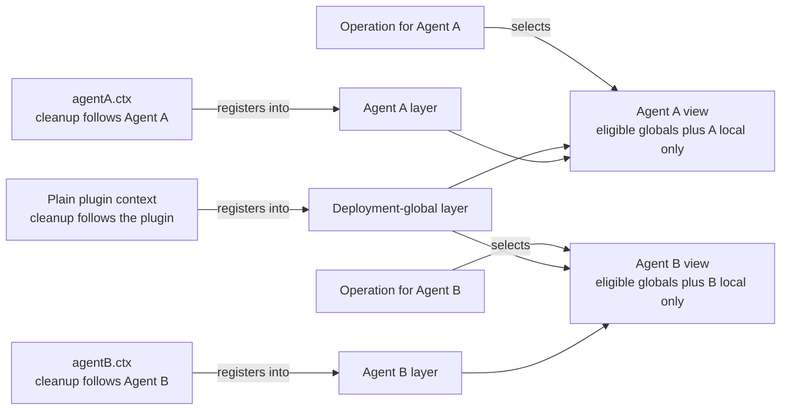
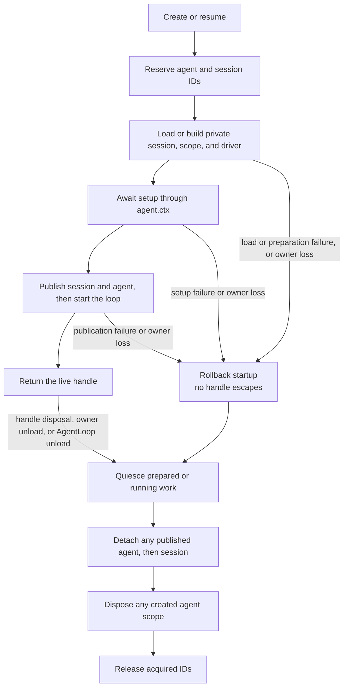

# RFC: The agent is a registration scope

Status: implemented

## Problem

One application needs to share infrastructure across many agents while giving each agent a coherent local world. Model adapters, persistence, user interfaces, and most tool implementations belong to the deployment; personas, visible tools, live policy, event listeners, and cleanup often belong to one agent.

A separate service graph per agent duplicates shared infrastructure. One global registration graph has the opposite failure: an agent-specific tool, prompt section, restriction, or listener can leak into unrelated agents. Contributors need one way to compose local behavior without learning a different registration API for every service.

The mechanism also needs a clear lifetime. An agent must not become visible before its local registrations exist, and final loop work must not lose those registrations before it settles. Parent-owned subagents make both failures easy to trigger because several differently configured agents can exist concurrently inside one application.

## Decision

Every live agent owns one flat registration layer through `agent.ctx`. Code registers through the context that owns the contribution; scope-aware services resolve deployment-global registrations plus exactly one matching agent layer; scoped events route by the operation's real agent; and the layer is published and revoked with the agent lifecycle.

A Cordis **context** is the object through which code accesses services and registers owned effects. The [Cordis primer](../../../cordis-primer.md) explains the framework beyond that concept.

The contract has four parts:

| Contributor question | Contract |
|---|---|
| Where do I register agent-local behavior? | Use the ordinary service API through `agent.ctx` |
| What does an agent see? | Deployment globals plus its own layer, with service-specific merge rules |
| Which scoped listeners run? | By default, unscoped listeners plus listeners for the operation's agent; an explicit global-listener exception is described below |
| How long does local behavior exist? | Assembled during unpublished setup, observable only after creation succeeds, and retained through quiescent teardown |

The scope is deliberately flat. Resolution never walks parent or sibling scopes. Parent ownership links lifetimes without importing registrations.

For scope-aware registries and default listener routing, the whole mechanism can be read from left to right: the registering context chooses a layer, while the agent named by an operation chooses which one local layer joins the deployment-global layer.



The missing cross-edges describe registry resolution and default listener routing: Agent A's registered values and ordinary scoped listeners do not enter Agent B's view, and a parent's layer does not enter a child's view merely because the parent owns the child's lifetime. For scope-filtered events, `{ global: true }` is the explicit opt-in exception; it can observe across scopes while cleanup still follows the registering agent. Registry-membership notifications are a separate unfiltered event class described below.

The companion [runtime-design RFC](2026-07-12-agent-scope-runtime-design.md) explains how the implementation preserves this contract under Cordis dispatch, JavaScript mutation and reentrancy, asynchronous setup, rollback, and racing disposal.

### Registration origin selects visibility and cleanup

A contribution made through a plain plugin context is deployment-global and is disposed with that plugin. The same method called through `agent.ctx` contributes only to that agent and is disposed with the agent scope.

| Registration origin | Registration layer and default audience | Disposed with |
|---|---|---|
| Plain plugin context | Deployment-global; eligible for every agent view, subject to service merge and restriction rules | Registering plugin |
| `agent.ctx` | Agent-local; visible to that agent by default | Agent scope |

This applies to tools, prompt sections and variables, restrictions, protections, guards, and scoped event listeners. Named scoped values ordinarily shadow same-named global values; an owning service may reserve a protected name and reject the shadow instead. Duplicate names within one layer fail. Event listeners have the explicit `{ global: true }` audience exception described below.

The public pattern is ordinary registration inside `setup`:

```js
const reviewSummaryTool = {
  name: 'review_summary',
  description: 'Return the review summary.',
  parameters: { type: 'object', properties: {} },
  async execute() {
    return [{ type: 'text', text: 'review complete' }]
  },
}

const handle = await ctx.agents.create({
  agentId: AgentId('reviewer'),
  sessionId: SessionId('reviewer-session'),
  agentOptions: { model: 'model-name' },
  setup(agentCtx) {
    agentCtx.systemPrompt.section({
      name: 'deployment:persona',
      order: 0,
      text: 'Review code, but do not modify files.',
    })
    agentCtx.tools.restrict({ allow: ['read'] })
    agentCtx.tools.register(reviewSummaryTool)
  },
})

const reviewer = handle.agent
ctx.tools.get('read', reviewer)            // global and allowed
ctx.tools.get('bash', reviewer)            // undefined: filtered global
ctx.tools.get('review_summary')            // undefined: not global
ctx.tools.get('review_summary', reviewer)  // reviewer-local

await handle.dispose()
ctx.tools.get('review_summary', reviewer)  // undefined: scope is gone
```

### The operation selects the view

Registration origin and operation subject are separate facts. Calling a read method through `agent.ctx` does not implicitly select that agent; lookup, execution, prompt assembly, and event dispatch still receive the agent or scope they act for.

For example, `agent.ctx.systemPrompt.assemble()` without an assembly scope requests the global view. `ctx.tools.get(name, agent)` and `ctx.tools.execute({ ..., agent })` select that agent's tool view explicitly. This lets one shared service act for any agent without binding the service instance itself to one scope.

`agent.ctx.agent` is the associated agent for setup code, but it is not a general scope-selection shortcut. Contributors creating nested generic scopes use the nearest scope tag as the registration key; inheriting an `agent` property does not import the outer registration layer.

### Scoped events follow the operation's real subject

By default, an event about agent A reaches unscoped listeners and A-scoped listeners, not B-scoped listeners; agent-less dispatch reaches only unscoped listeners. Product helpers and service-owned paths couple the routing key to the value the operation already owns—such as `ToolExecution.agent`, `ApprovalRequest.agent`, the prompt assembly scope, or the session's captured owner. Advanced code that constructs a low-level carrier or assembly context directly must keep its subject and scope fields aligned; development invariants detect mismatches, but the low-level types do not make every mismatch unrepresentable.

Cordis listeners have one explicit exception. `{ global: true }` bypasses contextual filtering, so a listener registered through `agent.ctx` can observe other agents and subjectless dispatches while its cleanup still belongs to that agent scope. Use it only for deliberate cross-scope observation.

Registry-membership notifications remain unfiltered because they describe shared registry state rather than an operation for one agent. The generated [event catalog](../../../cordis-catalog/events.md) is the exhaustive reference for event signatures and modes.

### Creation publishes after setup; disposal revokes after work stops

`ctx.agents.create()` and `resume()` construct an unpublished agent. Their optional `setup(agentCtx)` callback may await child-plugin activation and register the complete local world. During setup, neither the agent nor its session is visible in the public registries, and driving methods reject.

The returned promise resolves only after setup, ordered lifecycle notification, and loop start succeed. Setup failure or owner loss rolls the unpublished world back and releases its IDs. A caller therefore never receives a handle to a partially configured agent.

`AgentHandle.dispose()` performs the reverse boundary. It stops and drains the loop, preserves the session and scoped listeners through final events and flushes, detaches the agent and session, unwinds the scope, and releases IDs. Repeated or racing calls join the same completion promise.

The calling Cordis context and AgentLoop are structural co-owners. Unloading either disposes the agent, so creation through a short-lived plugin context intentionally gives the agent that shorter lifetime.

The lifecycle keeps the local layer private until setup succeeds and keeps it alive until final work has drained:



Contributors should put agent-local activation inside `setup` and always dispose the returned handle. Code that needs to observe a live agent waits for `create()`/`resume()` to resolve rather than polling the registries during setup.

## Tool restrictions resolve against a live flat view

A tool restriction filters the live deployment-global end-capability layer, after which scope-local tools are added. `allow` retains named globals, `deny` removes named globals, multiple restrictions intersect, and a hidden global tool is absent from both registry presentation and executable lookup.

Filter presence is explicit: omitting a filter installs no restriction, `restrict({})` rejects, and `allow: []` deliberately hides every global end capability.

Because globals are live, allow- and deny-lists intentionally differ when a new global tool appears:

```text
at time 0:
  global tools        = { read, bash }
  deny { bash } view  = { read }
  allow { read } view = { read }

after registering global tool web:
  deny { bash } view  = { read, web }
  allow { read } view = { read }
```

Scope-local tools are merged after the filter. A local tool can therefore exist even when it is absent from an allow-list over globals. This is composition behavior, not an authorization promise.

Reserved Code Mode presentation is not part of the filterable end-capability layer. The [Code Mode RFC](../feature/2026-06-15-code-mode.md) owns the `run_code`, SDK, `toolOrder`, and presentation-versus-execution contracts; contributors changing Code Mode behavior follow that decision rather than inferring new authority semantics from agent scope.

## Security and authority are explicit non-goals

Agent scopes compose trusted in-process registrations. They do not sandbox plugins, define a parent-to-child authority lattice, freeze a creation-time grant set, or guarantee that a child can do no more than its parent. A plugin holding a Cordis context runs in the same process and can call the services injected into that context.

A parent can own a child whose visible tool set is wider than its own. For example, a parent restricted to global `read` can spawn a child with no restriction; the child then sees later global tools plus its own local registrations. The parent owns the child's lifetime but does not donate or cap the child's registration layer.

Deployments that need non-escalation require a separate authority representation, propagation rule, and execution check. Authority-versus-visibility ledgers, parent-subset grants, explicit future-grant APIs, and generic capability/output/termination tags are outside this decision.

## Subagents use the same composition rule

In-process subagents are a consumer of agent scope, not a second scoping model. A child gets a fresh flat layer during unpublished setup; its persona, tool filter, structured-output protocol, and listeners are ordinary registrations through the child's context. Parent teardown, backend teardown, and manual run disposal own the child lifetime without importing the parent's registrations.

`inheritsParentContext` describes conversation-history seeding only, not Cordis scope, service injection, tools, or authority. The [subagent capability RFC](../feature/2026-06-21-subagent-capability-seam.md) owns run usage and the provider contract, while the [runtime-design RFC](2026-07-12-agent-scope-runtime-design.md) explains in-process structured output and workflow race handling.

## Alternatives considered

The rejected architectures either separate visibility from cleanup, scope only behavior but not registered data, duplicate shared infrastructure, or conflate parent ownership with registration inheritance.

### Pass an agent option to every registration

An API such as `tools.register(definition, { agent })` leaves global registration as the leak-by-omission default and repeats scope plumbing in every registry. It can also express “visible to A, disposed with unrelated plugin B,” which registration through `agent.ctx` prevents.

### Filter events while keeping registries global

Listener filtering prevents a hook from intercepting the wrong agent but does not scope tool schemas, executable lookup, prompt sections, variables, or Code Mode bindings. Agent-local composition would still require temporary global mutation.

### Create one isolated service graph per agent

Service isolation chooses one registry instance, while the desired view is deployment globals plus one agent layer. Per-agent graphs duplicate adapters and force shared persistence and UI infrastructure to discover every instance. Independent applications still deserve separate graphs; collaborating agents inside one deployment do not.

### Inherit the parent's registrations into a child

Hierarchical inheritance silently imports every parent-scoped tool and policy. Flat layers plus parent-owned disposal separate lifetime from composition: the parent owns the child without deciding the child's local world. This choice deliberately makes authorization a separate design.

## Consequences

Contributors use the same registration methods at both deployment and agent scope; changing the calling context changes visibility and cleanup together. Model-visible tool lookup, execution, prompt assembly, policy, observation, and teardown agree on one agent key instead of maintaining parallel per-feature scope options.

The cost is explicit subject selection on reads and dispatch, asynchronous programmatic creation, disciplined handle disposal, and awareness that flat registration scope is not authority. Registries retain service-specific merge behavior, and only services that adopt the scope contract become agent-scoped automatically.

The decision applies to tools, prompt state, scoped events, session lifecycle and scoped session events, approvals, and in-process subagent composition. Filesystem policy, LLM interception, background backend state, and other registries retain their own subject or policy mechanisms until their designs explicitly adopt agent scope.
