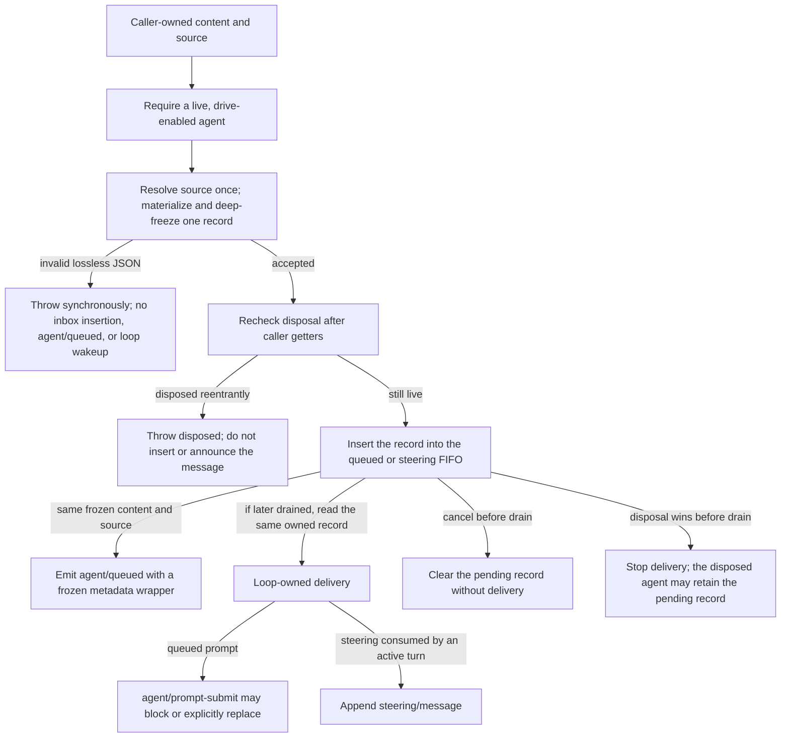

# RFC: Agent-scope runtime design and correctness

Status: implemented

## Problem

The [agent-scope contract](2026-07-08-agent-scope-contexts.md) defines the contributor-visible result: registrations made through `agent.ctx` form one flat local layer, operations resolve that layer by their real agent, setup remains unpublished, and teardown preserves the layer until work stops. The implementation must make those claims true inside a cooperative plugin framework and mutable JavaScript runtime.

Four failure classes interact in the paths this change hardens:

| Proof obligation | Failure if implemented locally or incompletely |
|---|---|
| Registration and dispatch select the same key | Prompt data resolves for one agent while behavior listeners run for another |
| Construction and teardown have continuous ownership | Reentrant unload publishes a partial world, leaks IDs, or revokes policy before final work |
| Covered validation and later use observe one accepted value | Stateful accessors or caller mutation make checked, executed, logged, and observed data disagree |
| Protocol invariants survive extensible middleware | Listener ordering removes required prompt state, re-allows denied work, commits a failed result, or forces another model step |

Cordis already supplies derived contexts, effect ownership, receiver-based filtering, and waterfalls, but none alone establishes all four obligations. Context association is not a scope key, raw disposers are not await-idempotent, waterfall listeners can short-circuit or wrap each other, and JavaScript `readonly` types do not constrain runtime accessors. Async persistence, setup, publication callbacks, subagent providers, and worker messages add reentrancy and race boundaries around those primitives.

## Decision

The runtime implements agent scope as four coupled mechanisms rather than one generic framework feature:

| Mechanism | Implementation decision |
|---|---|
| Layer and routing | A scope key tags registration effects; scope-aware contribution registries merge globals plus one layer; dispatch carriers filter listeners by the operation subject |
| Transactional lifetime | Scope, session, registry entry, driver, reservations, caller ownership, and AgentLoop ownership publish and unwind as one ordered transaction |
| Boundary ownership | The hardened acceptance-sensitive paths listed below capture caller fields once and retain stable identities or owner-controlled representations |
| Owner-final policy | Four narrow service-owned boundaries restore named prompt state, deny monotonically, observe final results, and stop terminal turns |

The same mechanisms carry into in-process subagents and the workflow bridge. Subagents are the composition proof because child setup, structured output, readiness, cancellation, result settlement, and disposal exercise all four obligations concurrently.

This RFC owns the implementation rationale, algorithms, race handling, and correctness enforcement. The [agent-scope contract](2026-07-08-agent-scope-contexts.md) owns contributor-facing behavior, tool-filter semantics, usage examples, and the security non-goal; this document links to that contract rather than redefining authority or public scope inheritance.

## Implementation model: domain terms and Cordis mechanics

Readers need four domain terms and four Cordis mechanics to follow the implementation. Readers already familiar with this codebase and Cordis can skim this section.

### Recurring domain terms

Four domain terms keep the rest of the RFC compact. A **Session** is an agent run's append-only event log, from which model history and durable replay are derived. **Lossless JSON** is the JSON subset that can be copied without changing meaning: primitives, dense arrays, and plain objects; cycles, sparse arrays, exotic prototypes, non-finite numbers, negative zero, `undefined`, `bigint`, functions, and symbols are rejected. An **end capability** is an actual callable tool implementation, whether the model sees it as a native schema or a Code Mode binding. **Code Mode** gives the model a generated SDK and a reserved `run_code` transport. Pure `code` presentation replaces native advertisement with that interface; `both` presentation retains native schemas alongside it.

### Four Cordis mechanics

Contexts select service access and registration origin, fibers own effects, waterfalls provide cooperative transformation, and dispatch receivers select listeners.

| Cordis concept | Meaning in this RFC |
|---|---|
| Context | The object through which a plugin reaches services and registers contributions; a derived context can carry a different registration scope |
| Fiber and effect | The runtime owner and one owned piece of setup/cleanup; disposing the fiber unwinds its effects |
| Waterfall | Ordered around-middleware whose listener calls `next()` to include downstream work and may transform or short-circuit the result |
| Dispatch receiver | The `this` object used by Cordis listener filtering; a scope carrier encodes the operation's agent key |

#### Context selects both service access and registration origin

A Cordis `Context` is the object through which code calls services such as `ctx.tools`, `ctx.systemPrompt`, and `ctx.sessions`. A service can recover the context through which it was accessed, so the same method can register globally from a plain plugin context or locally from `agent.ctx` without adding an `agent` option to every registration API. Cordis implements contextual service access with a **traced receiver**: a proxy that carries the accessing context while forwarding calls to the concrete service object.

```js
ctx.tools.register(globalTool)
agent.ctx.tools.register(agentOnlyTool)

ctx.on('tools/result', globalObserver)
agent.ctx.on('tools/result', agentObserver)
```

A context also exposes the dependency view injected into the plugin that minted it. `agent.ctx` therefore carries the agent loop's deliberate service surface; it is not an ambient root context or a security boundary.

#### Effects make cleanup follow ownership

An effect is setup whose cleanup belongs to a fiber. Tool registration, prompt contribution, event subscription, and an agent scope are effects, so normal disposal, failure, and hot module reload all follow the same ownership graph.

```js
ctx.effect(() => {
  const resource = openResource()
  return async () => {
    await resource.close()
  }
})
```

Cordis also supports generator effects that nest child effects in a chosen teardown order. The lifecycle section explains why construction must become owner-visible before arbitrary callbacks run.

#### Waterfalls remain cooperative extension points

A waterfall listener wraps downstream work. Calling `next()` includes the remaining listeners and base implementation; returning directly skips that downstream portion.

```js
ctx.on('system-prompt/assemble', async (_assembly, _context, next) => {
  const downstream = await next()
  return {
    ...downstream,
    sections: [...downstream.sections, extraSection],
  }
})

ctx.on('system-prompt/assemble', async () => replacementAssembly)
// The direct return skips this listener's downstream/base. An outer listener
// that already awaited next() still resumes around replacementAssembly.
```

This flexibility is intentional for ordinary policy, but it cannot express a fact that must remain true after every wrapper and short-circuit. [Owner-final policy](#owner-final-policy-four-narrow-boundaries) adds only the four final checkpoints that need stronger semantics.

#### Dispatch receivers select scoped listeners

Cordis filters listeners using the dispatch receiver, the object visible as `this` inside a function-style listener. `dsh-scope` builds a receiver carrying the operation's scope key, allowing global listeners plus listeners registered for that exact key while rejecting other agents' listeners.

The receiver is live coordination state, not durable session data. For example, `tools/result` is a live final-outcome notification, while `tool/result` is an append-only session event used for replay and model history.

## Registration and delivery: global plus exactly one agent layer

Within services that adopt the agent-scope contract, one scope key controls both registered data and registered behavior. Contribution reads combine the deployment-global layer with exactly one agent layer, while scoped event dispatch admits global listeners plus the listeners for that same agent.

Scope keys are opaque objects compared by identity; a live `Agent` is its own registration key. There is no name-based equality or parent traversal.

### Scope mechanism: context, key, and lifetime

The registration context selects the layer, the scope primitive binds that layer to cleanup, and the nearest scope tag—not an inherited convenience property—selects the key.

#### The calling context selects visibility and cleanup

A scope-aware registry method recovers the Cordis context through which its service receiver was accessed and calls `scopeOf(context)` once while installing the registration effect. An absent key selects the global store; a key selects the per-scope store. Cleanup closes over that accepted store and key, so later context mutation or a same-named replacement cannot redirect disposal. Event listeners follow a different Cordis path: `ctx.on()` retains the registering context, and targeted dispatch reads its scope while filtering listeners; `{ global: true }` deliberately bypasses that audience filter without changing cleanup ownership.

The [public contract](2026-07-08-agent-scope-contexts.md#registration-origin-selects-visibility-and-cleanup) owns the visibility table, shadowing rule, and `{ global: true }` listener exception. Internally, registry resolution overlays one exact identity-keyed map on the global map and never traverses an ancestry relation:

```text
resolveLayer(agentA):
  visible = copy(global registrations)
  visible.overlay(registrations from agentA.ctx)
  return visible
```

The one-overlay algorithm is why the generic primitive needs only opaque identity and effect ownership; parent/child meaning stays outside `dsh-scope`.

#### The scope primitive keeps layer and owner together

`dsh-scope` exposes only the operations needed to mint a tagged ownership layer, read its key, target dispatch, and reach quiescent cleanup. For ordinary scope-aware registries, using a separate `{ scope }` option could express “stored in A's layer, disposed with B”; registration through the scoped context makes that mismatch unrepresentable. The `{ global: true }` listener option is an intentional audience exception, and the low-level `scopeTarget(base, key)` primitive still relies on its service-owned caller to supply matching facts.

| Operation | Responsibility |
|---|---|
| `createScope(context, key)` | Mount an ownership fiber and return its tagged context |
| `scopeOf(context)` | Read the nearest inherited scope key |
| `scopeTarget(base, key)` | Build a scope-filtered dispatch receiver around the existing base receiver |
| `Scope.dispose()` | Return one shared idempotent promise that reaches cleanup quiescence |
| `Scope.rawDispose` | Expose the exact Cordis disposer for ordered generator composition |

`Scope.dispose()` and `rawDispose` serve different callers. Cordis raw disposers are single-shot, so a repeated raw call need not wait for an earlier asynchronous teardown; the public method follows the backing fiber's in-flight cleanup and gives racing callers the same completion promise. Generator lifecycles use `rawDispose` because Cordis recognizes nested ownership by exact disposer identity.

The primitive has one essential shape:

```text
createScope(parentContext, key):
  fiber = mount no-op plugin under parentContext
  scopedContext = derive fiber.context with nearest-scope-tag = key

  rawDispose = fiber's exact disposer
  dispose = memoized operation that:
    invoke rawDispose if teardown has not started
    follow fiber's in-flight cleanup until quiescent

  return { ctx: scopedContext, rawDispose, dispose }
```

Derived contexts inherit the nearest tag. Mounting a plugin under `agent.ctx` preserves the agent scope; deliberately creating another scope replaces the tag below it.

#### `ctx.agent` is an association; `scopeOf()` selects the layer

`agent.ctx.agent` gives setup code convenient access to the associated agent, but the nearest scope tag remains authoritative for resolution. A nested scope can inherit the ergonomic `agent` property while replacing the registration key.

```js
const auditKey = {}
const auditScope = createScope(agent.ctx, auditKey)

auditScope.ctx.agent === agent        // true: inherited association
scopeOf(auditScope.ctx) === auditKey  // true: nearest registration key

await auditScope.dispose()
```

This separation keeps the generic scope package independent of the agent package.

### Resolution contracts preserve domain semantics

The shared scope selects two layers, but each registry retains its own merge rules and must keep presentation, lookup, and execution coherent within the view it owns.

#### Registries retain domain-specific merge rules

The shared primitive answers “which layer?” and “who owns cleanup?”; each service still defines how its values combine. Prompt sections, variables, and tools use scoped-over-global shadowing by name. Tool-schema providers are additive. Tool lookup and execution receive an agent or scope explicitly, while prompt assembly receives an `AssembleContext` whose `scope` selects the layer.

Calling a read method through `agent.ctx` does not silently choose an agent subject. For example, `agent.ctx.systemPrompt.assemble()` without an assembly scope still requests the global view. Registration origin and operation subject remain explicit, allowing one shared service to act for any agent.

#### The tool view is live and executable

`ToolRegistry` owns one resolver rather than separate presentation and execution stores. It snapshots restriction definitions at registration, applies them to the current global map, overlays the matching scoped map, and derives lookup, dispatch, schemas, SDK bindings, timeouts, inspection, and UI presentation from that resolved map. A filtered global implementation therefore cannot remain executable through a second path.

The [public RFC](2026-07-08-agent-scope-contexts.md#tool-restrictions-resolve-against-a-live-flat-view) owns the exact allow/deny/future-global/local-overlay behavior. The internal distinction needed here is that `ToolRegistry.knownNames()` validates restrictions against the pre-restriction end-capability universe, while the system-prompt provider validates `toolOrder` against the presentation mode's wire universe.

Final prompt assembly can include schemas from other `systemPrompt.tools()` providers or assembly listeners. The coherent-view proof therefore covers `ToolRegistry`'s own schemas, bindings, lookup, execution, and presentation; another provider owns coherence for the unrelated schemas it contributes.

Reserved `run_code` presentation sits outside both registration maps. The [Code Mode RFC](../feature/2026-06-15-code-mode.md) owns its mode, SDK, and `toolOrder` semantics; this design relies only on the fact that the transport is resolved separately from filterable end capabilities.

### Dispatch contract follows the operation subject

Service-owned dispatch paths derive or couple the scope key with the operation subject, and a carrier composes that key with the chosen base receiver's existing dispatch behavior. For agent events the agent is both base and operation subject; tool, approval, and prompt dispatch instead wrap their owning service while selecting listeners with the operation's agent key. The low-level primitives can still represent mismatched facts, so helper use and development invariants—rather than the type system alone—protect direct internal callers.

#### The operation subject selects the listener set

The [public dispatch rule](2026-07-08-agent-scope-contexts.md#scoped-events-follow-the-operations-real-subject) and generated [event catalog](../../../cordis-catalog/events.md) own listener visibility and the exhaustive event-family mapping. The implementation problem is to prevent each service from choosing its carrier, subject argument, and scope key independently.

Fused helpers keep values that must agree together. `agentEvents(context, agent)` uses one agent as the subject, scope key, and first event argument. `assembleContextFor(agent)` sets both prompt facts and the scope selector. The session store captures its carrier when a session enters because later appends and flushes may occur without the original agent context.

#### The carrier preserves base-receiver behavior

Function-style listeners receive the carrier as `this`. Agent listeners may call methods on the agent base; service listeners rely on the owning service's contextual receiver behavior. The carrier is therefore a proxy that selects listeners while reading, writing, and invoking through the real base receiver.

The implementation uses a dedicated surrogate proxy target with an immutable composed-filter slot. It combines the base receiver's existing `Context.filter` with the scope predicate instead of replacing it. Methods bind to the real base; callable carriers preserve call and construct shape; descriptor queries normalize configurable flags as required by Proxy invariants; and definitions through the carrier require an explicitly configurable descriptor. Stable built-in references protect the composed filter from accidental `.call` replacement.

Those mechanics preserve observable JavaScript behavior, including private-field method identity:

```js
class Base {
  #count = 0
  increment() { this.#count += 1 }
}

const base = new Base()
const key = {}
new Proxy(base, {}).increment()  // TypeError: proxy lacks Base's private identity

const carrier = scopeTarget(base, key)
carrier.increment()           // works: method is bound to base
carrier === base              // false: carrier has distinct identity
```

Together these constraints keep listener selection correct while preserving the base-receiver behavior listeners expect.

The TypeScript-only `Scoped<T>` marker requires a carrier at typed dispatch sites. Runtime marks and development invariants cover JavaScript, casts, and direct Cordis dispatch; they detect routing mistakes but do not confine hostile same-process code.

## Lifecycle: compose privately, publish once, tear down in reverse

Scope, session, registry entry, and driver form one transaction with two owners. Request fields are captured first; AgentLoop tracking and both identity reservations precede asynchronous work; the caller owns the prepared lifecycle before setup; publication proceeds in synchronous observable phases; and every teardown path reaches one reverse-order quiescence boundary.

Two services split the public API from the implementation. `AgentRegistry`, reached as `ctx.agents`, stores live agents and is the front door for `create()` and `resume()`. Its registered `AgentFactory` is concretely implemented by `AgentLoop`, which constructs and drives agents using its own injected dependencies. The rest of this section calls that concrete co-owner the **AgentLoop factory**.

| Phase | Public state | Ownership fact |
|---|---|---|
| Reserve | IDs unavailable to competitors | AgentLoop tracking and exact reservations cover the next await |
| Prepare or load | Persistence data is loading, or session, scope, and driver exist privately | Resume's load sentinel covers persistence; the complete caller lifecycle covers setup |
| Setup | `setup(agent.ctx)` may await and register | Neither ID is published |
| Publish and start | Session, agent, and lifecycle notifications appear in order | Liveness is checked between observable phases |
| Dispose | Driver drains, registries detach, scope unwinds, IDs release | All owner paths join one completion promise |

The [public lifecycle contract](2026-07-08-agent-scope-contexts.md#creation-publishes-after-setup-disposal-revokes-after-work-stops) defines what callers observe. The following sections justify each ownership and ordering fact behind that contract.

### Reservations precede awaiting; lifecycle ownership precedes setup

AgentLoop tracking and exact identity reservations precede the first await. Resume adds a caller sentinel across persistence loading; create and resume both establish the complete caller-owned lifecycle before invoking setup.

#### The prepared lifecycle is owned before setup callbacks

The caller context owns the work it requested and receives the consumer-facing `AgentHandle`. The AgentLoop factory is a structural co-owner because a live agent continues to depend on its injected services. Either owner can deactivate the transaction; both converge on the same lifecycle disposer.

| Owner mechanism | Covers | Retires when |
|---|---|---|
| Caller lifecycle sentinel | Caller-fiber loss from lifecycle preparation through live lifecycle | Shared lifecycle reaches quiescence |
| Resume load sentinel | Caller-fiber loss across persistence load and lifecycle handoff | Load rollback or the adopted lifecycle reaches quiescence |
| AgentLoop tracker | AgentLoop unload and structural dependency loss | Transaction and lifecycle settle |
| ID reservations | Competing agent/session insertion | Ordered teardown releases both IDs |

A **sentinel** is an owner-visible effect that follows work whose final disposer is not yet available. It adopts the exact reservation disposers immediately, then follows the complete lifecycle disposer once preparation establishes it.

Cordis must make construction owner-visible before setup can reenter teardown. An effect's cleanup wrapper enters its owner list before its setup body runs, a child fiber receives its parent-owned disposer before Cordis's child-plugin notification (`internal/plugin`) announces it, and a fiber already unloading rejects new effects after taking its cleanup snapshot. Teardown observers are contained independently so one callback cannot starve peers or interrupt cleanup. These are domain-neutral lifecycle rules; `dsh-scope` uses them by mounting a no-op plugin fiber as the ownership bucket for one scope.

#### Caller ownership and factory dependency lookup stay separate

Factory delegation carries two contexts because ownership and dependency origin are different facts. `ownerCtx` is the caller-bound context whose fiber and optional scope own the requested lifecycle. The factory method receiver is the accepted factory traced through that access so the concrete service retains its own injected dependency view.

```text
callerCtx.agents.create(options)
  ownerCtx    = context carrying callerCtx's fiber and scope
  factoryThis = concrete accepted factory traced through ownerCtx
  Reflect.apply(capturedCreateAgent, factoryThis, [ownerCtx, options])
```

`setFactory()` captures the concrete target and its `createAgent` and `resume` callbacks once. It canonicalizes an already traced service before retracing, avoiding a second proxy layer that would break raw-identity state. Plain factory objects receive the explicit `ownerCtx` without depending on Cordis tracing.

#### Create and resume reserve identities before awaiting

Programmatic create and resume reserve both agent and session IDs before any operation can await. Create prepares a new or seeded session; resume loads persisted data while a caller sentinel and AgentLoop load tracker already own the interval in which no `Agent` object exists.

Reservations are capabilities, not advisory sets. Setup code cannot reserve, prepare, create, register, or enter a substitute under the same IDs. A session reservation prepares at most one exact object, and publication requires the matching factory-held capabilities. A failed or abandoned transaction therefore cannot publish a substitute or wedge an ID indefinitely.

Resume transfers ownership rather than opening a gap:

```text
resume(ownerCtx, request):
  snapshot request identity, options, and setup callback
  reserve agentId and sessionId
  install caller sentinel adopting both reservation disposers
  track load under AgentLoop

  persisted = await firstOf(persistence.load(sessionId), deactivated)
  session = sessionReservation.prepare(reconstruct persisted data)
  starting = startOwned(ownerCtx, session, reservations, setup)
  caller sentinel follows starting.dispose
  return await starting.result
```

If deactivation wins, a backend load may still settle internally but has no path back to publication. Preparation failure still returns a rollback-backed lifecycle result, so both owners can wait for actual cleanup instead of mistaking a rejected async result for successful installation.

### Setup composes an unpublished world

`setup(agentCtx)` may register tools, prompt state, restrictions, listeners, protections, or child plugins and may await their activation. The new agent is available as `agentCtx.agent`, but neither agent nor session is visible in its global registry.

The complete rollback skeleton exists before setup runs. If setup throws, rejects, or loses either owner, the scope and prepared resources unwind and the IDs become reusable. After setup settles, a microtask checkpoint and liveness checks let a same-turn owner unload win before publication.

Setup composes but cannot drive. `send`, `steer`, `inject`, and `cancel` reject until publication reaches the session-start boundary. The driver lock and inbox use runtime-private state, and only factory-held controls enable and start the loop; JavaScript casts cannot call a public start method or write directly into the queue.

```text
startOwned(ownerCtx, snapshot, preparedSession):
  world = prepareLifecycleWithCompleteRollback(ownerCtx, snapshot, preparedSession)

  result = async:
    require world active
    await firstOf(runOptionalSetup(snapshot.setup, world.agent.ctx), world.deactivated)
    await oneMicrotask()
    require caller, factory, owner fiber, and owner agent still active
    world.publish(snapshot.source)
    return handle(world.agent, world.dispose)

  on any error:
    await world.dispose()
    rethrow
```

### Publication is ordered, observable, and rollback-covered

Publication is one synchronous sequence with liveness checks between three observable notification phases. Both registry entries exist before the first listener runs, but driving stays locked until immediately before `agent/session-start`.

1. Enter the session store and capture its scope carrier.
2. Enter the agent registry without announcing it.
3. Recheck caller and factory liveness.
4. Emit `session/created`.
5. Recheck liveness.
6. Emit `agent/created`.
7. Recheck liveness.
8. Enable driving.
9. Emit `agent/session-start`.
10. Recheck liveness.
11. Start the driver.

```text
publish(world):
  world.beginSynchronousPublication()
  try:
    world.detachSession = sessions.enter(world.session, sessionReservation)
    world.detachAgent = agents.enter(world.agent, agentReservation)
    require callerAndFactoryActive
    sessions.announce(world.session)
    require callerAndFactoryActive
    agents.announce(world.agent)
    require callerAndFactoryActive
    world.driver.enableDrivingVerbs()
    emitNonVetoing(agent/session-start)
    require callerAndFactoryActive
    world.driver.start()
  finally:
    world.endSynchronousPublication()
```

#### Creation is paired, not atomic

Observers run between publication steps, so the sequence is not described as atomic. Effects already performed by an earlier listener cannot be retracted if a later listener throws. Instead, each registry marks a creation announcement as begun before dispatch and emits exactly one matching disposal edge during rollback. An entered object that was never announced has no disposal notification because no observer was told it existed.

A detach requested during `session/created` or `agent/created` is deferred until that dispatch unwinds. Stable captured carriers and exact-object guards prevent a later listener from observing `disposed` before `created` or a stale detach from deleting a replacement with the same ID. The outer publication barrier likewise prevents caller or AgentLoop teardown from removing the other registry entry or unwinding `agent.ctx` while an announcement remains on the stack.

Creation listener synchronous throws remain vetoes. Returned promise rejections are observed and logged but not awaited: publication has no asynchronous gap in which such a result could roll back safely. Disposal notifications and `agent/session-start` are non-vetoing and independently contain both synchronous throws and returned-promise rejections so one listener cannot block cleanup or later observers.

### Teardown stops work before revoking registrations

Every owner path reaches one memoized reverse-order transaction. It marks the lifecycle inactive, waits for an in-progress synchronous publication phase, stops the driver through actual exit and final durability work, detaches the agent and session, unwinds the scope, and releases IDs last.

Final turn events, the turn-ending flush, and any outstanding session flush started while the agent was idle therefore run while the session and scoped listeners still exist. `agent/disposed` observes an already quiescent and unregistered concrete agent while its session remains live; `session/disposed` follows after event feed detachment and store removal. Both use the stable carrier captured for their matching creation edge.

```text
disposeOwnedAgent(world):
  mark world inactive
  await world.synchronousPublicationIfRunning()
  await world.stopDriver()  # loop exit plus agent-started flushes
  world.detachAgent()
  world.detachSession()
  await world.scope.dispose()
  world.releaseSessionReservation()
  world.releaseAgentReservation()
```

`AgentHandle.dispose()` gives repeated and racing consumers the same completion promise. The lifecycle-long caller sentinel follows that promise even when handle disposal wins first, while the AgentLoop ledger independently stops new transactions and waits for every structurally dependent agent before the service disappears.

AgentLoop co-ownership follows dependency shape, not a blanket “creator owns every returned value” rule. An AgentLoop-created agent continues to depend on the loop's services, so AgentLoop unload stops it.

## Boundary ownership: hardened paths accept once and own the accepted value

The acceptance-sensitive paths enumerated below read caller-owned fields once and retain only owner-controlled identities or snapshots before crossing asynchronous, reentrant, model-visible, or durable-log code. This is a boundary-by-boundary implementation property, not a blanket claim about every public API. The protection is independent of TypeScript: `readonly` annotations vanish at runtime, and JavaScript accessors can return a different value on every read.

The shared shape distinguishes identity-bearing references from data. Agent objects and abort signals are retained by identity after one read. Boundaries whose contract requires lossless JSON—such as session events and subagent payloads—validate and materialize it in one traversal; other boundaries use their own owned representation, such as `structuredClone` for agent options. Scalars and callbacks are captured once, then each boundary applies the validation promised by its API before downstream use.

```text
accept(input):
  read every relevant top-level field exactly once
  retain identity-bearing references without rereading them
  validate acceptance-time fields from those captures
  copy or pin data in the representation owned by this boundary
  bind accepted callbacks once when method receiver state is intentional
  expose only owner-controlled identities, frozen records, or detached results
```

Capture does not imply uniform eager callback type-checking. Agent `setup` is captured once and any invocation failure enters rollback; a tool guard is likewise captured, and an invalid cast becomes a normalized execution error. The invariant is that later work never rereads caller fields to choose a different value.

| Boundary | Identity retained | Data detached or pinned |
|---|---|---|
| Tool and `SubagentProvider` registration | Original callback receiver | Name, flags, schemas, scalar config |
| Agent create/resume | Caller context, setup callback | IDs, options, session metadata and seed |
| Agent send/steer | None | Content blocks and resolved message source |
| Approval request | Agent and abort signal | Tool name, call ID, and reason |
| Tool execution | Agent, signal, registry-minted parent token | Call identity and arguments |
| Session append/load | Session identity | Header and event envelopes |
| Subagent start/result | Parent and signal | Prompt, filters, schema, options, result |

Before agent setup can run, the concrete agent pins its accepted ID, options, and session and binds `ctx` once. Registry detach closures likewise close over their accepted keys instead of rereading mutable public fields.

`send()` and running `steer()` resolve the message source once and materialize `{ content, source }` as one detached, deeply frozen lossless-JSON record before `agent/queued` or inbox insertion. The notification and FIFO share that accepted content and source; its metadata wrapper is frozen separately, so neither retained caller references nor an earlier notification listener can rewrite what a later listener, the session log, or the model sees. Invalid content or source throws synchronously without notification, enqueue, or loop wakeup; idle `steer()` delegates to the same `send()` boundary. The later `agent/prompt-submit` waterfall can still replace a queued prompt by returning new content; ownership forbids in-place mutation, not the explicit rewrite protocol.

The inbox path makes that accepted-value boundary concrete. Getter evaluation happens during materialization, so liveness is rechecked before the accepted record crosses into an inbox FIFO:



A stateful getter shows why validation and ownership must use the same capture:

```js
let reads = 0
const input = {
  get name() {
    reads += 1
    return reads === 1 ? 'safe_tool' : 'different_tool'
  },
}

// Wrong: validation and storage observe different values.
validateName(input.name)
storeName(input.name)

// Right: one accepted value drives both.
reads = 0
const acceptedName = input.name
validateName(acceptedName)
storeName(acceptedName)
```

### Registered definitions are frozen snapshots

Tool registration creates the stored definition identity once; changes occur through explicit unregister/register effects rather than mutation of a caller-retained object. Parameters are materialized in one traversal, callbacks bind once to the accepted definition receiver, and the stored record is deep-frozen.

The first-party `defineTool()` helper applies the same boundary before registration. It captures each option once, materializes the authoring `SchemaSpec`, and derives both the wire schema and later execution/presentation validation from that owned spec.

```text
defineTool(options):
  accepted = read each option exactly once
  parameterSpec = snapshotLosslessJson(accepted.parameters)
  wireSchema = snapshotLosslessJson(convertToJsonSchema(parameterSpec))
  build execute and presentation validation over parameterSpec

registerTool(context, definition):
  accepted = read each definition field exactly once
  stored = deepFreeze({
    accepted name, description, timeout,
    parameters: snapshotLosslessJson(accepted.parameters),
    execute: bind accepted.execute to definition,
    presentation callbacks: bind accepted callbacks when present
  })
  layerFor(scopeOf(context)).add(stored.name, stored)
```

`get()` and `visible()` return the frozen stored definitions; `schemas()` returns detached projections. Replacing `definition.execute` after registration has no effect, while a callback can deliberately read live state from its closure or original receiver.

Factory and backend registration use different reentrancy orderings around the same ownership rule. `AgentFactory` registration claims its single slot before reading callback accessors. `SubagentProvider` registration first snapshots the provider fields, then its effect checks and enters the accepted name. Both capture callback identity and intentional receiver state once, and hot-reload cleanup closes over the accepted slot or key instead of rereading a mutable public property.

### Durable session ownership carries the scope key

The [session-immutability RFC](2026-06-11-dev-invariants-over-deep-readonly.md#session-owns-immutable-history) owns header, event, and snapshot semantics. Agent-scope correctness adds one requirement: the store keeps append observers, accepted registry IDs, and captured scope carriers in private owner state rather than caller-writable fields. Outside JavaScript therefore cannot rename a stored session or redirect later `session/event` delivery by mutating visible state.

Approval requests follow the same async boundary at smaller scale: one capture preserves exact agent/signal identities, copies scalar fields, captures the session once, and drives `approval/asked`, scoped policy, cancellation, and `approval/decided` from that record.

### Tool execution has pipeline-owned identity

The [interception-seams RFC](../feature/2026-06-30-interception-seams.md) owns the public tool-pipeline contract. For agent-scope correctness, `ctx.tools.execute(input)` must turn caller-owned input into one pipeline-owned `ToolExecution` before any scoped policy or dispatch runs. It first reads `callId` and `name` once and requires strings; a failure there rejects because even an error result would lack trustworthy correlation identity. Once those strings are accepted, later input failures can become normal final error outcomes.

Arguments are materialized once and deep-frozen. The registry assigns a frozen property-free `ToolExecutionToken`; callers cannot choose it. `token`, `callId`, `name`, `arguments`, `agent`, and optional opaque `parent` token become non-writable and non-configurable before policy. `signal` is the only operational field an around-dispatch wrapper may replace or remove.

```text
prepareExecution(input):
  callId = read input.callId exactly once
  name = read input.name exactly once
  require both are strings

  accepted = read arguments, agent, parent, and signal exactly once
  require parent is absent or a registry-minted token
  arguments = deepFreeze(snapshotLosslessJson(accepted.arguments))

  execution = {
    token: new frozen property-free object,
    callId, name, arguments,
    agent: accepted.agent,
    parent: accepted.parent,
    signal: accepted.signal
  }
  protect every field except signal
  return execution
```

Stable execution identity prevents middleware from changing which tool or scope policy accepted. It also gives structured-output commit a safe `WeakMap` key when an adapter reuses a string call ID. Code Mode correlates an SDK sub-call with its enclosing `run_code` using only the outer execution's opaque token, never a mutable reference to the live outer object.

Result boundaries apply the same ownership rule. Each transform returns data that is captured field-by-field, validated, materialized, and ultimately deep-frozen for final observers; malformed outcomes normalize to JSON-safe error results rather than reaching the session log as apparent success.

## Owner-final policy: four narrow boundaries

Waterfalls remain the ordinary extension mechanism; each of four protocol invariants runs after the last extension point capable of violating that specific invariant. Each owner-final API has the weakest one-way power that can preserve its guarantee.

Here **canonical** means the named registry or tool-schema-provider output assembled before the waterfall—not “all output the service approves.” Protection restores only the names its owner declares.

| Invariant | Cooperative extension point | Owner-final boundary | Guarantee |
|---|---|---|---|
| Named prompt/tool contribution | `system-prompt/assemble` waterfall | `systemPrompt.protect()` finalization | Canonical presence, absence, definition, and local anchor survive |
| Non-overridable tool denial | `tools/pre-execute` allow/deny/ask waterfall | Synchronous `tools.guard()` | A denial cannot become allow |
| Authoritative live outcome | Execute and post-execute waterfalls | Awaited `tools/result` notification | Observers receive one immutable final result |
| Terminal protocol completion | Continuation waterfall and pending steering | Serial `agent/turn-stop` | No middleware or late steering creates another step |

### Prompt protection restores named canonical contributions

`systemPrompt.protect({ sections, tools })` snapshots the requested names and restores their canonical registry or tool-schema-provider output after the complete assembly waterfall. Global and matching scoped protections compose by set union; a waterfall failure still fails assembly rather than triggering recovery.

Protection covers both presence and absence. If the canonical assembly omits a protected name, finalization removes a listener-fabricated entry; this is how Code Mode keeps a native schema absent while preserving the SDK/transport form. Tool providers likewise expose one captured coherent record for schemas and optional known names, so a stateful getter cannot validate one name and display another.

#### Global section protection reserves its name

A globally protected section name cannot be shadowed by a scoped section. Scoped registration under an already protected name fails, and adding protection fails if a scoped shadow already exists. This check occurs before assembly because scoped-over-global merge would otherwise make the shadow itself appear canonical.

Tool-schema protection does not create a blanket reservation for unrelated schema names. Providers are additive and may deliberately contribute other executable schemas; the owner-final guarantee covers only the named canonical contribution.

#### Restoration preserves a useful local anchor

Protection does not reset the whole assembly. It removes protected names from the waterfall result and reinserts each canonical entry before the first surviving later unprotected canonical neighbor, or at the end if none survives. Unprotected entries retain the order and definitions chosen by middleware.

```text
assemble(context):
  assembly = assemble registries for context.scope
  canonical = snapshot protected section/tool inputs
  transformed = await systemPromptAssembleWaterfall(assembly)

  for each protected canonical name:
    remove every transformed entry with that name
    if canonical includes the name:
      insert before first surviving later canonical neighbor, else append

  return transformed
```

Code Mode globally protects `tools:sdk` and reserved `run_code`; structured output adds scoped protection for its instruction and capture schema.

### Tool guards deny monotonically

`ctx.tools.guard()` installs a global or scoped synchronous check after the complete `tools/pre-execute` waterfall and before dispatch. A guard returns a denial reason or `undefined`; it has no allow result.

Pre-execute hooks still compose ordinary allow, deny, and ask decisions. An ask resolves through the optional approval service, where only `allowed-once` becomes allow and absence or any non-grant becomes deny. Guards run afterward, so listener order cannot convert their denial into dispatched work.

```js
agent.ctx.on(
  'tools/pre-execute',
  async () => ({ kind: 'allow' }),
  { prepend: true },
)

agent.ctx.tools.guard(execution =>
  execution.name === 'bash'
    ? 'reviewer agents are read-only'
    : undefined,
)
```

Even a later prepended allow listener cannot bypass the guard. A denied call still becomes an error outcome that flows through result transformation and final observation.

### `tools/result` observes the final live outcome

For a successfully prepared execution, the live pipeline is `tools/pre-execute` → guards → `tools/execute` → `tools/post-execute` → `tools/result`. Malformed non-identity input instead takes the error-shell path directly to final observation, as the algorithm below shows. The first, execute, and post stages are transformable waterfalls; `tools/result` is an awaited observe-only notification after every transform and outer error normalization.

Every observer receives the same frozen execution and a separate deep-frozen snapshot of the owned result returned to the caller. Listener failures are contained independently, so they cannot change that returned result or starve peers. Routing uses `execution.agent`.

`tools/result` is not the durable `tool/result` session event. The live notification also fires for direct programmatic executions and is the source of truth for in-process commit logic. The agent loop later appends the durable event for replay, UI reconstruction, and model history.

```text
execute(input):
  accept trustworthy callId and name
  try to prepare pipeline-owned execution
  on preparation failure:
    create an identity-bearing error shell
    ownedResult = owned error result
    freeze execution
    observerResult = deepFreeze(snapshotLosslessJson(ownedResult))
    await every tools/result observer independently with observerResult
    return ownedResult

  gate = await tools/pre-execute(execution)
  resolve ask through approval when needed
  denial = policy denial or first guard denial

  if denied:
    result = errorResult(denial)
  else:
    result = await tools/execute(execution, dispatchRegisteredTool)

  result = await tools/post-execute(execution, result)
  ownedResult = normalize into owned lossless JSON
  freeze execution
  observerResult = deepFreeze(snapshotLosslessJson(ownedResult))
  await every tools/result observer independently with observerResult
  return ownedResult
```

Waterfalls transform only at their named stages; guards only deny; final observers only observe.

### `agent/turn-stop` makes continuation terminal

Steering is input for another model step inside the current turn; queued prompts wait for a future turn. Ordinary continuation remains extensible: the loop computes a default, runs `agent/turn-continuation`, records any force-continue reason as steering, and treats pending steering as a reason to continue.

The scoped serial `agent/turn-stop` checkpoint runs after that folding. A listener returns `{ action: 'stop' }` or abstains with `undefined`; malformed values and throws close the current turn with an error. A stop is terminal, so later listeners and steering cannot restore continuation.

The loop uses `strictSerial` because ordinary Cordis serial dispatch treats `null` and `false` as abstentions. This terminal protocol permits only `undefined` to abstain, making accidental return values fail closed.

Terminal state remains active through `turn/end` and the durability flush. Steering added by continuation, turn-close, or flush listeners is discarded after a terminal stop, while the ordinary queued-prompt FIFO remains untouched.

```text
afterSuccessfulStep(turn):
  decision = await agent/turn-continuation(defaultDecision)
  record decision.reason as steering when present
  if steering is pending: decision = continue

  terminal = await strictSerial(agent/turn-stop)
  if terminal == stop:
    discard steering
    terminalStopped = true
    decision = stop

  append turn/end
  await session/flush

  if terminalStopped:
    discard steering added by turn/end or flush listeners
  else:
    move leftover steering to the next-turn queue
```

This stronger control is reserved for terminal protocols such as a completed structured child; ordinary continuation policy remains cooperative.

## Subagents: the composition proof

In-process subagents add no second scoping model. They create a fresh flat child scope during unpublished setup, install ordinary scoped persona/filter/protocol registrations, own the child through a run handle, and use the same owner-final checkpoints for structured output.

The roles and phases are explicit:

| Role | Responsibility |
|---|---|
| Caller | Supplies parent, prompt, optional child configuration, and eventual disposal |
| `SubagentService` | Validates capabilities, owns the public wrapper, normalizes result and lifecycle telemetry |
| `SubagentProvider` backend | Chooses transport and creates one run |
| In-process driver | Owns child creation, setup, prompt drive, result read, cancellation, and teardown |
| Child `Agent` | Uses the ordinary agent lifecycle and its fresh `agent.ctx` |

```text
recommended caller order: start -> await run.started -> await run.result -> await run.dispose()
internal observation:     started and result may settle in either order; lifecycle publication waits for started
ownership:                dispose may race any phase and joins one cleanup promise
```

The [agent-scope contract](2026-07-08-agent-scope-contexts.md#subagents-use-the-same-composition-rule) gives the contributor-facing example, and the [subagent capability RFC](../feature/2026-06-21-subagent-capability-seam.md) owns the public `SubagentRun` contract. This section follows only the in-process ownership and terminal-protocol implementation.

### The child world uses ordinary registrations

A child persona is a scoped `deployment:persona` section. Its tool filter is a scoped restriction over the live global tool layer. Structured output is a bundle of scoped tool, prompt, protection, guard, and listener registrations.

```js
let structured
const setup = childCtx => {
  if (persona !== undefined) {
    childCtx.systemPrompt.section({
      name: 'deployment:persona',
      order: 0,
      text: persona,
    })
  }
  if (toolFilter !== undefined) childCtx.tools.restrict(toolFilter)
  if (schema !== undefined) {
    structured = attachStructuredRuntime(childCtx, schema)
  }
}
```

The driver creates one run-owner fiber under `parent.ctx` and calls the child factory through it. Parent teardown, `spawn` backend teardown, and manual run disposal reach the same node, but the child still receives a new registration key. Lifetime inheritance therefore does not imply registration inheritance.

### Structured output is a child-owned terminal protocol

A structured child registers a real-schema `structured_output` tool and instruction in its own scope. Concurrent children can use different schemas without a global placeholder, reference count, or remove-for-everyone pass.

The [Code Mode RFC](../feature/2026-06-15-code-mode.md) owns advertised wire routes and SDK behavior. The correctness distinction here is execution nesting: a native capture has one tool execution, while an SDK capture is an inner execution whose parent token identifies the enclosing `run_code`. Tool mode is presentation rather than an execution allowlist, so a direct unadvertised capture still follows the native commit path; a deployment that forbids that route uses an execution guard.

Named protection restores this child's canonical capture contribution and instruction without erasing unrelated schemas deliberately added by another assembly provider.

#### Native calls commit once; Code Mode SDK calls commit twice

The capture body validates and stages a cloned value by stable `ToolExecution` identity. The scoped final-result observer commits a native capture only if that exact execution's final result succeeds.

A schema-validation failure becomes the ordinary `INVALID_ARGS` tool result, so the model can correct the value and call the capture tool again within the same turn.

```text
structured_output.body(value, execution):
  validate value against this child's schema
  staged[execution] = clone(value)
  return ordinary success

on tools/result(execution, finalResult):
  if execution is staged:
    value = staged.remove(execution)
    if finalResult succeeded:
      captured = value
```

For a Code Mode SDK call, successful inner observation records a pending value against the opaque outer `run_code` token. Commit waits for the outer transport's own successful final result because an inner side effect can succeed while the program or its post-policy still fails.

```text
on tools/result(innerStructuredCall, innerResult):
  if innerStructuredCall is staged:
    value = staged.remove(innerStructuredCall)
    if innerResult succeeded:
      pending = { outerToken: innerStructuredCall.parent, value }

on tools/result(outerRunCodeCall, outerResult):
  if pending.outerToken == outerRunCodeCall.token:
    value = pending.value
    pending = none
    if outerResult succeeded:
      captured = value
```

Once capture is staged against an outer transport or committed, the scoped guard denies later calls in that response. After commit, `agent/turn-stop` ends the turn after ordinary continuation and steering fold. A child that otherwise completes cleanly without a committed capture returns an error rather than being re-prompted; requesting a schema makes output mandatory, not guaranteed.

### The run protocol separates acceptance, readiness, result, and disposal

`SubagentService.start()` returns synchronously, but `run.started` is the publication boundary. Callers treat the child as live only after readiness, consume `result`, and always dispose the run.

Pre-readiness cancellation of an in-process run deactivates the run-owner fiber, prevents publication, rejects `started`, resolves `result` as `aborted`, and emits neither subagent lifecycle edge.

`SubagentProvider` registration captures name, capability flags, the `inheritsParentContext` conversation-history descriptor, and the bound start callback once. The descriptor says whether completed parent turns seed the child's conversation; it says nothing about scope, services, tools, or authority.

Starting a run captures every request field once. Parent and abort signal remain identity references; prompt, filter, schema, and options are detached lossless JSON; fixed `persona` and absolute `maxDepth` values validate before backend ownership. The in-process backend separately snapshots its optional session seed, and the service snapshots the terminal result when it settles.

Depth validation repeats at each public entry while one helper owns the accepted domain:

```text
tool-subagent plugin load:
  assertSubagentMaxDepth(config.maxDepth)

SubagentService.start(request):
  capture and validate request.maxDepth

startInProcessRun(request):
  capture and validate request.maxDepth
  parentDepth = validated depthOf(parent)
  childDepth = parentDepth + 1
  reject if childDepth is not a safe integer
  reject if maxDepth exists and childDepth > maxDepth
```

Only `undefined` means parent depth zero. Present depth and cap values must be non-negative safe integers and must not be negative zero; derived overflow rejects even when no request cap exists.

The service does not expose the backend-owned run handle directly. It captures `id`, `started`, `result`, and methods once; binds methods to that handle; wraps result in one detached frozen record; and installs a shared disposal promise before calling untrusted backend cleanup. Once a callable backend disposer has been captured, a malformed later field triggers rollback; if no callable disposer can be captured, rollback is impossible and acceptance fails immediately. A backend disposer that directly returns the wrapper's reentrant promise is rejected as a cycle instead of hanging.

```text
startInProcessRun(backendContext, acceptedRequest):
  install backend ownership
  attach accepted abort signal
  create run-owner fiber under accepted parent.ctx
  create child through runOwner.ctx.agents with unpublished setup

  started = child creation publication
  result = after started:
    send accepted prompt
    await child idle
    derive owned terminal result
  dispose = dispose run owner and await quiescence

SubagentService.start(...):
  backendRun = backend.start(detached request)
  serviceRun = freeze accepted id, readiness, bound methods, normalized result
  observe result immediately
  after readiness:
    emit subagent/start, then buffered/eventual subagent/end
  on readiness failure:
    emit neither lifecycle edge
```

The service observes result settlement immediately even while readiness is pending, preventing an early rejection from becoming temporarily unhandled. Lifecycle listeners receive one frozen payload; their throws and returned-promise rejections are contained independently and cannot veto the run.

## Workflow integration preserves the subagent contract

The [dynamic-workflows RFC](../feature/2026-07-05-dynamic-workflows.md) owns workflow behavior. The agent-scope concern is whether the worker bridge preserves the same readiness, terminal-claim, and bounded-cleanup boundaries across a message port. It never announces an unready child, never lets cleanup rewrite an already chosen result, and never suppresses disposal merely because another terminal fact already won.

The worker executes the workflow script and exchanges protocol messages; the host owns `SubagentService`, which invokes `SubagentProvider` backends and returns normalized run wrappers that the host retains. Their lifetimes follow dependency shape: an AgentLoop-created agent stops when its loop unloads, while a workflow run captures its holder-bound `SubagentService` at start, so unloading the workflow engine prevents new runs without revoking an already returned run.

Three state dimensions remain separate:

| Dimension | Question | Winning rule |
|---|---|---|
| Admission | May a worker message still start or announce a child? | Closed admission refuses the exact run and cleans it up |
| Terminal claim | Which external result does the workflow expose? | Earlier accepted external cancellation wins; otherwise first result/death claim wins |
| Physical cleanup | Which registered children and worker resources remain? | Every path may still dispose survivors through per-call gates |

### Child admission waits for readiness

After `SubagentService.start()` returns its normalized wrapper, the host registers that exact wrapper before awaiting, attaches result observers immediately, and rechecks admission both then and when `started` settles. A closed boundary claims cancellation and disposal for that exact entry, removes it only when disposal settles, and reports `ChildStartError` only while the worker reply channel remains open.

The backend's nested `start()` may synchronously reenter workflow cancellation before the service wrapper reaches the host registry. The immediate post-start check and exact-wrapper identity guard close that interval; a backend that later fulfills its own readiness cannot resurrect workflow admission.

```text
after subagents.start returns its run wrapper:
  register exact wrapper for cancellation
  observe and snapshot result immediately
  if admission closed: refuse and clean exact wrapper
  else await run.started

  on ready:
    if admission closed: refuse and clean exact run
    else send ChildStarted, then buffered/eventual outcome

  on readiness failure:
    send ChildStartError only if the worker reply channel remains open
    dispose exact wrapper if still registered
```

### Each terminal contender claims before its own callbacks

Each terminal path records the state it owns before invoking its own callback fanout. External `cancel()` records the accepted cancellation reason before invoking child cancellation. On the Result path, the worker queues its `Result` message before settlement cleanup messages on the same port, and the host records the winning result before any Result-triggered abort or cancellation. Reentry therefore observes the fact that already won instead of rewriting it.

```text
on workflow Result:
  cancellationWasAlreadyAccepted = external cancellation is in flight
  claim chosen result:
    if earlier external cancellation and result is not cancelled:
      cancelled result
    else:
      worker result

  if not cancellationWasAlreadyAccepted:
    abort shared child-request signal
    cancel every registered child through its at-most-once gate
  settle chosen result
```

The worker may also send a later `ChildCancel`; host fanout and the worker message share one per-call cancellation gate, so an arbitrary backend's `cancel()` need not be idempotent. Each callback is contained independently.

### Worker death, exit, and disposal remain separate

The first worker death signal closes message admission, claims a death result unless an earlier terminal fact won, cancels and disposes registered children, and synthesizes missing lifecycle ends. A queued message can arrive between Node's `error` and `exit`, so the logical admission barrier—not physical exit—prevents late child creation or narration.

Physical exit performs a final disposal-only sweep without repeating explicit cancellation. A cancellation grace period bounds how long the host waits for cooperative settlement before terminating the worker; a grace result can already be chosen while exit cleanup still needs to dispose surviving child handles. The bound is real: after grace expires, public disposal may return after invoking child disposal and reaping host resources even if a slow backend disposer has not reached quiescence.

Public `handle.dispose()` claims its shared promise before invoking cancellation or child callbacks. Each `disposeChild` likewise claims its call-ID promise before invoking the backend disposer. Public-first reentry joins the public promise; worker-first reentry lets the holder traversal join the already claimed child promise. Settled `dispose()` still drives a host-side reap before awaiting quiescence, so a fire-and-forget child cannot remain alive merely because workflow result settlement already occurred.

Together these rules ensure `workflow/agent-start` names only ready children, external result precedence is stable, and every surviving child reaches disposal.

## Correctness enforcement

The runtime rule is checked at four escape boundaries: API shape couples related subjects, TypeScript marks typed dispatch, development invariants inspect actual dispatch, and repository gates keep declarations aligned with enforcement.

### API shape couples values that must agree

`agentEvents(context, agent)` couples carrier, subject, and first event argument. `assembleContextFor(agent)` couples prompt facts with scope selection. `SessionStore.flush(session)` owns lookup of the carrier captured when the session entered.

```text
assembleContextFor(agent):
  return { agent, scope: agent }

agentEvents(context, agent):
  carrier = scopeTarget(agent, agent)
  return dispatcher that always injects agent as the event subject
```

These helpers make a mismatch harder to express than the correct spelling.

### Type markers cover every scoped event declaration

Scoped agent, approval, tool, prompt, session, and subagent lifecycle events declare a `Scoped<T>` receiver. TypeScript rejects a bare subject at typed dispatch sites, including subagent lifecycle events scoped to the delegating parent.

The marker is compile-time only; JavaScript, casts, and direct Cordis dispatch can bypass it.

### Development invariants inspect actual dispatch

The invariants plugin observes Cordis's internal dispatch before listener delivery. Every scoped event requires a marked carrier, and events whose arguments expose the subject require the carrier key to be the same object.

Session and subagent payloads do not expose their owner key directly, so their service centralizes key selection and the invariant proves carrier presence. Additional invariants reject an assembly whose `agent` and `scope` disagree and a turn opened before `agent/session-start`.

Dedicated `dsh-scope` unit tests cover the carrier's advanced Proxy behavior: private-field method binding, call/construct shape, primordial filter invocation, own-key/descriptor consistency, and explicit configurable definitions. These are implementation tests, not checks performed by the invariants plugin.

### Repository gates keep declarations and dispatchers aligned

`verify-scoped-dispatch` compares declared scoped events with the runtime invariant table, and the generated event matrix requires every declaration to name a recognized dispatcher. Source JSDoc generates the [event catalog](../../../cordis-catalog/events.md), which remains the exhaustive signature and mode reference.

## Alternatives considered

The [agent-scope contract](2026-07-08-agent-scope-contexts.md#alternatives-considered) owns the rejected public architectures: explicit agent parameters, event-only filtering, per-agent service graphs, and hierarchical registration inheritance. This RFC records the implementation alternatives rejected after choosing the public contract.

### Publish the agent before running setup

Early publication lets setup find the agent in global registries but lets observers act on a partially configured world. Rollback can remove entries but cannot retract external effects from listeners that already ran.

The unpublished setup callback already receives `agent.ctx` and `ctx.agent`, so early global lookup is unnecessary.

### Allow only synchronous setup

Synchronous setup cannot honestly compose child plugins whose activation is asynchronous. TypeScript also permits a promise-returning callback where a void return is expected, so a synchronous-looking type would not reliably contain accidental async work.

Awaited setup makes the transaction explicit and keeps first publication and prompt assembly behind it.

### Validate caller data, then clone it

Validation followed by a separate clone rereads accessors, so it can approve one value and retain another. A generic JSON clone can also erase or coerce exotic prototypes and unsupported values. The lossless-JSON traversal validates and materializes one captured value in the same operation.

### Enforce invariants with prepended waterfall listeners

A prepended listener is not permanently outermost: another plugin can prepend later, a short-circuit can skip inner work, and an outer wrapper can replace a downstream result. The same defect appears in prompt assembly, tool decisions, result commit, and turn continuation.

The four owner-final APIs express the exact one-way power required: restore named canonical data, deny monotonically, observe immutable final outcome, or stop after ordinary continuation folding.

### Put agent-scope policy inside vendored Cordis

Cordis already supplies derived contexts, effect ownership, and receiver-based filtering. The harness-level primitive composes those domain-neutral mechanisms rather than teaching Cordis about agents, tools, prompts, or global-plus-agent merge rules.

The lifecycle hardening remains correctly inside Cordis because effect pre-registration, parent ownership before child publication, and rejection of late effects protect every plugin under reentrant hot reload, not only agent scopes.

## Consequences

The implementation makes the contributor contract locally checkable at each escape boundary. Its cost is explicit runtime machinery for key coherence, continuous ownership, accepted-value stability, and post-middleware finality.

### Correctness properties

The mechanisms compose into five properties:

- Registry layers and event carriers derive from one opaque key, while fused helpers couple subjects that must agree.
- Reservations, sentinels, provider tracking, publication barriers, and reverse teardown cover every asynchronous or reentrant ownership interval.
- At the hardened boundaries listed above, accepted identities and snapshots prevent runtime accessors or later mutation from splitting validation, execution, logging, and observation.
- Prompt protection, guards, final-result observation, and terminal stop each have only the one-way power their invariant requires.
- In-process subagents and workflow runs preserve readiness, terminal precedence, and disposal under provider callbacks, worker death, and racing owners.

### Costs and constraints

The proof is not free:

- Registries keep global and per-scope state, and every scoped dispatcher must preserve the operation subject through a proxy-shaped carrier.
- Programmatic create and resume require reservation capabilities, two-owner tracking, rollback state, ordered publication, and a shared quiescence promise.
- Acceptance boundaries copy, freeze, bind, or retain values according to their contract, increasing allocation and validation work.
- Owner-final behavior uses four explicit APIs instead of relying on ordinary listener ordering.
- Runtime invariants, generated dispatch checks, and focused Proxy/lifecycle/race tests remain necessary because TypeScript cannot enforce direct JavaScript dispatch or runtime reentrancy.

The direct no-setup `ctx.agentLoop.create()` path remains synchronous for configuration and callers that already have complete options. Programmatic registry create/resume use the full unpublished transaction.

### Limits of the proof

The proof covers services and event families that explicitly adopt the agent-scope helpers. It does not make every service call scope-aware, strengthen the ordering contract of a custom agent registered outside AgentLoop, or force an arbitrary external subagent backend to reach quiescence after a workflow grace deadline.

The [security and authority non-goal](2026-07-08-agent-scope-contexts.md#security-and-authority-are-explicit-non-goals) is part of the public contract. These mechanisms prove composition and ownership behavior inside one trusted process; they do not prove confinement or parent-to-child non-escalation.
