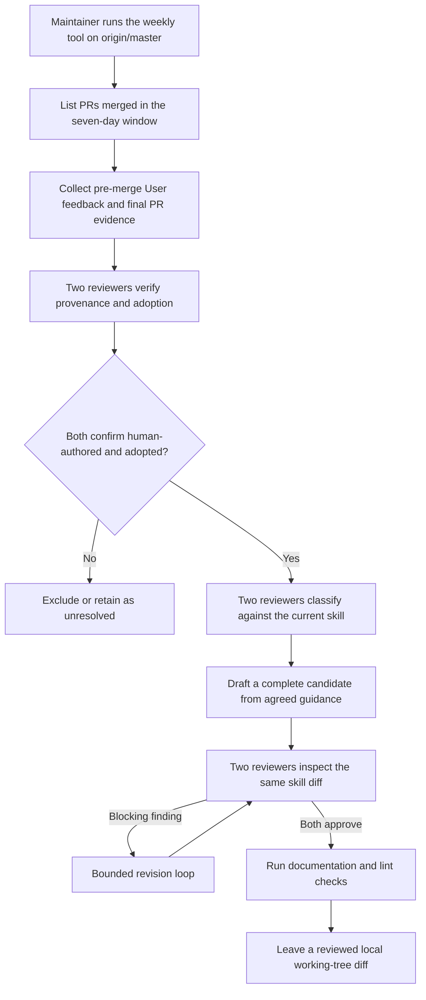

# RFC: Periodic human-review maintenance for dsh-code-review

Status: proposed

## Problem

The `dsh-code-review` skill records failure modes that require reviewer judgment, but one-off audits are expensive to repeat and easy to scope inconsistently. Treating every comment as a lesson produces checklist bloat; treating merge, thread resolution, or an author's “fixed” reply as proof of adoption promotes feedback that the final code may not implement. The maintenance process needs enough evidence and independent review to fail closed without requiring a webhook service, durable event state, or automatic repository promotion before the workflow has proven useful.

## Proposal

Periodic out-of-repo maintenance. A private tool, kept on the skill maintainer's machine rather than committed to this repository, runs against a clean full-history checkout at refreshed `origin/master` on an operator-chosen cadence — daily and weekly are both safe because the scan is idempotent against the current skill, and the `--since` window is a `--since 2d` overlap for daily or `--since 7d` for weekly. Repeated `--pr` arguments inspect an explicit set. The tool stores no repository cursor. The only artifact that reaches this repository is a working-tree diff to [.agents/skills/dsh-code-review/SKILL.md](../../../../.agents/skills/dsh-code-review/SKILL.md) that the maintainer inspects and, if useful, promotes through the repository's normal PR review.

### Acquisition contract

Each selected PR is filtered before any feedback is retrieved: its merge commit must be an ancestor of `origin/master`. Merge-commit reachability is the sole eligibility check — a stacked PR whose direct base is a feature branch is admitted whenever the base has since reached master, because the code the reviewer commented on is now on master regardless of the intermediate stack. A single PR that fails preflight, acquisition, or evidence collection is logged to `skipped-pulls.json` and skipped rather than aborting the whole weekly run. The search stage also fails loud when the window would exceed GitHub's 1,000-result search cap so no merged PR is silently omitted. The acquisition stage then reads complete paginated connections for inline review comments, review submissions, PR conversation comments, and PR commits. It admits feedback only when GitHub reports the actor `type` as `User`, and only when both creation and last-edit timestamps strictly predate the PR merge (an equal-timestamp edit is treated as post-merge); review submissions use GraphQL `lastEditedAt` because the REST representation omits edit time.

### Adoption evidence

Each feedback item carries a stable source ID and bounded change evidence. When the reviewer's `commit_id` still belongs to the PR (force-push fail-closed), the tool selects the latest PR commit whose committer timestamp strictly predates the feedback as the baseline — not the reviewer's clicked commit, which may be an older commit — and compares that baseline with the merge commit that actually landed on master. Conversation feedback, force-pushed reviews, and any feedback that predates every PR commit fall to the whole-PR baseline and are deterministically classified `unclear` before any reviewer sees them, because the base-to-head diff cannot prove that a change is causally after the feedback; only feedback-commit baselines reach the adapter for adoption. Merge status, a resolved thread, an author's “fixed” reply, or a same-file edit is context rather than adoption proof; the PR author's own comments never reach the adapter as they cannot be adoption of themselves.

### Dual-reviewer classification and drafting

Two independently configured reviewer adapters classify every item by provenance (`human-authored`, `forwarded-automation`, or `unclear`) and adoption (`adopted`, `rejected`, or `unclear`). Only matching `human-authored` plus `adopted` verdicts proceed. The adopted set then receives a second independent classification against the current skill: candidate, already covered, implementation-specific, or not feedback. A singleton may qualify; recurrence is not required. Disagreement receives one bounded re-evaluation and remains visible in run artifacts if unresolved. A single batch whose adapter output fails schema or id validation is failed closed at the batch level — every feedback item in it is marked unclear and routed to `excluded` — rather than aborting the whole run; the offending raw output is preserved under the run's private artifacts for debugging.

The primary adapter drafts from structured agreed guidance, never raw review text. It remains tool-free and read-only by adapter-author contract: it returns complete candidate file content, which the tool validates before writing the sole target. Both adapters then review the same complete skill diff; blocking findings return to a bounded revision loop, and both must approve the same revision. The tool rejects staged changes and edits outside the target skill both before running the documentation and lint gates and again before reporting success, so a gate or concurrent process that adds another path cannot slip through. It restores its own write on failure using best-effort compare-and-swap so a concurrent maintainer edit is not overwritten, produces a reviewed local diff and private run artifacts on success, and never commits, pushes, opens, or merges a PR.

### Reviewer adapter protocol

Each private executable receives a byte-bounded, versioned JSON request on stdin and returns byte-bounded, schema-conforming JSON on stdout. The tool refuses to run when the two reviewer commands resolve to byte-identical executables — a minimum-bar mechanical check; guaranteeing that primary and secondary are backed by independent providers or models is the deployment operator's responsibility. The `access` and `tools` fields are contract markers on the adapter author, not an OS sandbox: reviewer subprocesses spawn with a scrubbed environment, `cwd` set to a private run directory rather than the repository root, and feedback wrapped in a nonce-tagged `<untrusted-feedback nonce="…">` block that every prompt instructs the model to treat as data; the 128-bit nonce prevents an untrusted body from forging the closing tag. Every subprocess uses bounded, abort-aware process-tree cleanup. Adapter authors implement each operation as pure read-only inference — even the `edit` operation returns complete candidate content in JSON, which the tool validates and writes to the sole target. Every production `git`/`gh`/gate spawn also uses the scrubbed environment so a pre-push hook's routing variables cannot silently redirect the maintainer. Candidate writes and the failure rollback use best-effort compare-and-swap against the last written content; the rollback also unstages the target so an adapter- or gate-staged candidate cannot survive a failed run into a later commit.

### Where the mechanism lives

The tool source, adapter binaries, provider credentials, and the seven-day scheduler are kept private to the maintainer's machine rather than committed to this repository. This document specifies the protocol; the reference implementation is private infrastructure. The mechanism serves a single skill maintained by a single operator, so the ongoing cost of vetting mechanism edits through repository review outweighs any provenance benefit. If the mechanism is ever handed off to a second maintainer, that handoff is a follow-up RFC that revises this decision — the operator doc at [docs/cookbook/maintaining-dsh-code-review.md](../../../cookbook/maintaining-dsh-code-review.md) is the entry point for anyone taking over.

## Alternatives considered

- **Ship the tool inside this repository.** Rejected for a single-maintainer scope: repository maintenance overhead (typecheck, lint, coverage, cross-cutting refactors) would exceed the value of committed provenance. Retained option for a later handoff.
- **Record every feedback-time PR head** — rejected: it improves causal isolation but requires a continuously running observer, durable event state, retries, and force-push reconciliation. Periodic maintenance uses reviewed-commit evidence where available and fails closed on broader whole-PR evidence.
- **Persist a processed-PR cursor** — rejected: an overlapping seven-day scan is cheap and naturally idempotent against the current skill, while cursor state creates recovery and missed-event problems.
- **Run on every new comment** — rejected: review waves produce many related comments and lack the final artifact needed to judge adoption.
- **Treat merge or thread resolution as adoption** — rejected: a PR can merge with rejected, superseded, or intentionally unresolved feedback.
- **Create or merge repository changes automatically** — rejected: the tool first needs a track record of useful periodic output. The maintainer inspects and promotes the local diff through normal repository review.
- **Learn from bot findings that were fixed** — rejected: the source contract is human review feedback. Actor type is filtered before analysis, and human accounts forwarding automated findings are excluded by provenance review.
- **Use one reviewer as author and final judge** — rejected: independent verdicts expose unsupported generalization before it reaches the skill.

## Acceptance criteria

Promotion from `proposed/` to `implemented/` requires all of the following to be observed in a real end-to-end run against this repository:

- The private tool runs from a clean detached checkout at refreshed `origin/master` and either reports "no candidate" or produces a working-tree diff limited to `.agents/skills/dsh-code-review/SKILL.md`. **Observed on 2026-07-15:** 62 merged PRs scanned, 5 skipped (unreachable merge commit or >250-commit acquisition cap), 426 human feedback items considered, 0 candidates surfaced.
- Both reviewer adapters are independently configured (distinct providers or models) and complete an analyze / adopt / review pass without user intervention. **Observed on 2026-07-15:** distinct primary/secondary adapters completed adoption + analysis in ~8 minutes; batch fail-closed handled one adapter id-hallucination without aborting the run.
- A scheduler triggers the tool without an interactive terminal, and a candidate diff (or a "no candidate" record) reaches the operator through a durable notification channel.
- At least one candidate diff produced by this workflow is inspected by the operator and promoted to `master` through a normal repository PR review. That PR is the evidence that the workflow can turn adopted feedback into shipped skill guidance.

## Risks

- **Causality inferred from committer timestamps.** The feedback-commit baseline is selected by comparing GitHub commit timestamps with feedback creation timestamps; committer clock skew and rewrites still leave a residual false-adoption window. Cross-referencing GitHub's PR event stream would tighten this but requires event acquisition beyond the scope of the periodic tool.
- **Two-non-candidate classifications routed to `excluded` without a dispute round.** When both classifiers say "not a candidate" but disagree on which non-candidate reason applies (for example `covered` vs `specific`), the item is excluded rather than re-evaluated. Both classifiers agree the item does not become new reviewer behavior, so a dispute round would not change the outcome.
- **Dual-reviewer independence beyond byte-hash distinctness is a deployment contract.** The tool refuses to run when the two commands resolve to byte-identical executables, but cannot verify that two distinct wrappers back different providers or models. Operators must configure independent primary and secondary adapters.
- **Best-effort compare-and-swap for candidate writes and rollback.** File-based CAS on POSIX is not truly atomic; the window is one event-loop tick. The tool targets single-user weekly maintenance and a truly concurrent editor is out of scope.
- **Single-maintainer bus factor.** Because the mechanism lives on one machine, its interruption stops skill maintenance entirely until the operator restores service or hands off to a new maintainer through a follow-up RFC.
