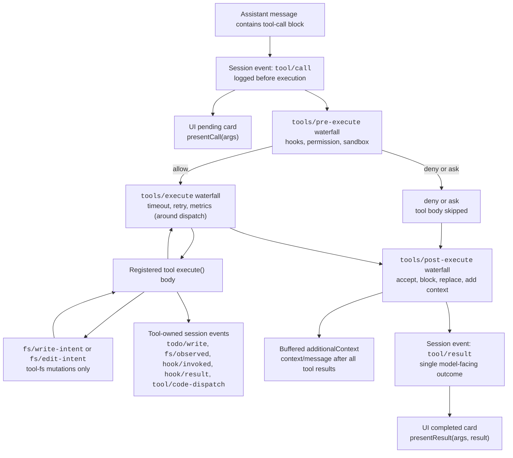

<!-- Generated by scripts/gen-doc-graphs.ts - do not edit by hand.
     Run `pnpm run gen-doc-graphs` to regenerate. -->

# Tool Execution Pipeline

This graph shows where policy, hooks, sandboxing, filesystem guards, result rewriting, and UI rendering fit without changing the loop. The key extension points are the `tools/pre-execute`, `tools/execute`, and `tools/post-execute` waterfalls.

Filesystem read-before-edit checks live below `tool-fs` on the `fs/*` event gate; hook bridges and future permission prompts live on the generic pre/post tool waterfalls; and around-dispatch concerns like the tool-call timeout policy (`@deepseek-ai/dsh-timeout-policy`) wrap core dispatch on `tools/execute`. That split lets the same hooks observe bash, fs, web, todo, and subagent calls without coupling those tools to one policy service. Code Mode rides the same pipeline twice over: `run_code` is itself a registered tool body, and each tool call its program makes re-enters `ctx.tools.execute()` through BOTH waterfalls — serialized one at a time, logged as a `tool/code-dispatch` session event, with a deny surfacing to the program as a binding rejection (a sub-call's `additionalContext` is deliberately dropped — no safe outlet mid-run preserves call/result adjacency).

Maintenance mode: curated Mermaid flow; exact tool schemas and event signatures live in generated catalogs.
