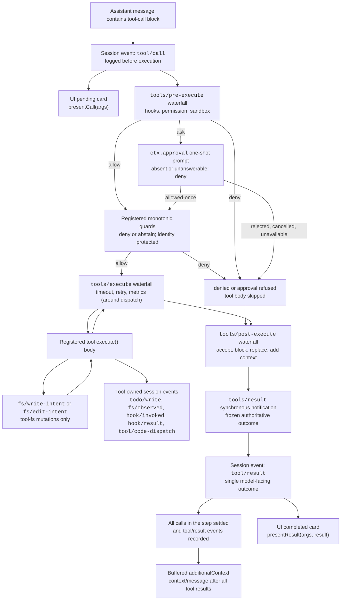

<!-- Generated by scripts/gen-doc-graphs.ts - do not edit by hand.
     Run `pnpm run gen-doc-graphs` to regenerate. -->

# Tool Execution Pipeline

This graph shows where policy, hooks, sandboxing, filesystem guards, result rewriting, final-outcome observation, and UI rendering fit without changing the loop. The transformable extension points are the `tools/pre-execute`, `tools/execute`, and `tools/post-execute` waterfalls; monotonic guards and `tools/result` are the owner-enforced boundaries around them.

Filesystem read-before-edit checks live below `tool-fs` on the `fs/*` event gate; hook bridges and approval-triggering permission policy enter through the generic pre/post tool waterfalls, while `ctx.approval` resolves an `ask` before the monotonic guards; owner policy that must not be reordered uses registered guards; and around-dispatch concerns like the tool-call timeout policy (`@deepseek-ai/dsh-timeout-policy`) wrap core dispatch on `tools/execute`. The synchronous `tools/result` notification observes the immutable final outcome after every transform, lossless-JSON validation, and outer error normalization. That split lets the same hooks observe bash, fs, web, todo, skill, and subagent calls without coupling those tools to one policy service. Code Mode rides the whole pipeline twice over: `run_code` is the reserved registry-owned transport whose body enters the pipeline, and each tool call its program makes re-enters `ctx.tools.execute()` — serialized one at a time, carrying the outer execution's opaque token for correlation, and logged as a `tool/code-dispatch` session event, with a deny surfacing to the program as a binding rejection (a sub-call's `additionalContext` is deliberately dropped — no safe outlet mid-run preserves call/result adjacency).

Maintenance mode: curated Mermaid flow; exact tool schemas and event signatures live in generated catalogs.
