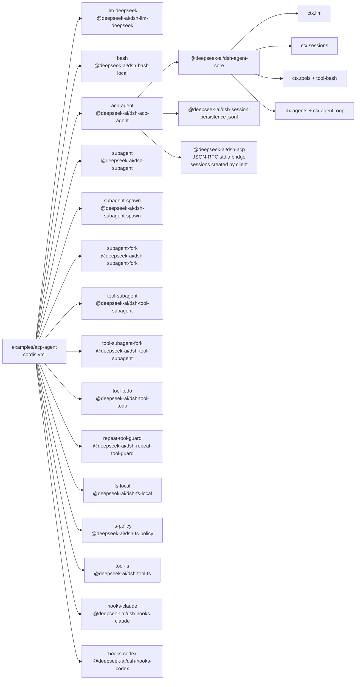

<!-- Generated by scripts/gen-doc-graphs.ts - do not edit by hand.
     Run `pnpm run gen-doc-graphs` to regenerate. -->

# ACP Agent App Composition

The ACP demo exposes the same agent spine over JSON-RPC stdio, with no stdout logger and no pre-created agent; clients create sessions through the ACP bridge.

| Plugin id | Package / module |
| --- | --- |
| `llm-deepseek` | `@deepseek-ai/dsh-llm-deepseek` |
| `bash` | `@deepseek-ai/dsh-bash-local` |
| `acp-agent` | `@deepseek-ai/dsh-acp-agent` |
| `subagent` | `@deepseek-ai/dsh-subagent` |
| `subagent-spawn` | `@deepseek-ai/dsh-subagent-spawn` |
| `subagent-fork` | `@deepseek-ai/dsh-subagent-fork` |
| `tool-subagent` | `@deepseek-ai/dsh-tool-subagent` |
| `tool-subagent-fork` | `@deepseek-ai/dsh-tool-subagent` |
| `tool-todo` | `@deepseek-ai/dsh-tool-todo` |
| `repeat-tool-guard` | `@deepseek-ai/dsh-repeat-tool-guard` |
| `fs-local` | `@deepseek-ai/dsh-fs-local` |
| `fs-policy` | `@deepseek-ai/dsh-fs-policy` |
| `tool-fs` | `@deepseek-ai/dsh-tool-fs` |
| `hooks-claude` | `@deepseek-ai/dsh-hooks-claude` |
| `hooks-codex` | `@deepseek-ai/dsh-hooks-codex` |

Source config: [`examples/acp-agent/cordis.yml`](cordis.yml).

Maintenance mode: hybrid: the leaf plugin list is parsed from its `cordis.yml`; app package expansion is curated from package source.
