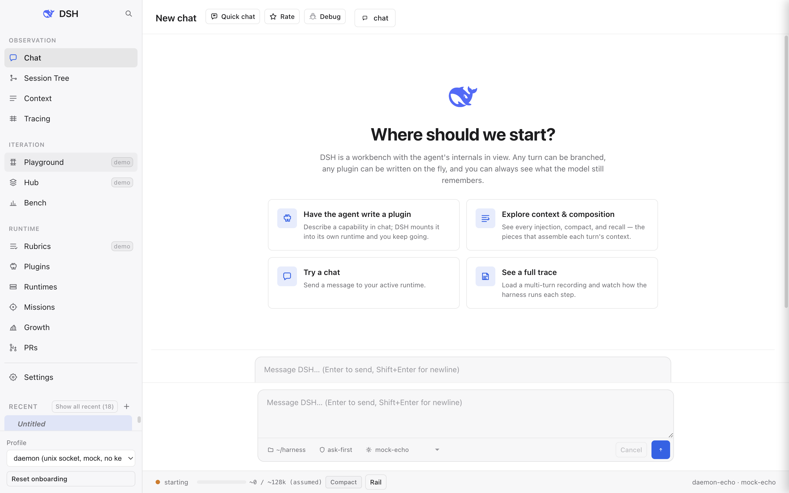
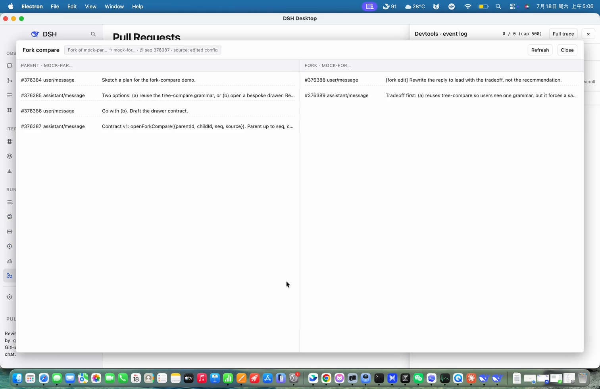
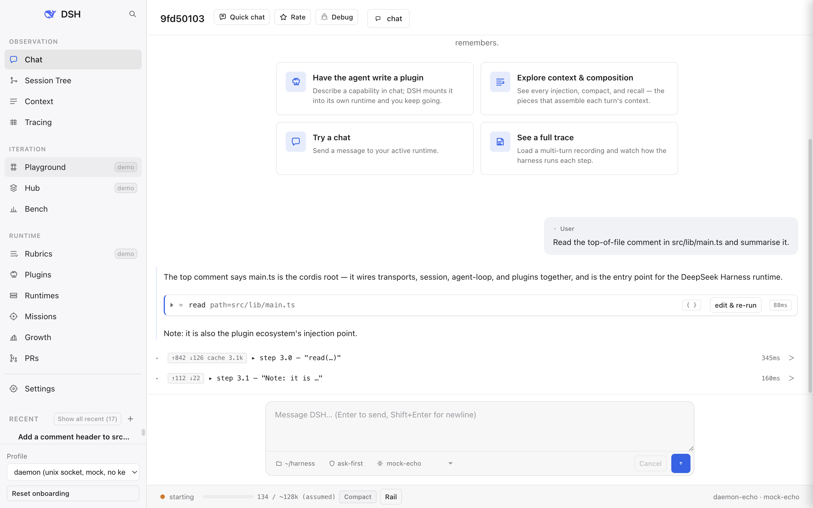

# DSH Desktop (reference host)

A minimal Electron desktop that talks to the DeepSeek Harness (DSH) runtime
over its internal JSON-RPC 2.0 protocol. It is the reference host for the
protocol: a place to see the whole capability surface working end to end
before we build the "real" apps against it. Not a shipped product — a demo
kept outside the official repo so the shell can move fast and the protocol
can stay strict.





*Demo walkthrough video: coming in a follow-up commit.*

## Quick start

Two `pnpm install` steps: once at the repo root (installs `tsx`, which
this shell uses to run the runtime's `.ts` bins), then once inside
`examples/desktop/` for the shell's own deps.

```sh
# from the repo root of your deepseek-harness clone
pnpm install
cd examples/desktop
pnpm install
pnpm start
```

First launch shows a two-step onboarding overlay (role · approval mode)
that writes a starter `~/.dsh-desktop/` and boots the **stdio-deepseek**
profile. From that point on, `pnpm start` picks up where you left off —
sessions and overlays live under `~/.dsh-desktop/`. (See below for
what happens when you launch without `DEEPSEEK_API_KEY` set — you get
a one-click switch card, not a red wall.)

Prereqs: node 22.22+ / pnpm 11.7+, plus the DSH runtime SDK on disk.
The shell auto-detects the SDK in two shapes:

- **In-repo (default when you clone deepseek-harness):** the shell
  sits at `examples/desktop/` and finds the runtime by walking up to
  the repo root. Nothing to configure.
- **Sibling checkout:** if you've cloned this shell into its own
  directory next to a `deepseek-harness-dev/` checkout (the original
  dev-workflow layout), the shell falls back to that sibling. Prefers
  the `.worktrees/integration/` worktree when materialized — that's
  where `daemon-demo` lives until it lands on master.

Set `DSH_DEV_ROOT=…` to force any custom layout.

**The default profile is `stdio-deepseek` — a real DeepSeek model,
real tool calls, real approvals.** That's on purpose (flipped
2026-07-18 per boss call): new downloaders should see the actual
model on the first prompt, not an echo bot. It needs
`DEEPSEEK_API_KEY`; the two supported places to put it are:

- A `.env` file at the DSH runtime root (repo root when you cloned
  deepseek-harness; the sibling `deepseek-harness-dev/` checkout in
  the dev-workflow layout), one line, format `DEEPSEEK_API_KEY=sk-...`
  — the runtime picks this up on spawn.
- Or exported in your shell before `pnpm start`
  (`export DEEPSEEK_API_KEY=sk-...`).

If no key is present when you launch, the shell doesn't wall you off
with a red banner — it renders a runtime card titled
**"DEEPSEEK_API_KEY needed for real-model profile"** with hint text
that spells out both options ("(1) set DEEPSEEK_API_KEY in .env or
your shell (see README Quick Start), or (2) try the keyless echo demo
to explore the UI first") and a **Switch to keyless demo
(stdio-echo)** button that one-click drops you into the echo profile
so you can walk every tab without a key. Any profile you switch to
persists to `~/.dsh-desktop/config.json` and comes back on next boot.

The model dropdown filters itself to models the current profile can
actually reach, so if you switch to an echo profile you'll only see
`mock-echo`, and switching back to `stdio-deepseek` restores
`deepseek-v4-flash` / `deepseek-v4-pro`. See the **Profiles** table
below for the full matrix; the "What's real vs demo" section right
after that spells out which surfaces are live wire vs. fixture on
each profile.

## Pages & Features

The sidebar nav groups the 14 pages into three bands: **observation**
(what the runtime is doing right now), **iteration** (loop-in tooling
you point at the runtime), and **runtime & rest** (the plumbing you
configure and the places you send the results). Pages marked
**(demo)** carry a `demo` chip on the nav item; the "What's real vs
demo" section below spells out exactly which surfaces are fixture and
which gap ticket tracks the missing wire.

### Observation

#### Chat

The default pane. A conversation is a DSH **session**: the sidebar lists
all your sessions with a pulsing live-dot on whichever one has a turn in
flight, and the transcript replays cleanly when you switch between them.
Streaming assistant text, reasoning blocks, and tool calls all render
inline as they arrive; every tool call is a collapsible `<details>` block
keyed by `callId`, reasoning is a first-class bubble (not hidden behind
a toggle), and `context/message` / `steering/message` events surface as
📎 cards so you can see what the runtime added to the model's context
and why. A `Cancel` button appears mid-turn and cuts the stream via
`session/cancel`.



#### Session Tree

Sessions are not a flat list — DSH records lineage in the session header
(`parentSession`, `seedLength`) and emits `subagent.started` /
`subagent.finished` notifications when a child agent runs. The **Tree**
tab folds the flat `session/list` into a forest so you can see the
whole fork ancestry at a glance. Orphans (children whose parent is
missing from the list) surface with an `(orphan)` badge rather than
being silently promoted to roots. Inside chat, every assistant bubble
carries a hover-revealed **fork from here** button that mints a child
session at that exact seq and marks it in the tree with a `⑂ forks
from here (N)` card.

#### Context

A per-turn ledger of everything the runtime injected, compacted, or
recalled on the current session. Each event row shows the source knob
(inject / recall / compact), the payload preview, and the seq it
attached to, so you can walk backwards from any assistant reply to the
exact context slice that produced it. Per-knob chips call out which
gap-ticket (G<n>) writeback is still pending — the page is real wire
for events that already ship (`context/message`, `session/compact`
outcomes) and honestly labels the rest.

#### Tracing

The project-wide runs table — every session across every profile in a
single eight-column aggregate: **Name / Most Recent Run / Trace Count /
Error Rate / P50 / P99 / Total Tokens / Total Cost**. Clicking a row
opens a tri-view drawer (Tree / Timeline / Graph — see Feature
highlights) that recursively unfolds a single session's event tree,
LLM/tool timing spans, and callgraph. Meant for the "which of my 200
sessions actually cost me tokens this afternoon" question, backed by
the same `session/list` projection the Chat sidebar reads.

### Iteration

#### Playground **(demo)**

An isolated scratch runtime that lives right next to the Plugins pane.
Enter via the **Playground** button; a fresh daemon boots against a
throwaway leaf so you can try a plugin lineup without disturbing your
main session. `Discard` throws the whole thing away; `Apply` promotes
the tried lineup back into your user overlay. The compare drawer picks
a live session, copies its first user message into the playground
input, and paints the live session's events alongside the playground
stream — same prompt, two overlays, side by side. The scratch boot is
real; the standalone Playground page hasn't fully landed, so the nav
button currently shims to Plugins.

#### Hub **(demo)**

The plugin discovery surface — the "shop" side of the same list the
Plugins page edits. Plugin listings themselves are real wire
(`daemon/plugins/list`), but the surrounding catalogue metadata
(categories, descriptions, ratings, install counts) is fixture pending
G1 / G11 / G12. A page-footer SDK legend spells out which chip on a
card is coming from where.

#### Bench

The benchmark harness surface — pick a benchmark, pick a lineup, watch
the runner tick through cases and stream the pass/fail column into
your session tree. The benchmark list and detail views are fixtures
until the wire methods land; the page header carries a legend chip
`demo · G18/G19/G20 pending` so you can tell fixture rows from live
ones at a glance.

#### Rubrics **(demo)**

The RL-annotation surface: pick a session, walk its turns, attach a
rubric score + a written justification to each assistant reply.
"Create from scratch" opens a rubric editor; "Import from…" pulls a
rubric spec from a plugin. Drafts saved live in memory until the G1
seam lands — the page-header legend `demo · G1 seam pending` calls
that out.

### Runtime & rest

#### Plugins

DSH is a cordis leaf — a flat list of `{id, name, config?}` entries —
and the Plugins tab is where you see and shape that list. Three
sub-areas: **Installed** (base entries and user-overlay entries side by
side; toggle any row, or **Add plugin…** to append a new one — changes
stage into your user overlay and ship on the next **Apply + restart**),
**Browse** (a curated marketplace read from `config/plugin-index.json`;
cards carry icon, package name, permission badges (net / fs /
subprocess), and a one-click **Install** that writes an overlay patch),
and **Vibe a plugin** (opens a chat under a leaf that mounts
`@deepseek-ai/dsh-tool-cordis` so the model gets `cordis_inspect`,
`cordis_mount`, `cordis_unmount` and can literally write plugin code
that extends its own runtime in a `node:vm` sandbox — two clicks from
"I need a plugin that does X" to a running plugin that does X).

#### Runtimes

Local runtime profiles and their isolated daemons in one place — one
row per profile with a status dot, PID, socket path, and the compose
recipe (which cordis leaves it's built from). Real wire on the plugin
list (`daemon/plugins/list`); the compose recipe view is fixture-tier
with a visible `composed locally · gap G8` chip. Meant for the "which
daemon am I actually talking to right now" question when you have
several profiles alive.

#### Missions

Single-screen view of everything happening across every session at
once. Built for the "agent has fanned out" case — plan execution,
code-review sweeps, research bundles — where the flat chat view stops
being enough. Three subviews over the same in-memory aggregate:
**Tree** (one info-dense row per session with status dot, title,
last-activity, event / tool-call / todo counts, and the last-event
summary), **Topology** (hand-rolled SVG layered layout of the
parent→child DAG; running nodes get a pulsing halo, edges into or out
of a running session carry a dashed flow animation), and **Board**
(kanban over todos aggregated across every session that emitted a
`todo/write`, three columns, each card badges back to its originating
session). Every card click jumps back to Chat for that session. The
header button `mock: mission demo` injects a synthetic 3-level 8-node
scenario so every subview is demoable without a live daemon; the
default empty-state preview shows three ghost cards labelled `preview`
until a real `todo/write` replaces them.

#### Growth

An auditable self-evolution log. Every plugin install, toggle, vibe
session, overlay apply, and onboarding choice appends a line to
`~/.dsh-desktop/growth-log.jsonl`; the page turns that into a heatmap
+ timeline + identity card. Deliberately "facts, not persona copy" —
every timeline node is clickable, and either drops you into the actual
session that produced it or shows the raw log row. Each node also has
an **Ask DSH about this** pill that opens a chat scoped to that entry.

#### PRs

A PR list that lives one click away from the chat. `gh pr list` runs
in the current profile's `cwd` (default: the DSH dev clone), so the
list is the real PRs against `deepseek-harness/deepseek-harness`.
Rows carry state / title / `head → base` / diff totals / relative
time. Clicking a row opens the PR in your default browser; the
trailing **Ask DSH** button mints a fresh session, seeds it with a
scoped review prompt, and switches you to Chat. Two clicks from PR
list to a running review chat. Falls back to a small demo dataset
when `gh` isn't installed or you're signed out, with a `demo data`
badge and a banner explaining the fix.

#### Settings

Profile switch, model dropdown, `DEEPSEEK_API_KEY` presence check, and
the local pricing table (pricing lives in the shell, not the daemon,
so tokens-to-cost math is auditable client-side). Also where you
reset onboarding, override `DSH_DEV_ROOT` / `DSH_ARTIFACT_DIR`, and
inspect which plugins the current profile composes. Every knob here
is real wire.

### Off-nav affordances

#### Quick chat

A floating composer that opens above whichever tab you're on. Trigger
with **⌘⇧Space** (or **Ctrl+Shift+Space** on Linux/Windows), or click
**Quick chat** in the chat pane header. The card shows the five most
recent sessions with click-to-jump, plus a fresh composer. Submitting
mints a new session, switches to Chat, and sends the prompt. Meant for
the "quick thought, don't lose my place" case.

#### Devtools drawer

The user-visible embodiment of DSH's *model-visible ⟺ logged* contract:
every `session.event` the runtime shipped over the wire lands here.
Dev-facing families (`hook/*`, `request/header*`, `approval/*`,
`permission/*`, `bash/sandbox-mode`, `step/*`, `tool/code-dispatch`, …)
that would otherwise spam chat live here instead. Open with the ⚙
button in the chat header, or press ⌥D. Preset filters (All /
Approvals / Hooks / Requests), auto-populated type chips, and a
case-insensitive search box that runs against event type, session id,
or pretty-printed payload. Auto-scroll follows the tail; a 500-entry
ring buffer accumulates in the background so opening the drawer later
still shows the recent tail.

## Feature highlights

The affordances that cut across pages — the recurring ways the shell
teaches you to read what the runtime is doing. Every one of these is a
place where DSH departs from a "chat app that also lists tools" and
becomes a visualiser of the runtime's actual state.

- **Trace tri-view (Tree / Timeline / Graph).** One session, three
  reprojections of the same event stream. Tree is the recursive event
  hierarchy (turn → tool call → sub-events). Timeline is a Gantt-style
  span chart with LLM latency and tool latency on separate lanes.
  Graph is a callgraph over `parentSession` + subagent edges. Wired
  from the Tracing table and from any assistant bubble's ⋯ menu.
- **Recursive collapsible Fields tree.** Every event payload — no
  matter how deep — renders as a folder-tree of `field: value` rows
  you can twist open one level at a time. No "click to expand JSON in
  a modal"; the whole payload is the UI. The same widget backs
  `session.event` inspection, tool-call args/results, and the `{ }`
  drawer.
- **Reasoning as a first-class bubble.** Reasoning deltas stream into
  their own bubble with a distinct visual weight, not folded behind a
  "show thinking" toggle. The runtime emits them; the shell renders
  them; if the model has none, the bubble simply doesn't appear.
- **Diff and terminal tool cards.** Tool calls that carry a
  filesystem-diff payload render a unified-diff card with per-hunk
  syntax highlighting; tool calls that carry a shell/bash payload
  render a terminal card with a scrollback pane. Both fall back to the
  generic collapsible-details view if the `meta` discriminant is
  missing.
- **Fork & edit-rerun.** Every assistant bubble has a hover-revealed
  **fork from here** button; use it to mint a child session seeded at
  that exact seq, edit the user turn, and let a different reply
  stream in. The child is anchored back in the session tree with a
  `⑂ forks from here (N)` card so the branching is legible.
- **`{ }` JSON drawer — zero loss.** Every event card has a `{ }`
  button in the corner that swings a drawer holding the raw JSON of
  the source `session.event`, verbatim. The pretty renderer is a
  projection; the JSON is the source of truth, always one click away.
- **Compaction visualisation.** When the runtime emits a
  `session/compact` outcome, the compacted range renders as a
  collapsed banner inline in chat with the summary + token delta
  side by side, and the Context page ledger anchors a per-turn marker
  at the same seq. You can always see where the model's memory got
  trimmed and by how much.
- **MCP surface.** MCP tools are first-class citizens in the plugin
  list, the tool-call renderer, and the plugin catalog — same widget
  chrome, same permission badges, same Vibe hooks. An MCP tool is
  just another plugin the model sees.
- **Demo-chip convention.** Every fixture-backed surface labels
  itself: a `demo` chip on the nav item for whole-page fixtures, a
  `demo` corner badge on individual mock-minted cards, a
  `mock · <method> not on wire yet` chip on card headers where the
  UX is real but the method is proposed, and a page-header legend on
  mixed pages that names the gap ticket. Fixture vs real is always
  legible.
- **Real-model default profile.** `stdio-deepseek` (real DeepSeek,
  real tool calls, real approvals) is the default on first launch
  (flipped 2026-07-18) so new downloaders see the actual model on
  the first prompt, not an echo bot. Keyless demoing is one click
  away via the **Switch to keyless demo (stdio-echo)** card that
  renders in place of a red-wall error when `DEEPSEEK_API_KEY` is
  missing.

## Profiles

The profile dropdown in the sidebar swaps the whole runtime. Three you'll
actually use, plus two vibe variants:

| Profile | What it's for | Needs |
| --- | --- | --- |
| **stdio-echo** | Keyless demo, works on master. Direct-spawns the `jsonrpc-demo` bin (present on `deepseek-harness` master) over stdio. Runtime state (plugin list, sandbox mode, compact) is unavailable because there's no daemon to ask, but conversation, tool cards, forks, and devtools all work. This is the one-click fallback offered by the missing-key card. | none |
| **stdio-deepseek** | Real DeepSeek adapter, real tool calls, real approvals. **Default on first launch** (2026-07-18) — new downloaders should see a real reply, not the echo bot. Use this for actual work, and to demo any live-tool behaviour. | `DEEPSEEK_API_KEY` in the repo's `.env` or your shell |
| **daemon-echo** | Full-feature demo, keyless. Boots the real daemon over a Unix socket; the model is a mock that echoes your input back. Every renderer capability (daemon plugin list, sandbox toggles, live compact) is demoable. **Not yet available on master** — the `daemon-demo` bin lives in the `.worktrees/integration` worktree of the dev clone until it lands upstream; wait for that or use `DSH_DEV_ROOT` to point at a checkout that has it. | `daemon-demo` bin (integration worktree only) |
| **daemon-vibe-echo** | daemon-echo + the vibe leaf loaded. The Vibe entry point is gated (mock-echo can't actually compose plugins) but the leaf is there for UI walkthroughs. **Not yet available on master** — same reason as daemon-echo. | `daemon-demo` bin (integration worktree only) |
| **stdio-vibe-deepseek** | Real Vibe. `cordis_mount` etc. run under the DeepSeek adapter and the model can extend its own runtime. | `DEEPSEEK_API_KEY` |

The model dropdown right below the profile dropdown filters itself to
models the current profile can actually reach: `mock-echo` on the echo
profiles, `deepseek-v4-flash` / `deepseek-v4-pro` (plus their `[1m]`
long-context variants) on `stdio-deepseek`. Switching profile also
resets the model to the profile's default, so you can't accidentally
end up on a model your current runtime has no adapter for.

## What's real vs demo

Every surface in the shell is either driven by a live JSON-RPC method
or filled with an on-disk fixture so the whole capability is walkable
without a live daemon. Both are useful for different reasons — real
surfaces show you what a plugin author can actually hook into today,
fixtures show you the *shape* the runtime will emit once the wire
lands. The two are visually distinguishable so you can tell at a
glance:

- **`demo` chip on the nav item** — the whole page is fixture-only.
- **`demo` corner badge on a card** — the card was minted by a
  `mock-*` debug button or a fixture seed, not by a real wire event.
- **`mock · <method> not on wire yet` chip** on a card header — the
  card family is real UX; the method is proposed but not yet on the
  shipped protocol.
- **page-header legend chip** (e.g. `wire · file-tier · G<n>` on Hub /
  Runtimes / Bench) — the page mixes real wire and fixture; the chip
  spells out which is which and which gap-ticket (G<n>) tracks the
  missing wire.

The current split, on the default `stdio-deepseek` profile (the same
9-real / 5-fixture set applies to `daemon-echo` — the model
underneath swaps, the surfaces don't):

**Real wire (9 surfaces):**

- Chat — `session/prompt` + `session/cancel` + streaming
  `session.event` (assistant chunks, reasoning deltas, tool calls,
  context injections all reach real events).
- Session Tree — real `session/list` folded into a forest via
  `parentSession` / `seedLength` in each `SessionListEntry.header`.
- Context page — real `session.event` ledger (inject / recall /
  compact events all wire); per-knob chips call out which G<n>
  writeback is still pending.
- Tracing page — `session/list` projection (eight-column table over
  real sessions).
- Plugins → Installed / Browse — `daemon/plugins/list` and
  `plugins:add` are real wire; the curated Browse index is a fixture
  clearly labelled `Curated demo index`.
- Runtimes — `daemon/plugins/list` is real; the compose recipe view
  is fixture-tier with a `composed locally · gap G8` chip.
- PRs — real `gh pr list` in the profile's `cwd`; the fallback demo
  dataset is only used when `gh` is missing / signed out, and shows a
  visible `demo data` badge.
- Devtools — every `session.event` the runtime shipped shows up here,
  live.
- Settings — profile switch, `DEEPSEEK_API_KEY` presence check, and
  the local pricing table are all real (pricing lives in the shell,
  not the daemon).

**Fixture-only (5 surfaces):**

- **Playground** — `demo` chip on the nav item. The scratch runtime
  boot is real, but the entry point currently shims to the Plugins
  tab; the standalone Playground page hasn't landed.
- **Hub** — `demo` chip on the nav item + page-footer SDK legend.
  Plugin listings are real wire; the surrounding catalogue metadata
  (categories, descriptions, ratings) is fixture pending G1 / G11 /
  G12.
- **Bench** — `demo` chip on the nav item + page-header legend
  (`demo · G18/G19/G20 pending`). The benchmark list and detail views
  are fixtures until the wire methods land.
- **Rubrics** — `demo` chip on the nav item + page-header legend
  (`demo · G1 seam pending`). Drafts saved from "Create from scratch"
  live in memory only.
- **Missions empty-state preview** — the three-card ghost kanban
  ("Draft the release notes", "Refactor the compact seam", "Land the
  artifact preview PR") is a `preview` fixture; real todos replace it
  as soon as any session writes a `todo/write`.

The full audit — every card, every wire method, every gap ticket
(G1..G21) — lives in `docs/review-demo-labels.md`.

## Known limitations

The demo is deliberately narrow in a few places — either because a wire
method is still landing, or because the runtime capability doesn't exist
in the target profile.

- **stdio profiles don't have runtime-state features.** No plugin
  list, no live sandbox-mode badge, no `session/compact` button — those
  read/write daemon state that only the daemon profiles expose.
- **`session/compact` is proposed, not shipped.** The **Compact now**
  button works if the daemon has a `compact-basic` (or equivalent) leaf
  mounted; on MethodNotFound the button greys out with an explanatory
  tooltip. No mock compaction is fabricated.
- **`session/fork` is still landing.** The **fork from here** button
  and the tree smoke scenario fall back to a synthetic `session/new`
  and badge the child `(mock)` so callers know it's an empty child, not
  seeded.
- **Old sessions can't be resumed after `kill -9`.** The daemon's SDK
  server owns a per-connection sessionId map. Respawn works and new
  sessions work; resuming a session that predates the crash does not.
- **Plugin toggle is full-daemon-respawn.** The **Apply + restart**
  button tears the daemon down and brings it back up. Per-plugin
  dispose + re-mount is on the runtime side's list (`daemon/plugins/toggle`,
  `daemon/plugins/reload`).
- **Mission Control has no persistence.** A page reload wipes the
  aggregate and reseeds from the next `session/list` refresh — the
  view is a live overlay, not a store.
- **Artifact preview opens in your default browser.** No embedded
  webview, no cloud tunnel; the shell hosts a `127.0.0.1` static
  server and drops a card into chat when a new file appears in the
  artifact dir.
- **Growth reads jsonl + `session/list`.** A follow-up will migrate to
  the `session/list` + `session/events` aggregation so events that
  never touch the overlay (pure chat activity) also show up.
- **Widget cards are demoable via the header mocks.** No live tool on
  any shipped profile emits `card: 'widget'` yet; the three
  `mock: widget · …` buttons inject a synthetic `tool/call` +
  `tool/result` pair so the pipeline is exercised end to end.

---

## For developers

Everything below this line is implementation notes. If you're just using
the demo, you're done above.

### Architecture

Topology mirrors ChatGPT.app: an Electron main process spawns the DSH
**daemon** (long-lived host process) and connects a Unix-domain socket
for JSON-RPC frames; the renderer only renders. A `stdio-*` fallback
is kept for airgapped smoke tests and for demoing without a daemon
build.

```
+-----------------+       IPC        +------------------+    unix-socket JSON-RPC v2    +-----------------+
| renderer        | <--------------> | Electron main    | <--------------------------->  | DSH daemon      |
| (vanilla JS)    |    preload API   | (RuntimeSuper +  |   newline-delimited frames    | (daemon-demo)   |
+-----------------+                  |  DaemonSuper —   |                                +-----------------+
                                     |  respawn/probe)  |
                                     +------------------+
                                                Fallback (stdio-echo / stdio-deepseek):
                                                    direct-spawn jsonrpc-demo bin, stdio frames
```

### Structure

```
src/
  main/
    jsonrpc-client.js   pure JSON-RPC 2.0 framing (unit-tested)
    transport.js        StdioTransport + SocketTransport
    runtime.js          supervisor: transport + client + crash re-spawn + initialize
    daemon.js           probe+spawn+respawn for the daemon profile
    profiles.js         which cordis.yml + model to launch
    gh-prs.js           gh CLI wrapper (pure)
    artifact-server.js  127.0.0.1 static server + SSE live-reload
    main.js             BrowserWindow, IPC surface
  preload/preload.js    contextIsolation bridge
  renderer/
    index.html          two-pane layout
    style.css           vanilla, no framework
    renderer.js         session-event → DOM dispatch
    (~30 IIFE modules — mission, plugins, growth, playground, quick-chat, devtools, …)
test/
  *.test.js             439 unit tests (node --test, no Electron)
  smoke-runtime.js      headless smoke scenarios (stdio / daemon / kill / tree)
```

### Protocol surface used

From `packages/ui/jsonrpc/src/protocol.ts` (v2):

- `initialize({ cwd, model, protocolVersion: 2, capabilities: {interruptions:true} })`
  → `{ serverInfo, protocolVersion, capabilities }`
- `session/new({ sessionId })` → `{ sessionId }`
- `session/prompt({ sessionId, contentBlocks })` → `{ accepted: true }`
- `session/cancel({ sessionId, reason })` → `{ cancelled }`
- `session/list({})` → `{ sessions: [{ sessionId, header, live, persisted }] }`
- `session/events({ sessionId })` → metadata list;
  `session/events({ sessionId, seq, before, after })` → full-event window
- `shutdown` → `{}`

Server→client requests:
- `session/interrupt({ sessionId, interruptId, payload | spec })` →
  `{ outcome: 'accepted', payload } | { outcome: 'rejected' } | { outcome: 'cancelled' }`

Notifications: `session.event`, `session.finished`, `subagent.started`,
`subagent.finished`.

Daemon-only: `daemon/ping` → `{ name, version, pid, startedAt }`.

Proposed (not yet in shipped protocol; graceful fallback in the shell):
`session/fork`, `session/compact`, `daemon/plugins/list`,
`daemon/plugins/toggle`, `daemon/plugins/reload`,
`daemon/persona/get`.

### Tests

```sh
pnpm test                              # 439 unit tests (node --test, no Electron)
node test/smoke-runtime.js stdio       # stdio-echo end-to-end
node test/smoke-runtime.js daemon      # daemon-echo + session/list + prompt
node test/smoke-runtime.js kill        # SIGKILL daemon → auto-respawn + reconnect
node test/smoke-runtime.js tree        # session tree + fork lineage (mock fallback)
node test/smoke-runtime.js all         # everything (~90s)
```

### Manual verification recipes

**Kill-recovery.** In another shell, `pkill -9 -f daemon-demo/src/bin.ts`.
Status bar flips `running → crashed → respawning → running` on schedule
`[0,300,1000,2500,5000]ms`. Send a new prompt — new session works;
old sessions can't be resumed (see Known Limitations).

**Approval card.** Header debug button `mock-approval` renders an inline
card wired to the real interrupt-resolution path. In a coding-agent
profile with a real bash tool call, a live `session/interrupt` request
from the daemon hits the same handler and gets an `accepted` /
`rejected` / `cancelled` response over the JSON-RPC id.

**Plugins toggle.** `pnpm start`, click **Plugins**, uncheck `bash`,
click **Apply + restart**, wait for status dot green, reopen the tab —
`bash` shows dim / unchecked / still source=`base`.

**Onboarding reset.** `rm -rf ~/.dsh-desktop && pnpm start` — overlay
covers the app, pick role + approval mode; overlay dismisses and
runtime restarts once. Or use sidebar → **Reset onboarding**.

**Vibe.** Ensure your DSH runtime `.env` has `DEEPSEEK_API_KEY` (see
Quick Start for `.env` locations). Sidebar profile → `stdio-vibe-deepseek`.
Plugins → **Vibe a plugin**. A new session opens; ask it to mount a
plugin and watch a `cordis_mount` tool block appear.

### Wire needs owed by the protocol team

- `session/fork` (see Known Limitations).
- `session/compact` (see Known Limitations).
- `daemon/plugins/list` / `daemon/plugins/toggle` /
  `daemon/plugins/reload` (per-plugin dispose + re-mount).
- `daemon/persona/get` + role templates on the daemon side; today the
  role choice from onboarding lives in `~/.dsh-desktop/config.json` on
  the shell.
- `SessionListEntry.header.seedLength` populated end to end so fork
  markers can anchor at the exact seq rather than the current tail.

### Adaptive layout, widget channel, artifact preview

Three cross-cutting affordances documented in detail in the design docs
under `docs/`:

- **Adaptive layout** — four heuristic buckets (chat / code-review /
  artifact / monitor) auto-toggle a body class and a handful of CSS
  variables based on the recent event mix. Manual lock available; see
  `src/renderer/layout-heuristics.js` and `layout-controller.js`.
- **Widget channel** — inline interactive cards that ride on the
  existing `tool/result` event's `meta` field. See
  `docs/widget-channel-design.md` for the wire shape, plus
  `src/renderer/widgets.js` and the three header mocks.
- **Artifact preview** — `127.0.0.1` static server + SSE live-reload
  that watches `~/Library/Application Support/dsh-desktop-demo/.artifacts/`
  (override with `DSH_ARTIFACT_DIR=…`). Opens in your default browser;
  no embedded webview. Tool-driven and debug-mock paths both exercised.
  See `src/main/artifact-server.js`.

### Design docs

Deeper background lives under `docs/`: `arch-review-report.md`,
`capability-ui-coverage.md`, `product-flow-review.md`,
`product-ia-design.md`, `qa-walkthrough-report.md`,
`ui-refs-distilled.md`, `widget-channel-design.md`.
