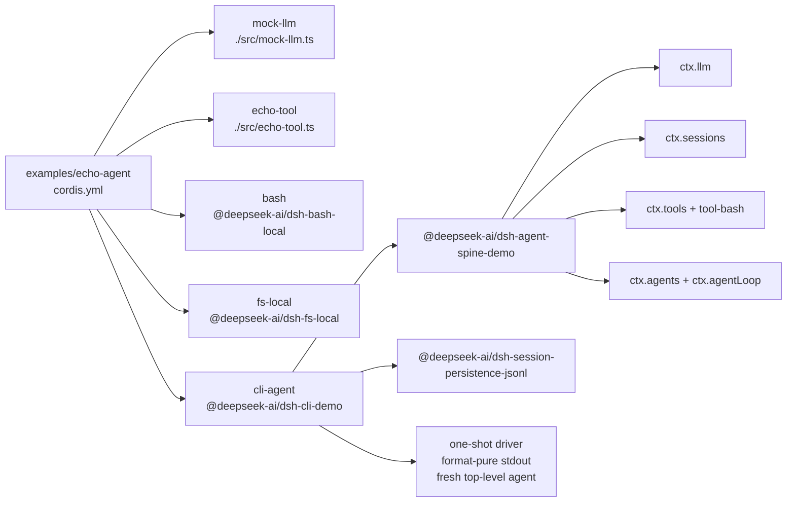

<!-- Generated by scripts/gen-doc-graphs.ts - do not edit by hand.
     Run `pnpm run gen-doc-graphs` to regenerate. -->

# Echo Agent App Composition

The echo demo swaps in a local mock LLM and teaching echo tool, then loads the headless one-shot app package.

| Plugin id | Package / module |
| --- | --- |
| `mock-llm` | `./src/mock-llm.ts` |
| `echo-tool` | `./src/echo-tool.ts` |
| `bash` | `@deepseek-ai/dsh-bash-local` |
| `fs-local` | `@deepseek-ai/dsh-fs-local` |
| `cli-agent` | `@deepseek-ai/dsh-cli-demo` |

Source config: [`examples/echo-agent/cordis.yml`](cordis.yml).

Maintenance mode: hybrid: the leaf plugin list is parsed from its `cordis.yml`; app package expansion is curated from package source.
