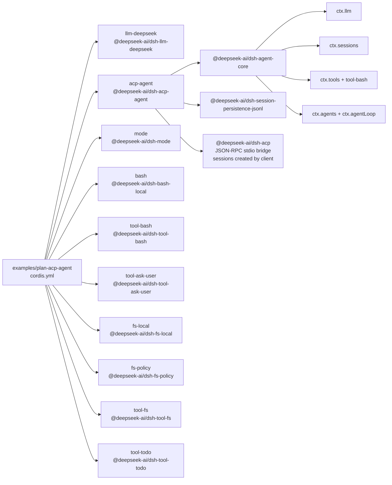

<!-- Generated by scripts/gen-doc-graphs.ts - do not edit by hand.
     Run `pnpm run gen-doc-graphs` to regenerate. -->

# Plan-Mode ACP Agent App Composition

The plan-mode demo composes session modes onto the ACP server: the editor mode picker drives plan mode, and the model exits through the user-reviewed exit_plan_mode tool.

| Plugin id | Package / module |
| --- | --- |
| `llm-deepseek` | `@deepseek-ai/dsh-llm-deepseek` |
| `acp-agent` | `@deepseek-ai/dsh-acp-agent` |
| `mode` | `@deepseek-ai/dsh-mode` |
| `bash` | `@deepseek-ai/dsh-bash-local` |
| `tool-bash` | `@deepseek-ai/dsh-tool-bash` |
| `tool-ask-user` | `@deepseek-ai/dsh-tool-ask-user` |
| `fs-local` | `@deepseek-ai/dsh-fs-local` |
| `fs-policy` | `@deepseek-ai/dsh-fs-policy` |
| `tool-fs` | `@deepseek-ai/dsh-tool-fs` |
| `tool-todo` | `@deepseek-ai/dsh-tool-todo` |

Source config: [`examples/plan-acp-agent/cordis.yml`](cordis.yml).

Maintenance mode: hybrid: the leaf plugin list is parsed from its `cordis.yml`; app package expansion is curated from package source.
